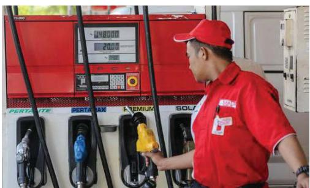
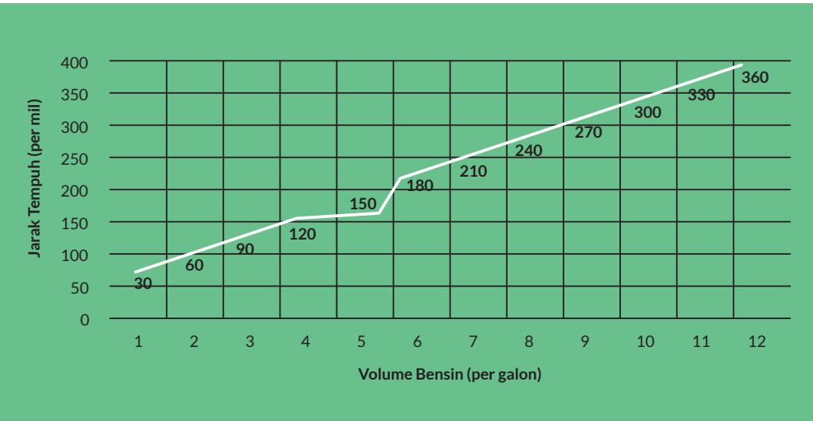

# Komposisi Fungsi dan Fungsi Invers

## Tujuan Pembelajaran

Setelah mempelajari bab ini, diharapkan kalian dapat

1. Menjelaskan pengertian fungsi

2. Menentukan domain, kodomain, dan range dari suatu fungsi

3. Menjelaskan syarat dan aturan komposisi fungsi

4. Membuat komposisi fungsi yang terdiri atas dua atau lebih fungsi

5. Menggunakan konsep komposisi fungsi untuk menyelesaikan masalah

6. Menyelidiki sifat komutatif dan sifat asosiatif pada komposisi fungsi

7. Menjelaskan syarat dan aturan pembuatan fungsi invers

8. Menggunakan konsep fungsi invers untuk menyelesaikan masalah

## Pengantar Bab

Setiap dari kalian pasti pernah ke Stasiun Pengisian Bahan Bakar Umum (SPBU). Kalian pasti paham bahwa biaya yang dibayar untuk pembelian bahan bakar kendaraan bergantung pada jenis bahan bakar dan volumenya.

  
Gambar 1.1 Pembacaan Volume Bensin dan Harga yang Harus Dibayar Sumber: liputan6.com/Faizal Fanani (2018)

Bagaimana hubungan antara volume bahan bakar yang dibeli dan biaya yang dikeluarkan? Apakah penambahan volume bahan bakar berbanding lurus dengan biaya? Dapatkah relasi antara biaya dengan volume bahan bakar dituliskan sebagai $B = f ( V ) ? \qquad V$ menyatakan volume bahan bakar yang dibeli dan B merupakan biaya yang dibayar.

Grafik di bawah menunjukkan hubungan jarak tempuh suatu kendaraan terhadap penggunaan bahan bakar. Apakah penambahan penggunaan volume bahan bakar berbanding lurus dengan jarak tempuh kendaraan? Bagaimana menuliskan relasi antara keduanya?

  
Gambar 1.2 Grafik Jarak Tempuh terhadap Volume Bahan Bakar

Dapatkah kalian menyatakan semua volume bahan bakar yang dapat ditampung sebuah kendaraan sebagai suatu himpunan? Dapatkah kalian menyatakan semua jarak maksimal yang dapat ditempuh untuk setiap volume bahan bakar sebagai suatu himpunan? Konsep seperti ini akan kalian pelajari dalam topik domain, kodomain, dan range dari fungsi.

Jika kalian menggabungkan kedua informasi di atas, relasi baru apa yang kalian dapatkan? Hal ini yang akan dipelajari lebih mendalam dalam subbab komposisi fungsi. Kalian juga akan mempelajari operasi-operasi yang dapat diterapkan pada dua atau lebih fungsi.

Kembali ke relasi biaya terhadap pembelian bahan bakar, bagaimana kalian menentukan banyak bahan bakar yang dibeli jika kalian mempunyai sejumlah uang tertentu? Bagaimana kalian dapat menentukan jarak tempuh jika kendaraan kalian mempunyai volume bahan bakar tertentu? Hubungan timbal balik ini akan dipelajari dalam fungsi invers.

Secara umum, bab dimulai dengan pemahaman tentang pengertian fungsi termasuk di dalamnya domain, kodomain, dan range. Bagian kedua dari bab ini akan membahas tentang komposisi fungsi serta operasi-operasi fungsi yang lain yang sering digunakan dalam kehidupan sehari-hari. Di sini juga akan dibahas syarat yang harus dipenuhi untuk mengomposisikan dua atau lebih fungsi. Pada bagian akhir dari bab kalian akan mempelajari invers dari suatu fungsi beserta syarat dan sifat-sifatnya; termasuk di dalamnya invers dari komposisi fungsi.

## Pertanyaan Pemantik

• Apakah setiap relasi merupakan fungsi?

• Apa peran domain, kodomain, dan range dari sebuah fungsi?

• Bagaimana menerapkan operasi dan komposisi fungsi untuk memodelkan suatu keadaan atau masalah?

• Kapan fungsi invers dapat diperoleh?

• Bagaimana menggunakan fungsi invers untuk memodelkan suatu keadaan atau masalah?

## Kata Kunci

Fungsi, domain, kodomain, range, relasi, komposisi fungsi, fungsi invers