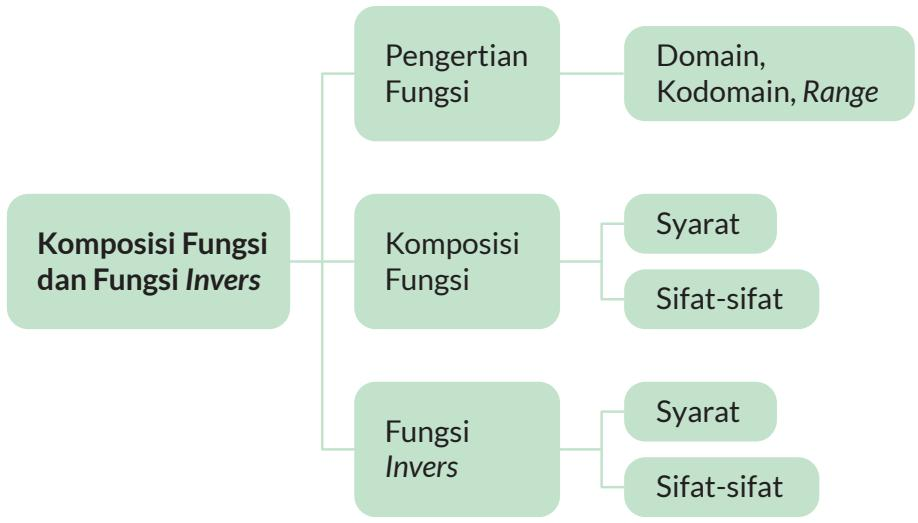
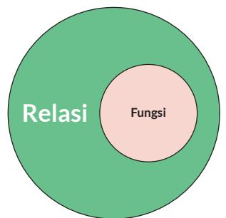
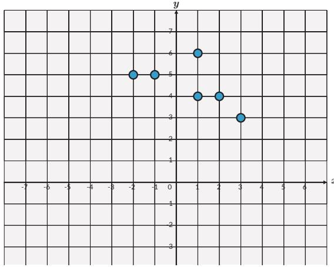
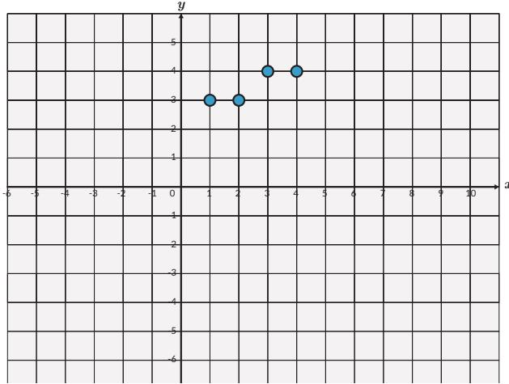

Peta Konsep  

## Ayo Mengingat Kembali

  
Gambar 1.3 Ronaldo dengan Nomor Punggung 7 Sumber: twitter.com/Manchester United (2021)

Relasi dapat dipahami dalam banyak hal di kehidupan sehari-hari. Konsep relasi menjelaskan hubungan antara anggota-anggota dari dua himpunan. Contohnya, setiap pemain bola di tim Manchester United memiliki nomor punggung masing-masing. Ronaldo memiliki nomor punggung 7.

Hubungan ini biasanya dijelaskan dalam bentuk himpunan pasangan berurutan, diagram panah, dan diagram Kartesius.

## A. Fungsi

Fungsi merupakan suatu relasi yang menghubungkan satu anggota dari suatu himpunan tepat ke satu anggota di himpunan yang lain. Fungsi adalah relasi yang lebih spesifik. Fungsi biasa dinyatakan dalam bentuk f(x) = y , di mana f merupakan fungsi, x merupakan variabel masukan (input) dan y adalah variabel keluaran (output). Kalian dapat memahami konsep ini dengan membayangkan fungsi sebagai mesin seperti pada gambar berikut:

  
Gambar 1.4 Analogi Fungsi Mesin

Jelaslah, kalian dapat simpulkan bahwa ada relasi yang merupakan fungsi dan ada yang bukan merupakan fungsi.

## 1. Fungsi dan Bukan Fungsi

Secara ilustratif, hubungan antara fungsi dan relasi dapat dipahami melalui Gambar 1.5 dan Gambar 1.6.

Pada bagian ini, kalian akan belajar menentukan relasi-relasi yang merupakan fungsi dan bukan merupakan fungsi. Relasi-relasi ini akan disajikan dalam bentuk diagram panah dan diagram Kartesius.

Perhatikan contoh ketiga diagram panah berikut. Ada yang menunjukkan relasi yang berupa fungsi dan ada yang menunjukkan bukan fungsi.

  
Gambar 1.5 Ada Relasi yang Bukan Fungsi

  
Gambar 1.6 Relasi Merupakan Fungsi dan Bukan Fungsi

Relasi yang terdapat pada Gambar 1.6 (a) dan (b) merupakan fungsi karena relasi tersebut menghubungkan satu anggota himpunan input dengan tepat satu anggota himpunan output. Gambar 1.6 (c) merupakan contoh relasi yang bukan fungsi karena relasi tersebut menghubungkan satu anggota; “q” ke dua anggota berbeda “y” dan “z” .

a.  

## Ayo Berdiskusi

Diskusikan dalam kelompok, apakah kedua relasi dalam diagram Kartesius ini merupakan fungsi atau bukan fungsi.

Tuliskan juga pasangan berurutan dari setiap titik.

  
b.

  
Gambar 1.7 Relasi dalam Diagram Kartesius