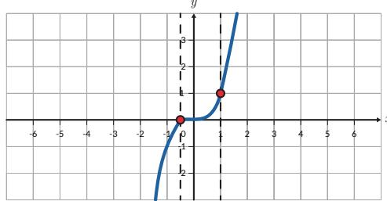

Hubungan antara pemakaian bahan bakar dengan jarak tempuh dipengaruhi oleh beberapa hal seperti kepadatan lalu lintas, jalan mulus, dan jenis mobil. Pernahkah kalian memikirkan bahwa model fungsi sangat diperlukan untuk membuat hubungan antara pemakaian bahan bakar dengan jarak tempuh sebuah mobil?

Seperti yang kalian sudah ketahui, relasi sering juga ditampilkan dalam bentuk grafik. Kalian dapat menentukan apakah relasi semacam ini merupakan fungsi atau bukan dengan menggunakan Tes garis vertikal. Caranya yaitu cukup menggeser garis vertikal dari kiri ke kanan (atau sebaliknya) dan melewati grafik relasi. Apabila garis vertikal tersebut memotong grafik di dua atau lebih titik yang berbeda, maka relasi tersebut bukanlah fungsi.

## Gambar A

Gambar A menampilkan grafik dari relasi dengan persamaan $x = y ^ { 2 }$ . Dengan menggunakan Tes garis vertikal, dapat dilihat bahwa pada $x = 2$ garis vertikal memotong grafik pada dua titik yang berbeda. Relasi ini bukanlah suatu fungsi.

## Gambar B

  
Gambar 1.8 Penggunaan Tes Garis Vertikal untuk Menentukan Relasi

Gambar B menampilkan grafik dari relasi dengan persamaan $y = x ^ { 3 }$ Dengan menggunakan Tes garis vertikal, dapat dilihat bahwa untuk setiap nilai x, garis vertikal memotong grafik tepat pada satu titik. Relasi ini adalah suatu fungsi.

## Latihan

1. Apakah relasi-relasi di bawah ini merupakan fungsi? Jelaskan alasanmu.

a. Relasi antara jumlah penjualan HP Galaksi seri A terhadap waktu.

  
b. Relasi antara lama mengunggah video di YouTube terhadap waktu.

  
Sumber: tubularinsights.com (2010)

2. Satuan energi adalah Joule dan kalori dengan 1 J = 2,4 kal. Apakah hubungan antara Joule dan kalori merupakan suatu fungsi? Jelaskan.

3. Berdasarkan data, pada tahun 2001 perusahaan A mampu menjual 9 laptop. Pada tahun 2002 dan 2003 perusahaan A mampu menjual masing-masing 27 dan 81 laptop. Apabila relasi antara tahun dan jumlah penjualan laptop membentuk fungsi eksponensial, berapa penjualan laptop pada tahun 2007?

4. Tentukan relasi mana dari grafik-grafik berikut yang merupakan fungsi (gunakan tes garis vertikal).

a.

b.  
