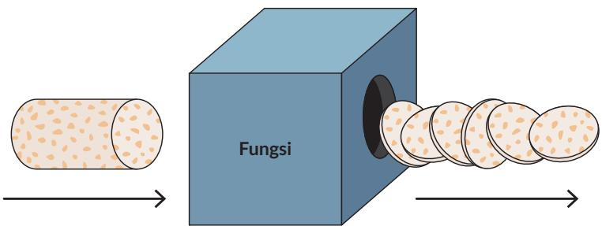

Relasi yang bukan fungsi dapat dibuat menjadi fungsi. Setujukah kalian dengan pendapat ini? Bagaimana kalian melakukan hal tersebut? Gunakan salah satu contoh soal dalam Latihan 1.1 no. 4 untuk mengubah relasi bukan fungsi menjadi fungsi.

## 2. Domain, Kodomain, dan Range

Eksplorasi 1.1 Domain, Kodomain, dan Range

Kalian sudah belajar domain, kodomain, dan range di SMP. Kalian memperdalam pemahaman ini dengan mengeksplorasi tiga masalah. Ketiga masalah tersebut dibuat berurutan agar kalian memperoleh pemahaman yang benar tentang domain, kodomain, dan range.

## Masalah Pertama

Data kecepatan seorang pelari jarak pendek (sprinter) setiap detik dicatat dan ditampilkan dalam grafik berikut:

  
Gambar 1.9 Grafik Kecepatan Pelari terhadap Waktu

## Pertanyaan

1. Buatlah tabel untuk grafik tersebut.

2. Nyatakan waktu (masukan) yang dicatat dalam notasi himpunan.

3. Nyatakan kecepatan (keluaran) yang dicatat dalam notasi himpunan.

## Masalah Kedua

  
Gambar 1.10 Mesin Memproses Tempe Menjadi Keripik Tempe

Sebuah pabrik pembuatan keripik tempe memiliki mesin yang beroperasi dengan mengubah 1 potong tempe bulat menjadi 6 keripik tempe. Pembuatan tempe dapat saja menghasilkan $\textstyle { \frac { 1 } { 2 } }$ potong keripik tempe atau bentuk pecahan lainnya. Menurut aturan, mesin membuang keripik yang tidak utuh ini (tidak lulus quality control) dan mengeluarkan keripik utuh. Mesin keripik tempe hanya beroperasi apabila ada minimal 200 potong tempe yang dimasukkan dan berhenti beroperasi apabila lebih dari 600 potong tempe dimasukkan. Asumsikan mesin produksi keripik tempe adalah sebagai fungsi linear, lengkapi tabel produksi tempe berikut:

Tabel 1.1 Jumlah Potongan Tempe dan Keripik Tempe
<table><tr><td rowspan=1 colspan=1>Jumlah Potong Tempe (Masukan)</td><td rowspan=1 colspan=1>Jumlah Keripik yang Dihasilkan (Keluaran)</td></tr><tr><td rowspan=1 colspan=1>200</td><td rowspan=1 colspan=1></td></tr><tr><td rowspan=1 colspan=1>200,25</td><td rowspan=1 colspan=1></td></tr><tr><td rowspan=1 colspan=1>500,75</td><td rowspan=1 colspan=1></td></tr><tr><td rowspan=1 colspan=1>…</td><td rowspan=1 colspan=1></td></tr><tr><td rowspan=1 colspan=1>600</td><td rowspan=1 colspan=1></td></tr><tr><td rowspan=1 colspan=1>601</td><td rowspan=1 colspan=1></td></tr></table>

1. Tuliskan notasi himpunan yang menyatakan masukan dari mesin fungsi keripik tempe. Himpunan ini disebut sebagai domain.

2. Tuliskan notasi yang menyatakan semua kemungkinan keripik tempe yang dihasilkan. Himpunan ini disebut sebagai kodomain.

3. Tuliskan notasi himpunan yang menyatakan keluaran dari mesin fungsi keripik tempe. Himpunan ini disebut sebagai range.

4. Berdasarkan pertanyaan 3 dan 4, jelaskan hubungan antara kodomain dan range.

Penjelasan lebih lanjut tentang domain dan range dapat juga kalian pahami melalui contoh grafik di bawah ini. Perhatikan hubungan antara penggunaan bahan bakar dengan jarak tempuh mobil “XY” pada jalan bebas hambatan yang diberikan oleh grafik.