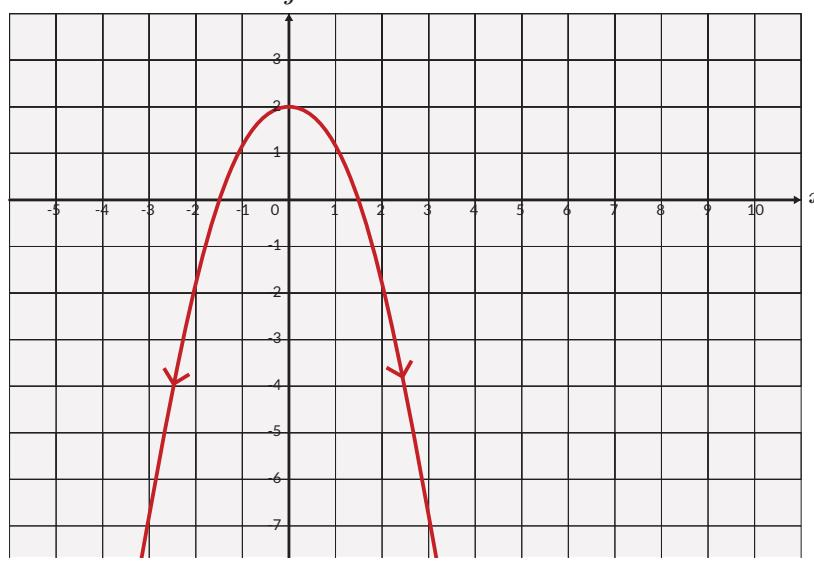
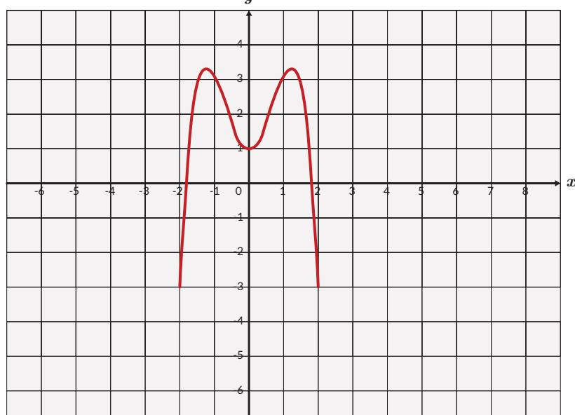
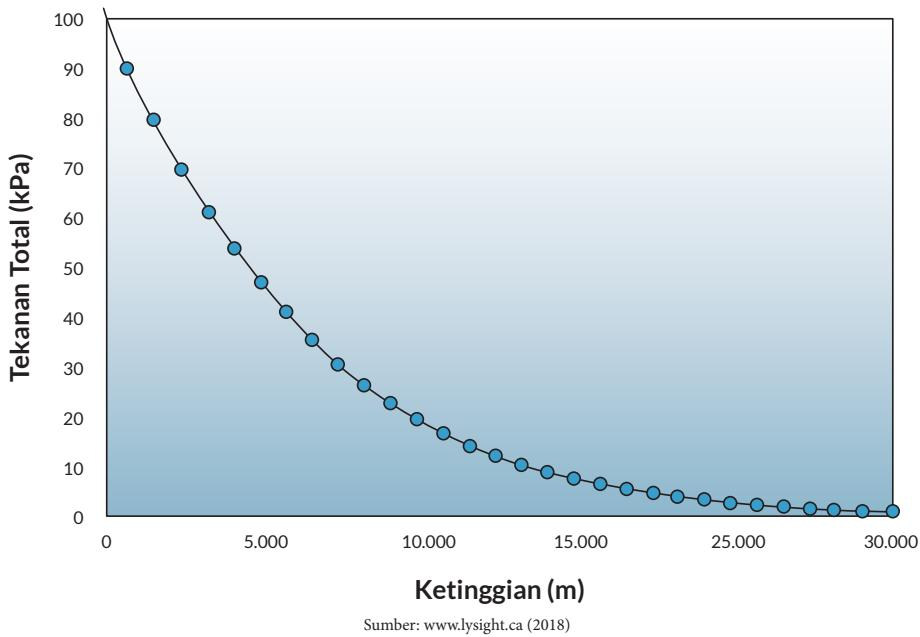
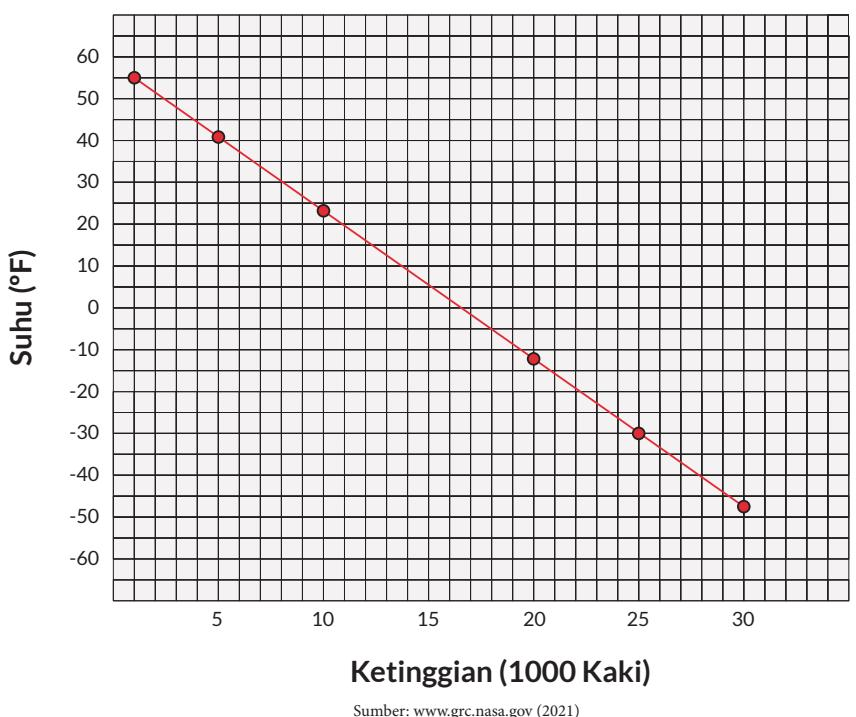

c.  

3. a. Berikan contoh suatu situasi atau fungsi dalam kehidupan sehari-hari di mana domain fungsi tidak dapat berharga negatif.

b. Berikan contoh suatu situasi atau fungsi dalam kehidupan sehari-hari di mana range tidak dapat berharga negatif.

4. a. Tentukan fungsi yang menyatakan hubungan antara suhu dalam Celcius dan Kelvin.

b. Tentukan juga domain dan range dari fungsi tersebut. Petunjuk: apakah ada suhu terendah dan tertinggi di alam semesta?

5. (Depresiasi nilai laptop) Seorang YouTuber membeli sebuah laptop baru seharga Rp20.000.000,00. Jika harga jual laptop tersebut pada tahun ke-t turun secara eksponensial dan dideskripsikan oleh fungsi berikut:

$$
H \left( t \right) = 2 0 . 0 0 0 . 0 0 0 \times e ^ { - 0 . 2 5 t } ,
$$

a. Berapakah harga jual laptop tersebut pada tahun ke-5?

b. Tentukan domain dan range-nya.

6. Tekanan udara berkurang jika ketinggian dari permukaan laut bertambah sebagaimana yang ditunjukkan oleh grafik di bawah ini. Tekanan udara dinyatakan dalam kiloPascal dan ketinggian di atas permukaan laut dinyatakan dalam kaki. Satu kaki = 0,3 m.

  
a. Tuliskan domain dan range dari fungsi ini.  
b. Apakah ada tekanan udara bernilai negatif?

7. Grafik suhu terhadap ketinggian di atas permukaan laut diberikan di bawah ini. Suhu diberikan dalam derajat Fahrenheit dan ketinggian di atas permukaan laut dalam kaki.

a. Tuliskan domain dan range dari fungsi ini.

Gunakan Geogebra untuk menyelesaikan tugas ini.

Gambarkan suatu fungsi dengan ketentuan sebagai berikut.

Domain memenuhi $0 ~ \leq x ~ \leq 1 0$

• Range memenuhi $3 ~ \leq y ~ \leq 2 3$

• Titik (1,5) dan (4,11) memenuhi fungsi yang dimaksud.

## B. Komposisi Fungsi

Sebelum belajar tentang komposisi fungsi secara mendalam, coba amati dan pahami cara menggabungkan dua fungsi dalam eksplorasi berikut.