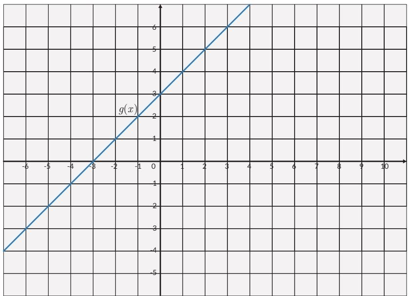

## Tahukah Kamu?

Dua gelombang apa saja jika bertemu akan berpadu. Perpaduan dua gelombang atau lebih dapat dinyatakan dengan penjumlahan kedua atau lebih fungsi sinus. Penjumlahan kedua fungsi sebenarnya adalah penjumlahan simpangan gelombang. Simpangan gelombang ditunjukkan oleh ketinggian gelombang dalam grafik.

  
Gambar 1.18 Penjumlahan Dua Fungsi Gelombang  
Penjumlahan dua fungsi gelombang dapat menghasilkan gelombang baru dengan simpangan yang lebih besar atau simpangan lebih kecil bahkan simpangan nol. Jika ada dua pengeras suara dalam suatu ruangan maka bunyi bergantian terdengar keras dan lemah sesuai dengan posisi pendengar karena penjumlahan dua fungsi gelombang.

## Ayo Berteknologi

Kode QR berikut ini berisi video yang mengilustrasikan penjumlahan grafik dua fungsi pada Gambar 1.18. https://youtu.be/JZaFl8yR1tc

## 2. Perkalian dan Pembagian Fungsi

Kalian telah melihat bahwa operasi penjumlahan dan pengurangan bisa diterapkan terhadap dua fungsi. Operasi ini bisa diperluas penerapannya untuk lebih dari dua fungsi. Sekarang, bagaimana dengan operasi perkalian dan pembagian dua atau lebih fungsi?

Jika $f ( x )$ dan $g ( x )$ merupakan dua fungsi dengan domain masing-masing $D _ { f }$ dan $D _ { g } .$ . Maka perkalian $( f \cdot g ) ( x ) = f ( x ) \cdot g ( x )$ menghasilkan fungsi yang baru dengan domain $D _ { f } \cap D _ { g }$

Pembagian dua fungsi $\begin{array} { r } { \left( \frac { f } { g } \right) ( x ) = \frac { f ( x ) } { g ( x ) } } \end{array}$ secara umum belum tentu menghasilkan fungsi. Supaya $\textstyle { \frac { f } { g } }$ menjadi sebuah fungsi, pembagi g tidak boleh memiliki nilai 0. Dengan kata lain, $\textstyle { \frac { f } { g } }$ adalah fungsi dengan domain $\left( D _ { f } \cap D _ { g } \right) - \left\{ x | g \left( x \right) = 0 \right\}$

## Latihan 1.3

1. Jika $f ( x ) = { \sqrt { x + 3 } }$ dan $g \left( x \right) = x + 3$

a. Tentukan $f \left( x \right) + g ( x )$

b. Tentukan domain dan range dari $f \left( x \right) + g ( x )$

2. $f ( x ) = x ^ { 2 } + 2 \mathrm { d a n } g ( x ) = 2 x - 5$

a. Tentukan $f \left( x \right) - g ( x )$

b. Tentukan domain dan range dari $f \left( x \right) - g ( x )$

3. Buatlah suatu fungsi kuadrat dan fungsi eksponensial! Tentukan hasil penjumlahan dan pengurangan kedua fungsi tersebut!

4. Dua fungsi, f(x) (berwarna merah) dan $g ( x )$ (berwarna biru) diberikan di bawah ini.

<table><tr><td rowspan=1 colspan=1></td><td rowspan=1 colspan=1></td><td rowspan=1 colspan=1></td><td rowspan=1 colspan=1></td><td rowspan=1 colspan=1></td><td rowspan=1 colspan=1></td><td rowspan=1 colspan=1></td><td rowspan=1 colspan=1></td><td rowspan=1 colspan=1></td><td rowspan=1 colspan=1></td><td rowspan=1 colspan=1></td><td rowspan=1 colspan=1></td><td rowspan=1 colspan=1></td><td rowspan=1 colspan=1></td><td rowspan=1 colspan=1></td><td rowspan=1 colspan=1></td><td rowspan=1 colspan=1></td></tr><tr><td rowspan=1 colspan=1></td><td rowspan=1 colspan=1></td><td rowspan=1 colspan=1></td><td rowspan=1 colspan=1></td><td rowspan=1 colspan=1></td><td rowspan=1 colspan=1></td><td rowspan=1 colspan=1></td><td rowspan=1 colspan=1></td><td rowspan=1 colspan=1></td><td rowspan=1 colspan=1></td><td rowspan=1 colspan=1></td><td rowspan=1 colspan=1></td><td rowspan=1 colspan=1></td><td rowspan=1 colspan=1></td><td rowspan=1 colspan=1></td><td rowspan=1 colspan=1></td><td rowspan=1 colspan=1></td></tr><tr><td rowspan=1 colspan=1></td><td rowspan=1 colspan=1></td><td rowspan=1 colspan=1></td><td rowspan=1 colspan=1></td><td rowspan=1 colspan=1></td><td rowspan=1 colspan=1></td><td rowspan=1 colspan=1></td><td rowspan=1 colspan=1></td><td rowspan=1 colspan=1></td><td rowspan=1 colspan=1></td><td rowspan=1 colspan=1>f(x)</td><td rowspan=1 colspan=1></td><td rowspan=1 colspan=1></td><td rowspan=1 colspan=1></td><td rowspan=1 colspan=1></td><td rowspan=1 colspan=1></td><td rowspan=1 colspan=1></td></tr><tr><td rowspan=1 colspan=1></td><td rowspan=1 colspan=1></td><td rowspan=1 colspan=1></td><td rowspan=1 colspan=1></td><td rowspan=1 colspan=1></td><td rowspan=1 colspan=1></td><td rowspan=1 colspan=1></td><td rowspan=1 colspan=1></td><td rowspan=1 colspan=1></td><td rowspan=1 colspan=1></td><td rowspan=1 colspan=1></td><td rowspan=1 colspan=1></td><td rowspan=1 colspan=1></td><td rowspan=1 colspan=1></td><td rowspan=1 colspan=1></td><td rowspan=1 colspan=1></td><td rowspan=1 colspan=1></td></tr><tr><td rowspan=1 colspan=1></td><td rowspan=1 colspan=1></td><td rowspan=1 colspan=1></td><td rowspan=1 colspan=1></td><td rowspan=1 colspan=1></td><td rowspan=1 colspan=1></td><td rowspan=1 colspan=1></td><td rowspan=1 colspan=1></td><td rowspan=1 colspan=1></td><td rowspan=1 colspan=1></td><td rowspan=1 colspan=1></td><td rowspan=1 colspan=1></td><td rowspan=1 colspan=1></td><td rowspan=1 colspan=1></td><td rowspan=1 colspan=1></td><td rowspan=1 colspan=1></td><td rowspan=1 colspan=1></td></tr><tr><td rowspan=1 colspan=1></td><td rowspan=1 colspan=1></td><td rowspan=1 colspan=1></td><td rowspan=1 colspan=1></td><td rowspan=1 colspan=1></td><td rowspan=1 colspan=1></td><td rowspan=1 colspan=1>0</td><td rowspan=1 colspan=1></td><td rowspan=1 colspan=1></td><td rowspan=1 colspan=1></td><td rowspan=1 colspan=1></td><td rowspan=1 colspan=1></td><td rowspan=1 colspan=1></td><td rowspan=1 colspan=1></td><td rowspan=1 colspan=1></td><td rowspan=1 colspan=1></td><td rowspan=1 colspan=1></td></tr><tr><td rowspan=1 colspan=1></td><td rowspan=1 colspan=1></td><td rowspan=1 colspan=1></td><td rowspan=1 colspan=1></td><td rowspan=1 colspan=1></td><td rowspan=1 colspan=1></td><td rowspan=1 colspan=1></td><td rowspan=1 colspan=1></td><td rowspan=1 colspan=1></td><td rowspan=1 colspan=1></td><td rowspan=1 colspan=1></td><td rowspan=1 colspan=1></td><td rowspan=1 colspan=1></td><td rowspan=1 colspan=1></td><td rowspan=1 colspan=1></td><td rowspan=1 colspan=1></td><td rowspan=1 colspan=1></td></tr><tr><td rowspan=1 colspan=1></td><td rowspan=1 colspan=1></td><td rowspan=1 colspan=1></td><td rowspan=1 colspan=1></td><td rowspan=1 colspan=1></td><td rowspan=1 colspan=1></td><td rowspan=1 colspan=1></td><td rowspan=1 colspan=1></td><td rowspan=1 colspan=1></td><td rowspan=1 colspan=1></td><td rowspan=1 colspan=1></td><td rowspan=1 colspan=1></td><td rowspan=1 colspan=1></td><td rowspan=1 colspan=1></td><td rowspan=1 colspan=1></td><td rowspan=1 colspan=1></td><td rowspan=1 colspan=1></td></tr><tr><td rowspan=1 colspan=1></td><td rowspan=1 colspan=1></td><td rowspan=1 colspan=1></td><td rowspan=1 colspan=1></td><td rowspan=1 colspan=1></td><td rowspan=1 colspan=1></td><td rowspan=1 colspan=1></td><td rowspan=1 colspan=1></td><td rowspan=1 colspan=1></td><td rowspan=1 colspan=1></td><td rowspan=1 colspan=1></td><td rowspan=1 colspan=1></td><td rowspan=1 colspan=1></td><td rowspan=1 colspan=1></td><td rowspan=1 colspan=1></td><td rowspan=1 colspan=1></td><td rowspan=1 colspan=1></td></tr><tr><td rowspan=1 colspan=1></td><td rowspan=1 colspan=1></td><td rowspan=1 colspan=1></td><td rowspan=1 colspan=1></td><td rowspan=1 colspan=1></td><td rowspan=1 colspan=1></td><td rowspan=1 colspan=1></td><td rowspan=1 colspan=1></td><td rowspan=1 colspan=1></td><td rowspan=1 colspan=1></td><td rowspan=1 colspan=1></td><td rowspan=1 colspan=1></td><td rowspan=1 colspan=1></td><td rowspan=1 colspan=1></td><td rowspan=1 colspan=1></td><td rowspan=1 colspan=1></td><td rowspan=1 colspan=1></td></tr><tr><td rowspan=1 colspan=1></td><td rowspan=1 colspan=1></td><td rowspan=1 colspan=1></td><td rowspan=1 colspan=1></td><td rowspan=1 colspan=1></td><td rowspan=1 colspan=1></td><td rowspan=1 colspan=1></td><td rowspan=1 colspan=1></td><td rowspan=1 colspan=1></td><td rowspan=1 colspan=1></td><td rowspan=1 colspan=1></td><td rowspan=1 colspan=1></td><td rowspan=1 colspan=1></td><td rowspan=1 colspan=1></td><td rowspan=1 colspan=1></td><td rowspan=1 colspan=1></td><td rowspan=1 colspan=1></td></tr></table>

Tentukan

a. (f + g)(2) b. (f –g)(1) c. (fg)(3) d. $( { \frac { f } { g } } ) ( 4 )$

5. Pendapatan dari penjualan suatu produk adalah $R \left( x \right) = - 2 0 x ^ { 2 } + 1 0 0 0 x ,$ sedangkan biaya produksi C(x) adalah 100x + 8000. Jumlah produk dinyatakan dalam x. Tentukan keuntungan sebagai fungsi dari jumlah produk x.

6. Jika f (3) = 7, g (3) = 6, f (6) = 13, g (6) = 12, tentukan a. f(3) + g(3) b. f (3) − g(3) c. f(3)  g(3) d. f(3)  g(3)

7. Berikan contoh nyata tentang perkalian dua fungsi dalam kehidupan sehari-hari.

8. Berikan contoh nyata tentang pembagian dua fungsi dalam kehidupan seharihari.