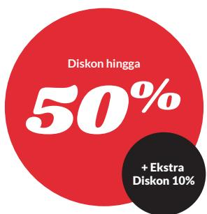

## 3. Komposisi Fungsi

Potongan harga dan diskon merupakan hal yang biasa ditemui dalam kehidupan sehari-hari. Misalkan, sebuah toko memberikan penawaran khusus akhir pekan dengan dua pilihan. Pilihan pertama ialah “diskon 20%” terhadap semua barang dengan tambahan potongan harga sebesar Rp25.000,00 setelah diskon 20%. Sedangkan pilihan kedua adalah potongan harga sebesar Rp25.000,00 dilanjutkan diskon 20% setelah potongan harga. Apakah kedua pilihan penawaran tersebut sama? Jika tidak, pilihan mana yang lebih menguntungkan untuk pembeli?

Pertanyaan tersebut dapat kalian jawab dengan memahami konsep komposisi fungsi.

## EkSplorasi 1.3

## Masalah Pertama

Perhatikan gambar di bawah ini. Sebuah toko memberikan diskon 20% dan potongan harga Rp25.000,00 untuk suatu produk tertentu.

  
Gambar 1.19 Diskon dalam Persen dan Potongan Harga

a. Lengkapi tabel di bawah ini.
<table><tr><td rowspan=1 colspan=1>Harga awal</td><td rowspan=1 colspan=1>Diskon20%</td><td rowspan=1 colspan=1>PotonganRp25.000,00</td><td rowspan=1 colspan=1>Hargaakhir</td></tr><tr><td rowspan=1 colspan=1>Rp100.000,00</td><td rowspan=1 colspan=1></td><td rowspan=1 colspan=1></td><td rowspan=1 colspan=1></td></tr><tr><td rowspan=1 colspan=1>Rp150.000,00</td><td rowspan=1 colspan=1></td><td rowspan=1 colspan=1></td><td rowspan=1 colspan=1></td></tr><tr><td rowspan=1 colspan=1>Rp200.000,00</td><td rowspan=1 colspan=1></td><td rowspan=1 colspan=1></td><td rowspan=1 colspan=1></td></tr><tr><td rowspan=1 colspan=1>Rp250.000,00</td><td rowspan=1 colspan=1></td><td rowspan=1 colspan=1></td><td rowspan=1 colspan=1></td></tr><tr><td rowspan=1 colspan=1>x</td><td rowspan=1 colspan=1></td><td rowspan=1 colspan=1></td><td rowspan=1 colspan=1></td></tr></table>

Apakah kalian sudah memahami cara menyelesaikan soal tersebut? Coba buatlah pernyataan fungsi untuk masalah serupa di bawah ini. Jika harga awal adalah x dan harga akhir atau nilai fungsi $f ( x ) \ = \ y$ , nyatakan y sebagai suatu fungsi yang memodelkan diskon 30% dilanjutkan dengan potongan harga sebesar Rp10.000,00.

## Masalah Kedua

Toko sering memberikan diskon ganda seperti yang ditunjukkan oleh gambar di bawah ini. Harga suatu produk diberi diskon 50% kemudian diberikan diskon lagi 10%.

  
Gambar 1.20 Diskon Ganda

a. Gambarkan mesin fungsi yang menunjukkan pemahaman diskon ganda ini dengan x merupakan harga sebelum diskon ganda dan y adalah harga sesudah diskon ganda. Nyatakan fungsi pertama sebagai $f ( x )$ dan fungsi kedua sebagai $g ( x )$ . Tuliskan hasil akhir sebagai dari operasi kedua fungsi terhadap masukan x.

b. Jika harga barang yang mengalami diskon ganda berkisar dari Rp100.000,00 s.d. Rp1.000.000,00 tentukan domain dan range dari fungsi yang merepresentasikan masalah ini.

Kalian perhatikan bahwa dalam menyelesaikan kedua masalah di atas kalian mengoperasikan fungsi pertama dengan masukan adalah harga awal penjualan kemudian hasil fungsi pertama dioperasikan dalam fungsi kedua untuk mendapatkan harga akhir.

## Definisi Komposisi Fungsi

Jika $g : A  B$ dan $f : B \to C$ merupakan dua fungsi maka komposisi keduanya $f \left( g \left( x \right) \right)$ dinyatakan dengan notasi $( f \circ g ) ( x )$ adalah fungsi dari domain A ke kodomain C. Komposisi dua fungsi dapat dipahami melalui diagram panah berikut:

  
Gambar 1.21 Diagram Panah dari Komposisi Fungsi

## Ayo Mencoba

Perhatikan contoh yang ada kemudian selesaikan soal.

$f \left( x \right) = x + 1$ dan $g \left( x \right) = x ^ { 2 }$ maka $h \left( x \right) = g \left( f \left( x \right) \right) = g \left( x + 1 \right) = \left( x + 1 \right) ^ { 2 }$ Jika $f \left( x \right) = x - 2$ dan $g ( x ) \ = \ \sqrt { x }$ tentukan $h \left( x \right) = \ g \left( f \left( x \right) \right)$

Pertanyaan penting selanjutnya adalah, “Apa syarat agar fungsi f dan g dapat dikomposisikan?”

## Eksplorasi

Untuk menjawab syarat agar fungsi f dan g dapat dikomposisikan maka lakukan dua eksplorasi masalah di bawah ini.

## Masalah Pertama

Perhatikan dua grafik f(x) dan $g ( x )$ pada gambar 1.22.

a. Nyatakan domain dan range dari setiap fungsi dalam bentuk himpunan.

b. Nyatakan domain dan range jika kedua fungsi dikomposisikan menurut $( f \circ g ) ( x )$

c. Nilai-nilai range dari $g ( x )$ yang dapat digunakan untuk komposisi fungsi $( f \circ g ) ( x )$