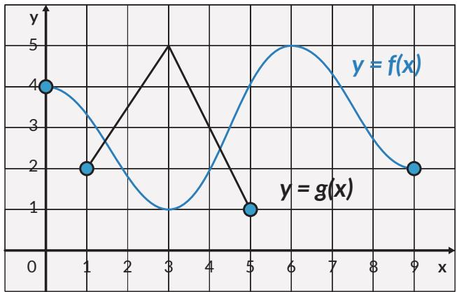
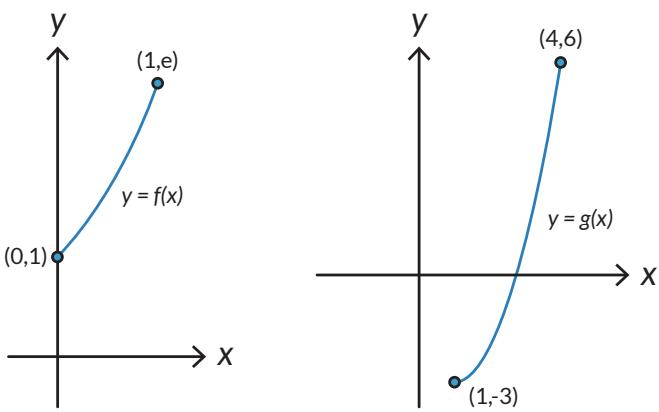

  
Gambar 1.22 Domain dan Range dari Fungsi Komposisi

## Masalah Kedua

Perhatikan kedua grafik di bawah ini. Misalkan, fungsi yang dinyatakan oleh grafik kiri adalah $f ( x )$ dan fungsi yang dinyatakan oleh grafik kanan adalah $g ( x )$ Apakah kedua fungsi dapat dikomposisikan menurut $( g \circ f ) ( x ) ?$ Jelaskan jawaban kalian!

  
Gambar 1.23 Grafik Dua Fungsi

## Syarat Komposisi Fungsi

Kedua masalah di atas memberikan pemahaman yang jelas syarat agar dua fungsi dapat dikomposisikan.

Dua fungsi $f$ dan g dapat dikomposisikan sebagai $f \circ g$ jika range dari g merupakan himpunan bagian dari domain $f .$ Ini merupakan syarat komposisi fungsi.

Pertanyaan menarik lainnya adalah “Apakah operasi komposisi fungsi memenuhi sifat komutatif dan asosiatif?”

## Eksplorasi 1.5

## Sifat Komutatif

## Masalah Pertama

Selidikilah apakah harga setelah diskon 25% yang dilanjutkan dengan diskon 20% sama dengan harga setelah diskon 20% yang dilanjutkan dengan diskon 25%. Apakah berlaku sifat komutatif dalam komposisi fungsi ini?

## Masalah Kedua

Selidikilah apakah harga setelah diskon 25% yang dilanjutkan dengan potongan Rp15.000,00 sama dengan harga setelah kena potongan Rp15.000,00 yang dilanjutkan dengan diskon 25%. Apakah berlaku sifat komutatif dalam komposisi fungsi ini?

## Masalah Ketiga

Perhatikan tiga fungsi di bawah ini, yaitu f, g dan $h$

$$
\begin{array} { r } { f ( x ) = 2 x + 1 , g ( x ) = x ^ { 2 } + 4 \mathrm { d a n } h \left( x \right) = \frac { 1 } { \left( x + 1 \right) } } \end{array}
$$

Tentukan domain dan range dari masing-masing fungsi!

• Dengan informasi tentang domain dan range dari masing-masing fungsi, selidikilah apakah komposisi-komposisi di bawah ini merupakan fungsi:

$$
g _ { } \circ  { f , f } \circ  { g , f } \circ  { h , h } \circ  { f , g } \circ  { h , h } \circ  { g } !
$$

• Mari cek apakah komposisi-komposisi di atas bersifat komutatif!

$$
\mathrm { a } . \quad g \circ f = f \circ g \ ?
$$

$$
\mathrm { b } . \quad f \circ h = h \circ f ?
$$

$$
\mathsf { c . } \quad g \circ h = h \circ g ?
$$

Berdasarkan Eksplorasi 1.5 ternyata komposisi fungsi secara umum tidak memenuhi sifat komutatif.

## Sifat Asosiatif

Eksplorasi dilakukan untuk mengecek apakah operasi komposisi fungsi memenuhi sifat asosiatif.

Perhatikan kembali tiga fungsi di bawah ini, yaitu $f , g$ dan h:

$$
\begin{array} { r } { f ( x ) = 2 x + 1 , g ( x ) = x ^ { 2 } + 4 \mathrm { ~ d a n ~ } h \left( x \right) = \frac { 1 } { \left( x + 1 \right) } } \end{array}
$$

1. Selidikilah apakah operasi asosiatif secara umum berlaku untuk komposisi fungsi, dengan kata lain cek apakah persamaan-persamaan berikut benar:

$\begin{array} { r } { \left( f \left( h \circ g \right) \right) ( x ) = ( ( f \circ h ) \circ g ) ( x ) ? } \end{array}$

$\begin{array} { r } { \left( h \left( f \circ g \right) \right) ( x ) = ( ( h \circ f ) \circ g ) ( x ) ? } \end{array}$

$\left( g \left( f \circ h \right) \right) ( x ) = ( ( g \circ f ) \circ h ) ( x ) ?$

2. Pikirkan konfigurasi komposisi lain yang mungkin dari ketiga fungsi di atas. Cek apakah sifat asosiatif masih terpenuhi.

Berdasarkan Eksplorasi 1.5 ternyata komposisi fungsi memenuhi sifat asosiatif.

Komposisi dua fungsi injektif dan dua fungsi surjektif

Untuk memahami fungi injektif dan fungsi surjektif lihat halaman 32 dan 33.

## Ayo Bekerja Sama

Misalkan $g : A  B$ dan $f : B \to C$ merupakan dua fungsi injektif. Apakah fungsi komposisi $f \circ g \mathrm { j u g a }$ bersifat injektif? Berikan alasanmu!

Misalkan $g : A  B$ dan $f : B \to C$ merupakan dua fungsi surjektif. Apakah fungsi komposisi $f \circ g$ juga bersifat surjektif? Berikan alasanmu!

## Latihan 1.4

1. Jika $\textstyle f ( x ) = { \frac { 1 } { x } }$ dan $g \left( x \right) = 2 x + 1$ , tentukan

a. $( f \circ g ) ( x )$

b. $\left( f \circ g \right) ( 3 ) \mathrm { d a n } \left( f \circ g \right) ( - 3 )$

c. $f ( a ) \mathrm { j i k a } ( f \circ g ) ( a ) = - 1 .$

2. Jika $\textstyle f ( x ) = { \frac { 1 } { ( 2 x + 1 ) } }$ dan $g ( x ) \ = \ 2 x ^ { 2 } \ + \ 1$ , tentukan

a. $( f \circ g ) \ ( x )$

b. $( g \circ f ) \ ( x )$