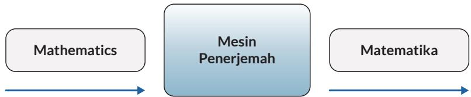

c. domain dan range dari $( f \circ g ) \ ( x )$

d. domain dan range dari $( g \circ f ) \ ( x )$

3. Jika $f ( x ) = 6 x ~ - ~ 5$ dan $g ( x ) \ = \ a x \ + \ b$ , tentukan a dan b sehingga $( f \circ g ) ( x ) = ( g \circ f ) ( x )$

4. Hasil dari $\left( f \circ g \right) ( x ) = \left( 2 x ~ + ~ 3 \right) ^ { 3 }$ sedangkan $f \left( x \right) = x ^ { 3 }$ tentukan g(x).

5. Lengkapi tabel di bawah ini.

<table><tr><td rowspan=1 colspan=1>x</td><td rowspan=1 colspan=1>f(x)</td></tr><tr><td rowspan=1 colspan=1>-2</td><td rowspan=1 colspan=1>-1</td></tr><tr><td rowspan=1 colspan=1>-1</td><td rowspan=1 colspan=1></td></tr><tr><td rowspan=1 colspan=1>0</td><td rowspan=1 colspan=1>1</td></tr><tr><td rowspan=1 colspan=1>1</td><td rowspan=1 colspan=1></td></tr><tr><td rowspan=1 colspan=1>2</td><td rowspan=1 colspan=1>3</td></tr></table>

<table><tr><td rowspan=1 colspan=1>f(x)</td><td rowspan=1 colspan=1> $g ( f ( x ) )$ </td></tr><tr><td rowspan=1 colspan=1>-1</td><td rowspan=1 colspan=1>0,5</td></tr><tr><td rowspan=1 colspan=1>0</td><td rowspan=1 colspan=1>1</td></tr><tr><td rowspan=1 colspan=1>1</td><td rowspan=1 colspan=1>2</td></tr><tr><td rowspan=1 colspan=1>2</td><td rowspan=1 colspan=1></td></tr><tr><td rowspan=1 colspan=1>3</td><td rowspan=1 colspan=1></td></tr></table>

<table><tr><td rowspan=1 colspan=1>x</td><td rowspan=1 colspan=1> $g ( f ( x ) )$ </td></tr><tr><td rowspan=1 colspan=1>-2</td><td rowspan=1 colspan=1></td></tr><tr><td rowspan=1 colspan=1>-1</td><td rowspan=1 colspan=1></td></tr><tr><td rowspan=1 colspan=1>0</td><td rowspan=1 colspan=1></td></tr><tr><td rowspan=1 colspan=1>1</td><td rowspan=1 colspan=1></td></tr><tr><td rowspan=1 colspan=1>2</td><td rowspan=1 colspan=1></td></tr></table>

6. Jika f (3) = 7, g (3) = 6, $f \left( 6 \right) = 1 3$ $g \left( 6 \right) = 1 2 ,$ tentukan $\left( f \circ g \right) \ ( 3 )$

7. Jumlah kertas yang diperlukan untuk mencetak x eksemplar modul matematika dinyatakan dalam fungsi $k ( x ) = 2 5 0 ( x + 1 )$ lembar. Biaya pencetakan yang diperlukan untuk k lembar adalah $b ( k ) = 4 0 0 k + 2 0 . 0 0 0$ (dalam rupiah). Jika pengeluaran hari ini untuk mencetak x eksemplar modul adalah Rp10.120.000,00 tentukan banyak eksemplar modul yang dicetak.

8. Suatu pabrik memberikan ketentuan mengenai jumlah produksi dan jenisnya. Produksi telepon genggam berbasis android adalah dua kali produksi telepon genggam berbasis bukan android sedangkan produksi laptop adalah tiga kali produksi telepon genggam berbasis android.

a. Gunakan mesin fungsi untuk menyatakan fungsinya.

b. Jika diproduksi 2.000 telepon genggam tidak berbasis android, berapa banyak laptop yang dihasilkan? Selesaikan dengan mesin fungsi.

9. Anton membeli sebuah meja belajar dari sebuah toko. Ada banyak pilihan meja dengan harga-harga yang bervariasi. Meja-meja tersebut berukuran besar. Karena ukuran mobil Anton kecil, maka Anton memutuskan untuk menyewa jasa antar dari toko tersebut. Setelah berdiskusi dengan pihak toko, maka total biaya yang harus dibayar adalah harga meja belajar, pajak pembelian, dan biaya angkut. Pajak pembelian sebesar 7,5% harga meja. Biaya angkut sebesar Rp20.000,00.

a. Tuliskan fungsi t(x) sebagai total harga meja yang mencakup harga meja dan pajak, dengan x adalah harga satu meja.

b. Tuliskan juga fungsi f(x) sebagai total biaya yang mencakup harga meja dan biaya angkut.

c. Tuliskan kedua komposisi fungsi berikut $( f \circ t ) ( x )$ dan $( t \circ f ) ( x )$ . Manakah dari kedua fungsi yang memberikan biaya yang lebih kecil untuk setiap harga meja?

d. Peraturan daerah di tempat Anton tinggal tidak melegalkan pengenaan pajak pada biaya angkut. Komposisi fungsi yang mana dari bagian c yang sejalan dengan perda ini?

## C. Fungsi Invers

Kalian pasti sering menemukan bahasa Inggris dalam kehidupan sehari-hari, baik lewat film, berita, cerita ataupun lagu. Kalian memahami artinya dengan menerjemahkan ke dalam bahasa Indonesia.

  
Gambar 1.24 Mesin Penerjemahan Bahasa

Dapatkah kalian menerjemahkan nama mata pelajaran (sebaliknya) dari bahasa Indonesia ke dalam dalam bahasa Inggris?

• Apakah proses kebalikan dapat kalian terapkan juga untuk semua relasi?

Berdasarkan Gambar 1.24, dapat diamati bahwa dengan membalikkan arah panah, untuk setiap mata pelajaran dalam bahasa Indonesia (keluaran), kalian bisa mencari kata yang mempunyai arti yang sama dalam bahasa Inggris (masukan). Prosedur ini membentuk suatu relasi kebalikan (invers) antara anggota-anggota keluaran dan masukan. Apakah relasi kebalikan ini berlaku juga pada fungsi? Apakah relasi kebalikan membentuk sebuah fungsi yang dikenal dengan fungsi invers? Pertanyaan ini akan bisa kalian jawab dengan memahami terlebih dahulu fungsi injektif, surjektif, dan bijektif.

## 1. Fungsi Injektif, Surjektif, dan Bijektif

Perhatikan kembali Gambar 1.9 dan 1.11. Pada grafik 1.9 ketika waktu = 6 detik dan 7 detik pelari memiliki kecepatan yang sama, yaitu 12 m/det. Pada grafik 1.11 terlihat bahwa jumlah bahan bakar berbeda menghasilkan jarak tempuh berbeda.

Gambar 1.25 di bawah ini menunjukkan jenis relasi yang berbeda. Menurut kalian, relasi mana dalam Gambar 1.25 yang menunjukkan grafik 1.9 dan grafik 1.11? Berdasarkan jenis relasinya, fungsi dibagi menjadi tiga jenis:

  
Gambar 1.25 Fungsi Injektif, Fungsi Surjektif, dan Fungsi Bijektif

## Ayo Berkomunikasi

Jelaskan pengertian fungsi injektif, fungsi surjektif, dan fungsi bijektif dengan kata-katamu sendiri.

## Ayo Berpikir Kritis

Setujukah kalian dengan pendapat bahwa fungsi kuadrat dan fungsi eksponensial merupakan fungsi bijektif? Jelaskan alasannya.

Pertanyaan di atas dapat kalian jawab dengan menggunakan definisi fungsi yang telah dipelajari dan dengan mengkaji domain dan range.