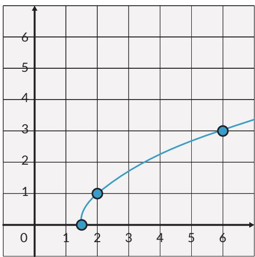

## Eksplorasi

Masalah berikut ini akan membantu kalian memahami syarat sebuah fungsi untuk memiliki invers.

Sebuah mobil melaju di jalan raya. Kecepatan tiap menit diukur dan dicatat dalam tabel di bawah ini:

Tabel 1.3 Kecepatan Mobil Terhadap Waktu
<table><tr><td rowspan=1 colspan=1>Waktu (menit)(x)</td><td rowspan=1 colspan=1>Kecepatan Mobil (m/menit)(y)</td></tr><tr><td rowspan=1 colspan=1>1</td><td rowspan=1 colspan=1>100</td></tr><tr><td rowspan=1 colspan=1>2</td><td rowspan=1 colspan=1>180</td></tr><tr><td rowspan=1 colspan=1>3</td><td rowspan=1 colspan=1>193</td></tr><tr><td rowspan=1 colspan=1>4</td><td rowspan=1 colspan=1>185</td></tr><tr><td rowspan=1 colspan=1>5</td><td rowspan=1 colspan=1>180</td></tr><tr><td rowspan=1 colspan=1>6</td><td rowspan=1 colspan=1>165</td></tr><tr><td rowspan=1 colspan=1>7</td><td rowspan=1 colspan=1>175</td></tr><tr><td rowspan=1 colspan=1>8</td><td rowspan=1 colspan=1>186</td></tr><tr><td rowspan=1 colspan=1>9</td><td rowspan=1 colspan=1>190</td></tr><tr><td rowspan=1 colspan=1>10</td><td rowspan=1 colspan=1>166</td></tr></table>

Dari data pada Tabel 1.3, jawablah pertanyaan berikut:

1. Apakah data waktu dan kecepatan membentuk relasi? Jika ya, apakah relasi itu adalah fungsi?

2. Plot data dengan sumbu x adalah waktu dan sumbu sumbu y adalah kecepatan.

3. Sekarang, kalian tentukan invers relasi dari pertanyaan 1.

4. Dari definisi fungsi yang kalian pelajari, apakah invers relasi pada pertanyaan (3) adalah fungsi? Jelaskan alasanmu.

5. Apabila pada menit ke-5 kecepatan diubah menjadi 182 m/menit, apakah relasi antara waktu dan kecepatan merupakan relasi surjektif dan injektif?

6. Dengan perubahan ini, apakah invers relasi adalah fungsi? Jika ya, apakah fungsi injektif dan surjektif (bijektif)?

Misalkan, f dan g adalah fungsi. Jika $( f \circ g ) ( x ) = x$ dan $( g \circ f ) ( x ) = x$ maka g adalah fungsi invers dari f dan f adalah fungsi invers dari g.

## Ayo Berpikir Kritis

Setujukah kalian bahwa konversi satuan merupakan fungsi yang mempunyai invers? Jelaskan jawaban kalian.

Berikan satu contoh konversi satuan, tentukan juga domain dan range-nya.

## Eksplorasi

Kalian akan menyelidiki invers dari komposisi fungsi.

Sebuah toko mainan memberikan potongan harga berupa diskon 20% dan dilanjutkan dengan potongan harga Rp10.000,00. Jawablah pertanyaan-pertanyaan berikut!

1. Jika $f : A  B$ dipahami sebagai fungsi harga setelah diskon 20%, dimana A adalah domain harga asal, dan B adalah kodomain dengan anggota harga setelah diskon. Maka tuliskan persamaan matematis untuk fungsi ini.

2. Jika $g : B  C$ sebagai fungsi potongan harga Rp10.000,00 setelah diskon 20%, dengan $C$ adalah kodomain dengan anggota harga akhir. Maka tuliskan persamaan matematis untuk fungsi ini.

3. Apakah benar harga akhir dapat diperoleh dengan cukup menggunakan fungsi $( g \circ f ) ( x ) ?$ Jelaskan alasanmu.

4. Apakah bedanya fungsi komposisi $( g \circ f ) ( x )$ dan $( f \circ g ) ( x ) ?$

5. Misal fungsi $( g \circ f ) ( x )$ memiliki invers. Jika diketahui harga akhir mainan, coba tuliskan fungsi yang dapat digunakan untuk memperoleh harga asal (gunakan fungsi invers dari g dan f lalu komposisikan).

6. Gunakan fungsi dari nomor 5, untuk mengetahui harga asal mainan jika diketahui harga akhir sebesar Rp30.000,00.

7.

## Ayo Berpikir Kritis

Apakah benar secara umum, jika $( g \circ f ) ( x )$ memiliki invers maka $\left( g \circ f \right) ^ { - 1 } \left( x \right) =$ $( f ^ { - 1 } \circ g ^ { - 1 } ) ( x ) ?$

## Latihan

1. Gambarkan fungsi-fungsi di bawah ini dan tentukan apakah fungsi-fungsi tersebut mempunyai fungsi invers. Jelaskan alasanmu. a. $f \left( x \right) = x ^ { 2 }$ b. $f ( x ) = 2 ^ { x }$ c. $f \left( x \right) = { \sqrt { 2 x } }$

2. Tentukan fungsi invers (jika ada) dari fungsi-fungsi di bawah ini, juga domain dan range-nya. a. $f \left( x \right) = x ^ { 3 }$ b. $f \left( x \right) = - 3 x + 1$ c. $f \left( x \right) = { \sqrt { x - 3 } }$ d. $\textstyle f \left( x \right) = { \frac { x + 4 } { 2 x - 5 } }$

3. Berikut ini adalah grafik dari fungsi $g \left( x \right) = \sqrt { 2 x - 3 }$

a. Gambarkan grafik dari invers fungsi g(x) dengan pencerminan terhadap $y = x$

b. Temukan persamaan matematis untuk fungsi invers $g ^ { - 1 } ( x )$