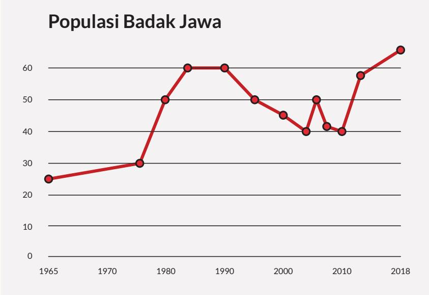

c. Plotlah dengan menggunakan beberapa titik fungsi invers $g ^ { - 1 } ( x )$

d. Bandingkan apakah grafik yang diperoleh sama dengan grafik pada bagian (a).

4. Diketahui $f \left( x \right) = 2 x + b$ dan $f ( f ( x ) ) = 4 x + 6$ . Tentukan nilai b dan $f ^ { - 1 } ( x )$

5. Populasi badak Jawa terhadap waktu diberikan pada grafik di bawah ini.

  
Sumber: www.ourworldindata.org (2021)

Apakah grafik ini menunjukkan fungsi bijektif atau surjektif? Jelaskan.

## Refleksi

1. Apakah saya sudah dapat membedakan fungsi dengan bukan fungsi dengan beberapa cara?

2. Bagaimana saya menentukan domain, kodomain, dan range dari suatu fungsi?

3. Bagaimana saya menentukan dua fungsi atau lebih dapat dikomposisi?

4. Apakah saya dapat membedakan fungsi injektif, fungsi surjektif, dan fungsi bijektif?

5. Bagaimana saya dapat menentukan suatu fungsi dapat mempunyai invers?

## Uji Kompetensi

1. Hubungan antara keuntungan yang diperoleh dengan harga barang yang dijual diberikan sebagai $U \left( x \right) = - 7 5 x ^ { 2 } + 3 0 0 x - 1 4 0$ , di mana x adalah harga barang dalam kelipatan Rp10.000,00.

a. Apakah $U ( x )$ merupakan suatu fungsi? Jelaskan.

b. Jika U(x) merupakan suatu fungsi, tentukan domain dan range-nya.

c. Jika diinginkan keuntungan tertentu dapatkah diketahui harga barang?

d. Jika $U ( x )$ merupakan suatu fungsi, apakah fungsi ini mempunyai invers? Jelaskan.

2. Berikan satu contoh situasi nyata yang bisa diberikan dalam fungsi di mana fungsi tersebut mempunyai invers.

3. Berikan satu contoh situasi nyata yang mana suatu fungsi tersebut tidak mempunyai invers.

4. Berikan satu contoh situasi nyata yang bisa diberikan dalam komposisi fungsi.

5. Perhatikan diagram panah di bawah ini.

Apakah fungsi $g ( x )$ mempunyai fungsi invers? Jelaskan.

6. Perhatikan percakapan di bawah ini .

Anton : Suatu fungsi dapat dipastikan mempunyai fungsi invers atau tidak dengan menggunakan diagram panah.

Toni : Saya tidak setuju karena diagram panah tidak memberikan informasi lengkap.

Setujukah kamu dengan pendapat keduanya? Adakah pendapatmu yang diperlukan untuk melengkapi kedua pendapat tersebut?

7. Perhatikan kedua grafik di bawah ini.

a. Tentukan nilai $( f \circ g ) ( 2 )$

b. Tentukan nilai yang menyebabkan $( f \circ g ) ( x ) = 4$

c. Apakah $( f \circ g ) ( x )$ berupa fungsi linear atau kuadrat? Jelaskan.

d. Apakah (g ◦ f)(x) berupa fungsi linear atau kuadrat? Jelaskan.

e. Apa yang harus dilakukan dengan domain f(x) jika diinginkan f(x) mempunyai invers?