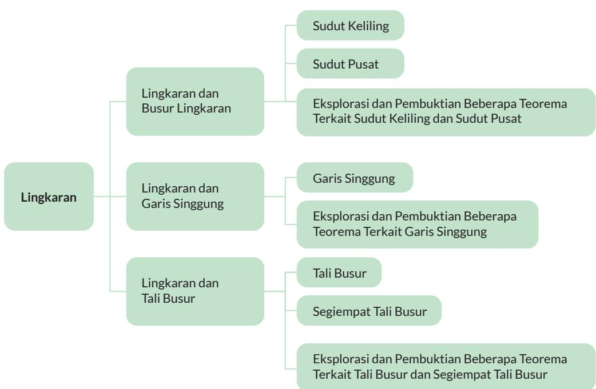
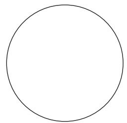

## Kata Kunci

Lingkaran, jari-jari, diameter, sudut pusat, sudut keliling, busur lingkaran, garis singgung, tali busur, segiempat tali busur, teorema Thales, teorema Ptolemeus

## Peta Konsep

## Ayo Mengingat Kembali

Gambarkan sebuah titik pada kertas, beri nama titik O. Ambil penggaris dan tandai sebuah titik yang berjarak 2 cm dari titik O (beri nama titik A). Tandai titik lain yang berjarak 2 cm dari titik O. Gambarkan 10 titik lain yang berjarak 2 cm dari titik O.

1. Jika semua (termasuk titik-titik lain yang belum kalian gambarkan) titik yang berjarak 2 cm dari titik O dihubungkan, bangun datar apa yang kalian dapatkan?

2. Titik O disebut apa untuk bangun datar tersebut?

3. Jarak 2 cm itu disebut apa bagi bangun datar tersebut?

Lingkaran adalah tempat kedudukan titik-titik yang jaraknya sama dari suatu titik tertentu (disebut pusat lingkaran). Jarak yang sama itu disebut jari-jari.

Ruas garis yang menghubungkan pusat lingkaran dengan salah satu titik pada lingkaran juga disebut jari-jari.

Daerah yang dibatasi oleh lingkaran disebut daerah lingkaran.

## A. Lingkaran dan Busur Lingkaran

  
Gambar 2.3 Mercusuar

Pada masa sebelum adanya GPS (Global Positioning System), mercusuar dibangun untuk menolong kapal bernavigasi sehingga tidak menabrak karang. Daerah yang diterangi oleh lampu mercusuar berbentuk daerah lingkaran. Kapal bernavigasi dengan memanfaatkan perhitungan sudut yang akurat sehingga dapat berlayar dengan aman.

Bagian dari lingkaran disebut busur lingkaran. Busur yang lebih kecil disebut busur minor (pada gambar berwarna biru) dan bagian yang lebih besar disebut busur mayor (berwarna merah).

Jika hanya disebutkan kata busur, maka yang dimaksud adalah busur minor.

Busur BC dituliskan $\widehat { B C }$ . Besarnya $\widehat { B C }$ ditentukan oleh besarnya $\angle B A C = \alpha$ (Titik A adalah pusat lingkaran).

Dalam matematika,

• Sudut α disebut sudut pusat yang menghadap pada $\widehat { B C }$

Sudut pusat adalah sudut yang titik sudutnya terletak pada pusat lingkaran dan kaki-kaki sudutnya adalah jari-jari lingkaran.

• Sudut θ disebut sudut keliling yang menghadap pada $\widehat { B C }$

Sudut keliling adalah sudut yang titik sudutnya terletak pada lingkaran dan kaki-kaki sudutnya berupa tali busur.

Apakah kalian ingat apa yang dimaksud tali busur? Tali busur adalah ruas garis yang menghubungkan dua titik pada lingkaran.