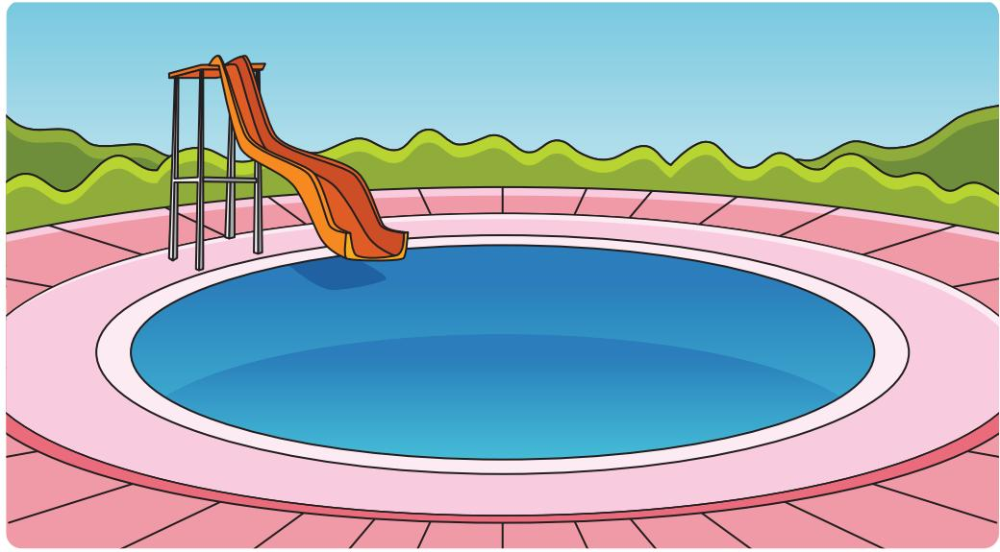
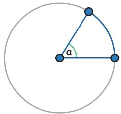
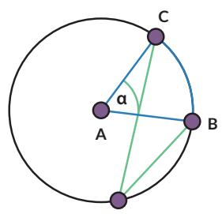

Ayo Bereksplorasi

Sebuah kolam berbentuk lingkaran. Pada salah satu bagian kolam ada perosotan. Pengelola ingin meletakkan lampu sehingga daerah perosotan selalu terang. Jika daerah yang ingin diterangi ditampilkan sebagai busur lingkaran berwarna biru. Busur lingkaran tersebut besarnya α.

Setiap lampu yang diproduksi oleh pabrik Q dapat menyinari daerah dengan jarak tertentu dan sudut penyinaran tertentu (β).

Jika semua lampu yang ada dalam gudang pengelola kolam dapat menyinari jarak yang dibutuhkan, bantulah pengelola taman memilih sudut penyinaran yang tepat.

1. Lampu taman dengan sudut penyinaran $3 0 ^ { \circ }$ diletakkan pada titik M dan dapat menerangi perosotan pada $\widehat { B C }$ Di mana saja pengelola dapat memasang lampu yang sama dan tetap menyinari perosotan pada $\widehat { B C } ?$

2. Jika lampu diletakkan di pusat kolam dan ingin menyorot $\widehat { B C }$ , apakah lampu dengan sudut penyinaran $3 0 ^ { \circ }$ dapat digunakan? Jika tidak, berapa sudut yang dibutuhkan?

3. Jika ukuran perosotan berubah $( \widehat { B C } )$ bagaimana pengaruhnya terhadap perubahan sudut penyinaran yang dibutuhkan?

<table><tr><td rowspan=1 colspan=1>α</td><td rowspan=1 colspan=1>θ</td></tr><tr><td rowspan=1 colspan=1></td><td rowspan=1 colspan=1></td></tr><tr><td rowspan=1 colspan=1></td><td rowspan=1 colspan=1></td></tr><tr><td rowspan=1 colspan=1></td><td rowspan=1 colspan=1></td></tr></table>

Kalian dapat melakukan Eksplorasi 2.1 dengan cara:

## Ayo Berteknologi

Jika tersedia, disarankan menggunakan aplikasi semacam GeoGebra atau Desmos. https://www.geogebra.org/m/cjdyK8UR#material/UT4sXfYW dan https://www.geogebra.org/m/cjdyK8UR#material/VGNfTTEu

## Ayo Bekerja Sama

Kalian dapat mengerjakannya secara berkelompok. Setiap siswa menyelidiki gambar yang berbeda. Setelah itu diskusikan hasilnya.

