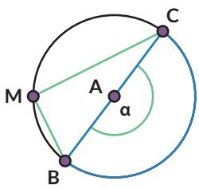
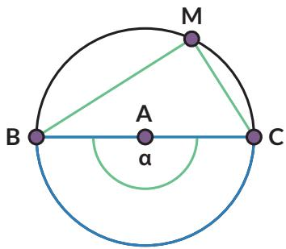
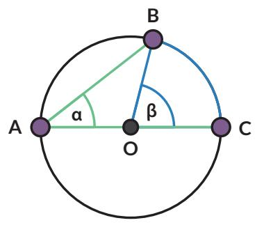

Temuan:

Sudut pusat besarnya kali sudut keliling yang menghadap ke busur lingkaran yang sama.

• Sudut keliling yang menghadap ke busur yang sama besarnya

• Sudut keliling yang menghadap ke diameter besarnya

## Pembuktian

Rani dan Nyoman juga ingin membuktikan hasil pengamatan mereka tentang hubungan sudut pusat dan sudut keliling pada lingkaran.

Nyoman mengusulkan bahwa ada empat kemungkinan.

  
Kasus 1

  
Kasus 2

• Kasus 1

Pertama-tama perhatikan kasus khusus saat $\overline { { A C } }$ melalui titik O.   
Ingat bahwa $\overline { { A C } }$ artinya ruas garis AC.

Bukti:

panjang ${ \overline { { O A } } } = { \mathrm { p a n j a n g } } { \overline { { O B } } }$

(jari-jari lingkaran) maka sama kaki.

$\angle O A B = \angle$

(karena $\triangle A O B$ sama kaki)

$\angle A O B =$ …..(1)

(jumlah sudut dalam $\triangle A O B$ adalah 180◦)

$\angle A O B =$ …..(2)

$( \angle A O B$ adalah pelurus $\angle B O C )$

$$
\beta =
$$

Gabungkan (1) dan (2) untuk membuktikan.

## Kasus 2

Sekarang perhatikan kasus yang lebih umum, saat $\overline { { A C } }$ tidak melalui pusat lingkaran. B

Tarik $\overline { { A D } }$ melalui titik $O ,$ membelah α menjadi $\alpha = \alpha _ { 1 } + \alpha _ { 2 }$

Dengan cara yang sama dengan

$$
\beta _ { 1 } = 2 \alpha _ { 1 }
$$

…… (1)

Kasus 1

Dengan cara serupa

$$
\beta _ { 2 } = 2 \alpha _ { 2 }
$$

…… (2)

Gunakan (1) dan (2)

$$
\begin{array} { c } { \beta = \beta _ { 1 } + \beta _ { 2 } } \\ { { { } } } \\ { { { } = \dots . . . . } } \end{array}
$$

• Kasus 3

akan kalian lakukan pada Latihan 2.1 no. 1.

• Kasus 4

Kasus 4 adalah kasus khusus untuk sudut keliling yang menghadap pada diameter lingkaran $( \angle A C B )$

Bukti:

1. Gambarkan jari-jari ${ \overline { { P C } } } .$ . Segitiga jenis apakah $\triangle A P C$ dan $\triangle B P C ?$ Bagaimana kalian tahu?

2. Nyatakan besarnya sudut-sudut yang sama pada $\triangle A P C$ sebagai $x ^ { \circ }$ dan besarnya sudut-sudut yang sama pada $\triangle B P C$ sebagai $y ^ { \circ }$ , tuliskan sudutsudut pada $\triangle A B C$ dalam $x ^ { \circ }$ dan $y ^ { \circ }$

a. $\angle A = . . .$ b. $\angle B = . . .$ c. $\angle C = \ldots$