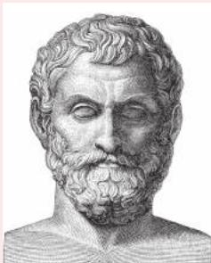
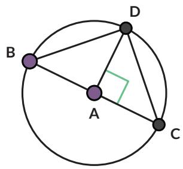
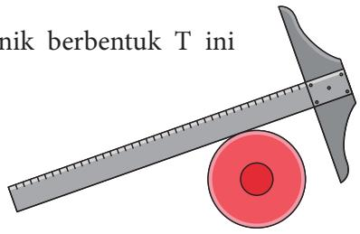

3. Apa yang kalian ketahui tentang sudut-sudut pada segitiga yang dapat digunakan untuk menentukan besarnya $\angle A C B ?$ $\angle A C B =$

## Tahukah Kamu?

Kasus 4 dikenal dengan nama Teorema Thales.

Thales adalah orang Yunani yang menjadi matematikawan, ahli astronomi, dan filsuf. Dalam Matematika, Thales adalah orang pertama yang menerapkan argumentasi deduktif dalam geometri. Dia adalah orang pertama yang namanya disematkan pada teorema.

## Teorema Thales:

Jika tiga titik A, B, C terletak pada lingkaran dan AB adalah diameter, maka $\angle A C B$ siku-siku.

  
sumber: en.wikipedia.org/Wilhelm Meyer (2021)

## Latihan

## 2.1

1. Ini adalah Kasus 3 dari bukti Eksplorasi 2.1.

a. Gambarkan sudut pusat yang menghadap ke busur yang sama dengan sudut keliling $\angle B A C$

b. Apakah pada lingkaran berikut juga berlaku bahwa sudut pusat besarnya dua kali lipat sudut keliling? Buktikan.

## Petunjuk

Buatlah diameter yang melalui titik A dan titik O.

2. Jika $\angle B O C = 9 0 ^ { \circ }$ , berapakah besar $\angle B E C 3$

3. Lingkaran A berjari-jari 2 satuan. Jika panjang ${ \overline { { B C } } } = 2 ,$ tentukan besar $\angle B D C$

4. $\overline { { A B } }$ adalah diameter pada lingkaran berikut. Jari-jari lingkaran 8,5 cm dan panjang $\overline { { A C } } = 8$ cm. Tentukan:

a. besar $\angle A C B$

b. panjang $\overline { { A B } }$

c. panjang $\overline { { B C } }$

5. Apa yang salah pada gambar berikut?

6. Lingkaran A berjari-jari 2 cm. Tentukan:

a. besar $\angle B D C$   
b. jika $\angle C A D = 9 0 ^ { \circ }$ , tentukan besar $\angle A C D$   
c. panjang CD

## Ayo Berpikir Kreatif

Jelaskan cara memanfaatkan alat gambar teknik berbentuk T ini untuk menentukan letak titik pusat piring.

8.

## Ayo Berpikir Kritis

Pada gambar berikut, titik P dan titik Q adalah mercusuar. Daerah dengan karang berbahaya telah dipetakan dan lingkaran menyatakan daerah berbahaya tersebut. Kapal diharapkan tidak memasuki daerah lingkaran untuk menghindari kemungkinan kandas.