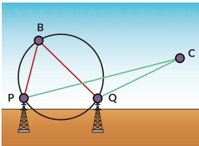
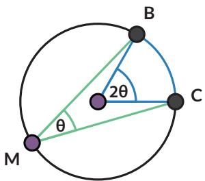

Pelajari sudut yang dibentuk antara cahaya dari kedua mercusuar $( \angle P C Q )$ jika kapal berada di luar lingkaran/pada lingkaran/di dalam lingkaran. Menurutmu, informasi apa yang perlu diketahui kapten kapal tentang lokasi ini untuk memastikan kapalnya tidak kandas?

## Rangkuman

Sifat-sifat sudut pada lingkaran:

1. Sudut keliling yang menghadap pada busur yang sama, besarnya sama.

2. Sudut pusat besarnya dua kali sudut keliling yang menghadap pada busur yang sama.

3. Sudut keliling yang menghadap pada diameter lingkaran, adalah sudut siku-siku.

1. Apakah saya memahami hubungan sudut keliling dan busur lingkaran?

2. Apakah saya memahami hubungan sudut keliling dan sudut pusat?

3. Apakah saya bisa mengerjakan soal-soal yang terkait dengan sudut keliling dan sudut pusat lingkaran?

## B. Lingkaran dan Garis Singgung

  
Gambar 2.4 Roda Kereta Api

Roda kereta api menyentuh rel kereta di satu titik. Secara matematis dikatakan bahwa rel adalah garis singgung roda dan titik sentuhnya disebut sebagai titik singgung.

## Eksplorasi 2.2

## Ayo Bereksplorasi

Dalam tugasnya, seorang navigator pada kapal laut perlu menghitung jarak pelabuhan yang berada pada cakrawala.

  
Gambar 2.5 Cakrawala

Titik biru mewakili posisi navigator pada kapal, titik oranye adalah pelabuhan yang tampak di cakrawala. Garis merah adalah jarak navigator ke permukaan air. Garis biru mewakili pandangan navigator ke pelabuhan, secara matematis merupakan garis singgung. Mari bereksplorasi menyelidiki sifat-sifat garis singgung.

1. Pelabuhan pertama kali terlihat sebagai sebuah titik di kejauhan. Garis singgung menyentuh lingkaran pada tepat satu titik (disebut titik singgung). Gunakan busur derajat untuk mengukur besar sudut yang dibentuk oleh garis singgung dan jari-jari lingkaran (pada titik singgung).

Sudut yang dibentuk oleh garis singgung dan jari-jari lingkaran pada titik singgung B besarnya

Bagaimana dengan garis singgung yang menyinggung di titik berbeda? Jika ada titik singgung lain, berapa besar sudut antara garis singgung dan jari-jari di titik singgung itu?

Kalian dapat menjawab pertanyaan ini dengan cara:

## Ayo Berteknologi

Jika tersedia, disarankan menggunakan aplikasi semacam GeoGebra atau Desmos.

https://www.geogebra.org/m/cjdyK8UR#material/ u6Ev7bHg

