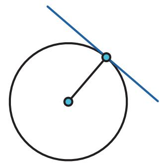

Kalian dapat mengerjakannya secara berkelompok. Setiap peserta didik menyelidiki gambar yang berbeda. Setelah itu diskusikan hasilnya.

a.  

c.  

d.  

e.  

f.  

Pada setiap titik singgung, sudut yang dibentuk oleh garis singgung dan jari-jari lingkaran di titik singgung itu besarnya

2. Pada sebuah titik pada lingkaran, gambarkan garis yang tidak membentuk sudut siku-siku dengan jari-jari lingkaran.

a. Garis tersebut memotong lingkaran di berapa titik?

b. Apakah garis tersebut merupakan garis singgung?

Garis sekan adalah garis yang memotong lingkaran pada dua titik.

3. Rani dan Nyoman mempelajari lebih lanjut tentang garis singgung lingkaran. Mereka menggambar garis singgung dari titik P ke lingkaran A.

Rani ingat teorema Thales, sehingga ia menduga ada sebuah lingkaran yang dapat digambarkan yang melalui titik A, B, dan P.

Tariklah ruas garis dari titik P ke setiap titik potong kedua lingkaran. Tentukan:

a. Garis PB merupakan garis singgung/garis sekan (pilih salah satu).

b. Garis PC merupakan garis singgung/garis sekan (pilih salah satu).

4. Tentukan besar sudutnya.

a. $\angle A B P =$

b. $\angle A C P =$

c. Jelaskan alasannya.

5. Tunjukkan bahwa $\triangle A B P$ kongruen dengan $\triangle A C P$

Akibatnya:

a. Panjang $\overline { { P B } }$ panjang $\overline { { P C } }$

b. $\angle A P B$ dan $\angle A P C$ besarnya

Dari sebuah titik di luar lingkaran dapat dibuat sebanyak \_ \_ buah garis singgung yang panjangnya

Yang dimaksud panjang garis singgung adalah panjang ruas garis PB atau ruas garis $P C$

6. Jika navigator tersebut mengetahui jari-jari bumi, dan ketinggiannya dari permukaan air (berdasarkan ukuran kapal), bagaimana cara dia menentukan jarak kapal dengan pelabuhan yang tampak di cakrawala?

## Latihan

2.2

1. Jika jari-jari lingkaran A adalah 7 cm dan titik P berjarak 25 cm dari titik A, berapakah panjang garis singgung $\overline { { P B } } ?$

2. Pada gambar berikut, $\overline { { B D } }$ dan $\overline { { C D } }$ adalah garis singgung lingkaran A. Jika $\angle B A C = 1 4 7 ^ { \circ }$ , tentukan besar $\angle B D C$

3.

## Ayo Berpikir Kreatif

Bram, seorang navigator kapal laut, tahu bahwa jari-jari lingkaran bumi panjangnya 6.371 km. Ruang kemudi kapal berada pada ketinggian 40 m dari permukaan laut. Tentukan jarak cakrawala yang dapat Bram lihat.

