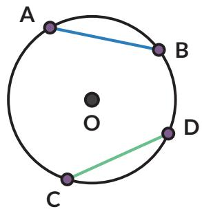
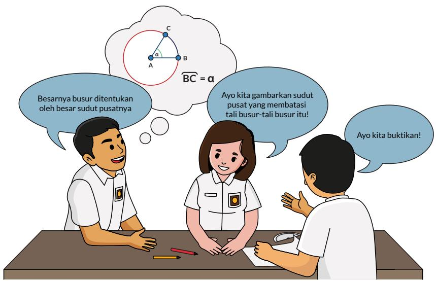
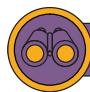

## Tahukah Kamu?

Garis singgung dapat digunakan untuk menentukan bagian bumi yang akan mengalami gerhana matahari.

  
Gambar 2.6 Gerhana Matahari Sumber: sciencedirect.com (2020)

## Rangkuman

1. Garis singgung berpotongan dengan lingkaran di satu titik.

2. Titik potong lingkaran dengan garis singgung disebut titik singgung.

3. Garis singgung dan jari-jari lingkaran di titik singgung berpotongan tegak lurus.

4. Dari satu titik di luar lingkaran, dapat dibentuk dua garis singgung yang sama panjang.

## Ayo Berefleksi

1. Apakah saya dapat menggambar garis singgung?

2. Apakah saya dapat menentukan panjang garis singgung?

3. Apakah saya paham sifat-sifat garis singgung?

## C. Lingkaran dan Tali Busur

  
Gambar 2.7 Busur Panah

Busur panah merupakan bagian dari lingkaran dan talinya menghubungkan dua titik pada lingkaran. Dalam matematika, ruas garis yang menghubungkan dua titik pada lingkaran disebut tali busur.

2.3

## Ayo Bereksplorasi

1. Tali busur $\overline { { A B } }$ sama panjang dengan tali busur $\overline { { C D } }$ Ingat bahwa busur $A B$ dituliskan $\widehat { A B }$ . Besarnya $\overbrace { A B }$ ditentukan oleh besarnya $\angle A O B = \alpha$ (Titik O adalah pusat lingkaran).

Apakah besarnya $\widehat { A B }$ dan $\widehat { C D }$ sama?

Ayo Berpikir Kreatif

2. Jika AB dan CD adalah dua tali busur yang sama panjang, gambarkan $\triangle O A B$ dan $\triangle O C D$ . Apakah $\triangle O A B$ dan $\triangle O C D$ kongruen? Bagaimana kalian tahu?

3. Berdasarkan no. 2, bagaimana besar $\angle A O B$ dan $\angle C O D ?$

4. Gunakan no. 3 untuk membuktikan temuanmu pada no. 1.

## Eksplorasi 2.4

## Ayo Bereksplorasi

Suatu hari seorang siswi SMA kelas XI, Sondang, dengan gembira mengatakan kepada Nyoman dan Rani bahwa dia menemukan suatu teorema baru ketika sedang bereksplorasi dengan lingkaran. Sondang menemukan jika dia mengambil segitiga siku-siku (sudut siku-sikunya menghadap pada diameter lingkaran) dan mencerminkan segitiga ini pada diameter lingkaran, maka segiempat yang dihasilkan memiliki sifat yang menarik, yaitu jumlah sudut yang berhadapan selalu sama dengan 180°.

1. Apakah penemuan Sondang itu benar atau hanya kebetulan berlaku untuk kasus itu saja?

2. Bagaimana kalau diagonal segiempat tidak harus merupakan diameter lingkaran? Apakah sifat itu masih berlaku?

Coba kalian bereksplorasi dan membuat kesimpulan dari hasil eksplorasi kalian!

1. Gambarkan sebuah lingkaran dan segitiga siku-siku yang sisi miringnya adalah diameter lingkaran. Cerminkan segitiga siku-siku itu pada diameter lingkaran. Perhatikan segiempat yang terbentuk. Apakah keempat titik sudutnya terletak pada lingkaran? Jelaskan.

2. Untuk masing-masing titik sudut, tentukan sudut tersebut menghadap ke busur yang mana.

a.

b.

c.

d.