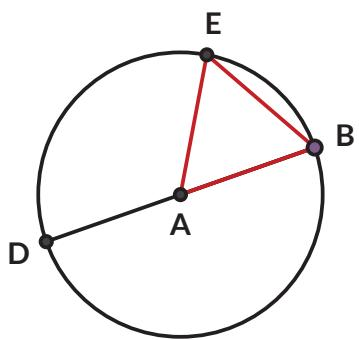
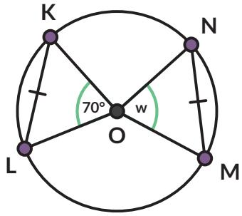

3. Jumlahkan sudut-sudut yang berhadapan.

a.

b.

4. Bagaimana jika segiempat itu bukan merupakan penggabungan segitiga sikusiku dan pencerminannya? Apakah sifat yang sama masih berlaku?

a. Ulangi langkah 2 dan 3 jika keempat titik sudutnya terletak pada lingkaran.

b. Ulangi langkah 2 dan 3 jika salah satu titik sudutnya tidak terletak pada lingkaran.

Segiempat yang keempat sisinya merupakan tali busur sebuah lingkaran disebut segiempat tali busur. Pada segiempat tali busur, sudut-sudut yang berhadapan jumlahnya

5. Kalian telah menemukan sifat sudut-sudut pada segiempat tali busur. Adakah sifat segiempat tali busur yang terkait panjang ruas garisnya? Perhatikan segiempat tali busur ABCD berikut.

a. Gambarkan titik P pada BD sehingga $\angle A C B = \angle D C P$ . Buktikan bahwa $\triangle C D P \sim \triangle C A B$

b. Tunjukkan bahwa $D P \cdot A C = A B \cdot C D$

c. Tunjukkan bahwa $\triangle A C D \sim \triangle B C P$

d. Tunjukkan bahwa $B P \cdot A C = B C \cdot D A$

e. Berdasarkan poin b dan d, apa yang dapat kalian simpulkan tentang $A C \cdot B D ?$

Hasil yang kalian dapatkan ini dikenal sebagai Teorema Ptolemeus.

## Latihan 2.3

1. Lingkaran yang berpusat di titik O dan jari-jarinya 5 cm. Berapa panjang tali busurnya yang paling panjang?

2. Jika $A D = 3$ cm dan $B E = A D$ , tentukan:

a. besar $\angle B A E$

b. besar $\angle B D E$

## 3. Apotema

Apotema adalah ruas garis dari pusat lingkaran dan tegak lurus tali busur. Buktikan bahwa $B D = D C$

4. Tentukan nilai w sehingga $\overline { { K L } }$ dan $\overline { { M N } }$ sama panjang.

Situs Gunung Padang adalah situs prasejarah megalitik besar yang terletak di Kabupaten Cianjur. Salah satu artefak yang ditemukan di sana diduga merupakan pecahan guci. Diskusikan dengan temanmu bagaimana cara menentukan diameter mulut guci tersebut.

6. Kincir air berikut digunakan untuk pembangkit energi dan irigasi. Pada diagram sebelah kanan, roda dengan diameter 10 m diletakkan pada sungai sehingga titik terendah roda terletak pada kedalaman 1 m.

a. Tentukan ketinggian titik A dari permukaan air.

b. Permukaan air ditunjukkan oleh tali busur $\overline { { D E } }$ . Tentukan besar $\angle D A E$

c. Tentukan jarak dua titik pada roda yang terletak di permukaan air.

7. Sinar garis r dan s adalah garis singgung pada lingkaran $Q .$ Jika sudut antara r dan s adalah $8 0 ^ { \circ }$ , tentukan besarnya sudut x.

