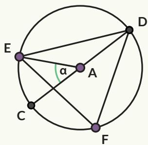
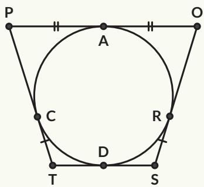
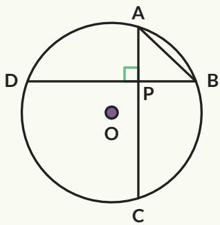

8. BD dan $\overline { { C D } }$ adalah garis singgung pada lingkaran A.

a. Apakah segiempat ABCD merupakan segiempat tali busur? Buktikan.

b. Jika segiempat ABCD merupakan segiempat tali busur, di manakah pusat lingkaran luar segiempat ABCD?

9. Segiempat ABCD adalah persegi panjang yang semua titik sudutnya terletak pada lingkaran.

a. Apakah ABCD merupakan segiempat tali busur? Buktikan.

b. Jika kalian menerapkan Teorema Ptolemeus pada segiempat ABCD, apakah yang kalian dapatkan?

c. Apakah nama teorema tersebut?

10.

## Ayo Berpikir Kreatif

Goras ingin menyajikan pizza yang dibelinya di atas piring. Sayangnya, piring yang tersedia diameternya lebih kecil daripada diameter pizza. Ia memotong pizzanya dengan cara tertentu, mengambil sebagian, lalu menyusun sisa pizza sehingga terlihat sebagai pizza utuh.

a. Ambillah selembar kertas berbentuk lingkaran. Cobalah melakukan hal yang dikerjakan Goras.

b. Apakah pizza kedua sama dengan pizza awal? Jelaskan.

## Rangkuman

Pada segiempat tali busur berlaku:

1. Sudut-sudut yang berhadapan saling berpelurus.

2. Hasil kali diagonal sama besarnya dengan jumlah dari hasil kali sisi yang berhadapan.

## Refleksi

1. Apakah saya dapat menerapkan teorema-teorema tentang lingkaran?

2. Apakah saya dapat membuktikan teorema-teorema terkait lingkaran?

3. Apakah saya mengerti sifat-sifat garis singgung?

4. Apakah saya mengerti sifat-sifat segiempat tali busur?

## Uji Kompetensi

1. Jika $\alpha = 4 8 ^ { \circ }$ , tentukan besarnya

a. $\angle C D E$

c. $\angle D A E$

b. $\angle D E A$

d. $\angle D F E$

2. Segiempat POST keempat sisinya menyinggung lingkaran. Jika panjang $\overline { { T S } } = 1 2$ cm dan panjang ${ \overline { { P C } } } = 1 4 { \mathrm { c m } }$ , tentukan keliling POST.

3. Pada lingkaran A yang berjari-jari 5 cm terdapat tali busur $\overline { { B C } }$ sepanjang 8 cm. Tentukan panjang apotemanya.

4. Dua tali busur, $\overline { { A C } }$ dan BD pada lingkaran dengan pusat O, berpotongan tegak lurus pada titik P. Panjang AB sama dengan jari-jari lingkaran.

a. Berapa besar $\widehat { A B } \ ?$

b. Apa nilai perbandingan ${ \frac { D C } { A B } } { \mathrm { i } }$ ? Jelaskan bagaimana kamu mendapatkan jawabannya.

5. Berapa panjang dari tali busur AC? a. $\textstyle { \frac { 1 6 { \sqrt { 1 7 } } } { 1 7 } }$ c. $\sqrt { 3 2 }$ b. $\sqrt { 6 8 }$ d. $\frac { \sqrt { 3 2 } } { 6 8 }$

