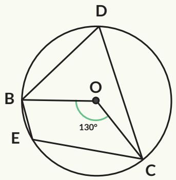

6. Segiempat BDCE adalah segiempat tali busur, O adalah titik pusat lingkaran, dan besar $\angle B O C = 1 3 0 ^ { \circ }$ . Tentukan besar $\angle B E C$

## Pengayaan

Gambar 2.8 menunjukkan segitiga sama sisi. Titik P terletak pada lingkaran luar segitiga ABC. Titik P dihubungkan dengan setiap titik sudut segitiga ABC.

Jika AP lebih panjang daripada $B P$ dan $C P ,$ buktikan bahwa:

$$
A P = B P + C P
$$

  
Gambar 2.8 Segitiga Sama Sisi ABC

Sifat ini pertama kali ditemukan oleh matematikawan Belanda bernama Frans van Schooten, karena itu disebut sebagai Teorema van Schooten.