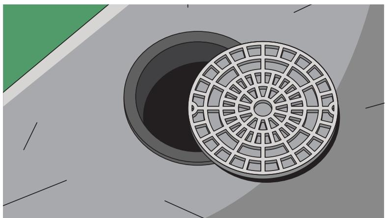

  
Gambar 2.1 Sepeda dengan Berbagai Bentuk Roda

## Ayo Berpikir Kritis

Roda sepeda umumnya berbentuk lingkaran. Pernahkah kalian bertanya kenapa? Apa yang terjadi jika roda sepeda tidak berbentuk lingkaran?

  
Gambar 2.2 Penutup Lubang Selokan