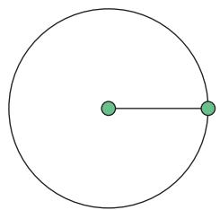

Lubang untuk memeriksa selokan (lihat Gambar 2.2) umumnya berbentuk lingkaran. Bagaimana kaitan bentuk lingkaran dengan keselamatan pekerja yang sedang berada di dalam? Apa yang terjadi jika tutup lubang bentuknya bangun datar yang berbeda? Bagaimana jika tutupnya berbentuk persegi? Bagaimana jika persegi panjang?

## Tahukah Kamu?

Pythagoras adalah matematikawan yang hidup pada abad keenam Sebelum Masehi. Para pengikutnya membentuk sebuah sekte tertutup yang disebut Pythagoreans. Pengikut sekte ini menganggap lingkaran sebagai bangun yang sempurna.

Archimedes adalah matematikawan Yunani kuno yang hidup pada abad ketiga Sebelum Masehi. Menurut legenda, Archimedes sedang berkonsentrasi penuh mempelajari lingkaran (yang digambarkan pada pasir di hadapannya) saat kota tempat tinggalnya dikalahkan dalam perang. Pasukan lawan (yang ditugaskan membawa Archimedes pada pemimpin mereka) menanyakan identitasnya. Archimedes (yang konsentrasinya terganggu oleh kehadiran mereka) menjawab dengan gusar, “Jangan ganggu lingkaran saya!” Kalimat tersebut disebut sebagai kata-kata terakhir Archimedes.

Pada bab ini kalian akan mempelajari tentang lingkaran dan teorema-teorema yang berhubungan dengan lingkaran. Kalian juga akan menerapkan teorema-teorema itu untuk menyelesaikan masalah yang terkait dengan lingkaran.

## Pertanyaan pemantik

• Mengapa roda sepeda berbentuk lingkaran?

• Apa saja sifat-sifat lingkaran?

• Apakah semua lingkaran sebangun?

• Bangun datar yang seperti apa yang semua titik sudutnya terletak pada lingkaran?

## Kata Kunci

Lingkaran, jari-jari, diameter, sudut pusat, sudut keliling, busur lingkaran, garis singgung, tali busur, segiempat tali busur, teorema Thales, teorema Ptolemeus

## Peta Konsep

## Ayo Mengingat Kembali

Gambarkan sebuah titik pada kertas, beri nama titik O. Ambil penggaris dan tandai sebuah titik yang berjarak 2 cm dari titik O (beri nama titik A). Tandai titik lain yang berjarak 2 cm dari titik O. Gambarkan 10 titik lain yang berjarak 2 cm dari titik O.

1. Jika semua (termasuk titik-titik lain yang belum kalian gambarkan) titik yang berjarak 2 cm dari titik O dihubungkan, bangun datar apa yang kalian dapatkan?

2. Titik O disebut apa untuk bangun datar tersebut?

3. Jarak 2 cm itu disebut apa bagi bangun datar tersebut?

Lingkaran adalah tempat kedudukan titik-titik yang jaraknya sama dari suatu titik tertentu (disebut pusat lingkaran). Jarak yang sama itu disebut jari-jari.

Ruas garis yang menghubungkan pusat lingkaran dengan salah satu titik pada lingkaran juga disebut jari-jari.

Daerah yang dibatasi oleh lingkaran disebut daerah lingkaran.

## A. Lingkaran dan Busur Lingkaran

  
Gambar 2.3 Mercusuar

Pada masa sebelum adanya GPS (Global Positioning System), mercusuar dibangun untuk menolong kapal bernavigasi sehingga tidak menabrak karang. Daerah yang diterangi oleh lampu mercusuar berbentuk daerah lingkaran. Kapal bernavigasi dengan memanfaatkan perhitungan sudut yang akurat sehingga dapat berlayar dengan aman.