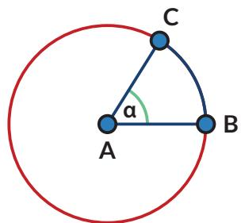
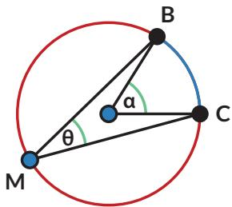

Bagian dari lingkaran disebut busur lingkaran. Busur yang lebih kecil disebut busur minor (pada gambar berwarna biru) dan bagian yang lebih besar disebut busur mayor (berwarna merah).

Jika hanya disebutkan kata busur, maka yang dimaksud adalah busur minor.

Busur BC dituliskan $\widehat { B C }$ . Besarnya $\widehat { B C }$ ditentukan oleh besarnya $\angle B A C = \alpha$ (Titik A adalah pusat lingkaran).

Dalam matematika,

• Sudut α disebut sudut pusat yang menghadap pada $\widehat { B C }$

Sudut pusat adalah sudut yang titik sudutnya terletak pada pusat lingkaran dan kaki-kaki sudutnya adalah jari-jari lingkaran.

• Sudut θ disebut sudut keliling yang menghadap pada $\widehat { B C }$

Sudut keliling adalah sudut yang titik sudutnya terletak pada lingkaran dan kaki-kaki sudutnya berupa tali busur.

Apakah kalian ingat apa yang dimaksud tali busur? Tali busur adalah ruas garis yang menghubungkan dua titik pada lingkaran.

Ayo Bereksplorasi

Sebuah kolam berbentuk lingkaran. Pada salah satu bagian kolam ada perosotan. Pengelola ingin meletakkan lampu sehingga daerah perosotan selalu terang. Jika daerah yang ingin diterangi ditampilkan sebagai busur lingkaran berwarna biru. Busur lingkaran tersebut besarnya α.

Setiap lampu yang diproduksi oleh pabrik Q dapat menyinari daerah dengan jarak tertentu dan sudut penyinaran tertentu (β).

Jika semua lampu yang ada dalam gudang pengelola kolam dapat menyinari jarak yang dibutuhkan, bantulah pengelola taman memilih sudut penyinaran yang tepat.

1. Lampu taman dengan sudut penyinaran $3 0 ^ { \circ }$ diletakkan pada titik M dan dapat menerangi perosotan pada $\widehat { B C }$ Di mana saja pengelola dapat memasang lampu yang sama dan tetap menyinari perosotan pada $\widehat { B C } ?$

2. Jika lampu diletakkan di pusat kolam dan ingin menyorot $\widehat { B C }$ , apakah lampu dengan sudut penyinaran $3 0 ^ { \circ }$ dapat digunakan? Jika tidak, berapa sudut yang dibutuhkan?

3. Jika ukuran perosotan berubah $( \widehat { B C } )$ bagaimana pengaruhnya terhadap perubahan sudut penyinaran yang dibutuhkan?

<table><tr><td rowspan=1 colspan=1>α</td><td rowspan=1 colspan=1>θ</td></tr><tr><td rowspan=1 colspan=1></td><td rowspan=1 colspan=1></td></tr><tr><td rowspan=1 colspan=1></td><td rowspan=1 colspan=1></td></tr><tr><td rowspan=1 colspan=1></td><td rowspan=1 colspan=1></td></tr></table>