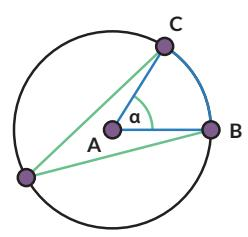
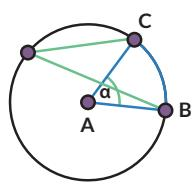
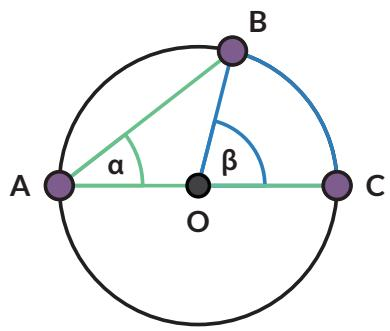

Kalian dapat melakukan Eksplorasi 2.1 dengan cara:

## Ayo Berteknologi

Jika tersedia, disarankan menggunakan aplikasi semacam GeoGebra atau Desmos. https://www.geogebra.org/m/cjdyK8UR#material/UT4sXfYW dan https://www.geogebra.org/m/cjdyK8UR#material/VGNfTTEu

## Ayo Bekerja Sama

Kalian dapat mengerjakannya secara berkelompok. Setiap siswa menyelidiki gambar yang berbeda. Setelah itu diskusikan hasilnya.

Temuan:

Sudut pusat besarnya kali sudut keliling yang menghadap ke busur lingkaran yang sama.

• Sudut keliling yang menghadap ke busur yang sama besarnya

• Sudut keliling yang menghadap ke diameter besarnya

## Pembuktian

Rani dan Nyoman juga ingin membuktikan hasil pengamatan mereka tentang hubungan sudut pusat dan sudut keliling pada lingkaran.

Nyoman mengusulkan bahwa ada empat kemungkinan.

  
Kasus 1

  
Kasus 2

• Kasus 1

Pertama-tama perhatikan kasus khusus saat $\overline { { A C } }$ melalui titik O.   
Ingat bahwa $\overline { { A C } }$ artinya ruas garis AC.

Bukti:

panjang ${ \overline { { O A } } } = { \mathrm { p a n j a n g } } { \overline { { O B } } }$

(jari-jari lingkaran) maka sama kaki.

$\angle O A B = \angle$

(karena $\triangle A O B$ sama kaki)

$\angle A O B =$ …..(1)

(jumlah sudut dalam $\triangle A O B$ adalah 180◦)

$\angle A O B =$ …..(2)

$( \angle A O B$ adalah pelurus $\angle B O C )$

$$
\beta =
$$

Gabungkan (1) dan (2) untuk membuktikan.