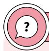
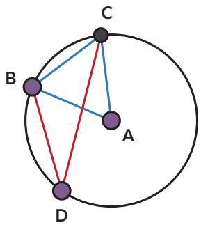
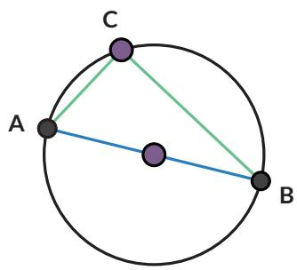

## Kasus 2

Sekarang perhatikan kasus yang lebih umum, saat $\overline { { A C } }$ tidak melalui pusat lingkaran. B

Tarik $\overline { { A D } }$ melalui titik $O ,$ membelah α menjadi $\alpha = \alpha _ { 1 } + \alpha _ { 2 }$

Dengan cara yang sama dengan

$$
\beta _ { 1 } = 2 \alpha _ { 1 }
$$

…… (1)

Kasus 1

Dengan cara serupa

$$
\beta _ { 2 } = 2 \alpha _ { 2 }
$$

…… (2)

Gunakan (1) dan (2)

$$
\begin{array} { c } { \beta = \beta _ { 1 } + \beta _ { 2 } } \\ { { { } } } \\ { { { } = \dots . . . . } } \end{array}
$$

• Kasus 3

akan kalian lakukan pada Latihan 2.1 no. 1.

• Kasus 4

Kasus 4 adalah kasus khusus untuk sudut keliling yang menghadap pada diameter lingkaran $( \angle A C B )$

Bukti:

1. Gambarkan jari-jari ${ \overline { { P C } } } .$ . Segitiga jenis apakah $\triangle A P C$ dan $\triangle B P C ?$ Bagaimana kalian tahu?

2. Nyatakan besarnya sudut-sudut yang sama pada $\triangle A P C$ sebagai $x ^ { \circ }$ dan besarnya sudut-sudut yang sama pada $\triangle B P C$ sebagai $y ^ { \circ }$ , tuliskan sudutsudut pada $\triangle A B C$ dalam $x ^ { \circ }$ dan $y ^ { \circ }$

a. $\angle A = . . .$ b. $\angle B = . . .$ c. $\angle C = \ldots$

3. Apa yang kalian ketahui tentang sudut-sudut pada segitiga yang dapat digunakan untuk menentukan besarnya $\angle A C B ?$ $\angle A C B =$

## Tahukah Kamu?

Kasus 4 dikenal dengan nama Teorema Thales.

Thales adalah orang Yunani yang menjadi matematikawan, ahli astronomi, dan filsuf. Dalam Matematika, Thales adalah orang pertama yang menerapkan argumentasi deduktif dalam geometri. Dia adalah orang pertama yang namanya disematkan pada teorema.

## Teorema Thales:

Jika tiga titik A, B, C terletak pada lingkaran dan AB adalah diameter, maka $\angle A C B$ siku-siku.

  
sumber: en.wikipedia.org/Wilhelm Meyer (2021)

## Latihan

## 2.1

1. Ini adalah Kasus 3 dari bukti Eksplorasi 2.1.

a. Gambarkan sudut pusat yang menghadap ke busur yang sama dengan sudut keliling $\angle B A C$

b. Apakah pada lingkaran berikut juga berlaku bahwa sudut pusat besarnya dua kali lipat sudut keliling? Buktikan.

## Petunjuk

Buatlah diameter yang melalui titik A dan titik O.

2. Jika $\angle B O C = 9 0 ^ { \circ }$ , berapakah besar $\angle B E C 3$

3. Lingkaran A berjari-jari 2 satuan. Jika panjang ${ \overline { { B C } } } = 2 ,$ tentukan besar $\angle B D C$

4. $\overline { { A B } }$ adalah diameter pada lingkaran berikut. Jari-jari lingkaran 8,5 cm dan panjang $\overline { { A C } } = 8$ cm. Tentukan:

a. besar $\angle A C B$

b. panjang $\overline { { A B } }$

c. panjang $\overline { { B C } }$