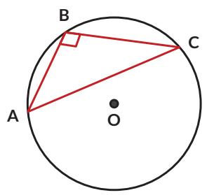
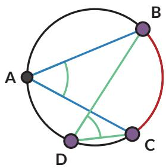
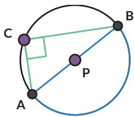

5. Apa yang salah pada gambar berikut?

6. Lingkaran A berjari-jari 2 cm. Tentukan:

a. besar $\angle B D C$   
b. jika $\angle C A D = 9 0 ^ { \circ }$ , tentukan besar $\angle A C D$   
c. panjang CD

## Ayo Berpikir Kreatif

Jelaskan cara memanfaatkan alat gambar teknik berbentuk T ini untuk menentukan letak titik pusat piring.

8.

## Ayo Berpikir Kritis

Pada gambar berikut, titik P dan titik Q adalah mercusuar. Daerah dengan karang berbahaya telah dipetakan dan lingkaran menyatakan daerah berbahaya tersebut. Kapal diharapkan tidak memasuki daerah lingkaran untuk menghindari kemungkinan kandas.

Pelajari sudut yang dibentuk antara cahaya dari kedua mercusuar $( \angle P C Q )$ jika kapal berada di luar lingkaran/pada lingkaran/di dalam lingkaran. Menurutmu, informasi apa yang perlu diketahui kapten kapal tentang lokasi ini untuk memastikan kapalnya tidak kandas?

## Rangkuman

Sifat-sifat sudut pada lingkaran:

1. Sudut keliling yang menghadap pada busur yang sama, besarnya sama.

2. Sudut pusat besarnya dua kali sudut keliling yang menghadap pada busur yang sama.

3. Sudut keliling yang menghadap pada diameter lingkaran, adalah sudut siku-siku.

1. Apakah saya memahami hubungan sudut keliling dan busur lingkaran?

2. Apakah saya memahami hubungan sudut keliling dan sudut pusat?

3. Apakah saya bisa mengerjakan soal-soal yang terkait dengan sudut keliling dan sudut pusat lingkaran?

## B. Lingkaran dan Garis Singgung

  
Gambar 2.4 Roda Kereta Api

Roda kereta api menyentuh rel kereta di satu titik. Secara matematis dikatakan bahwa rel adalah garis singgung roda dan titik sentuhnya disebut sebagai titik singgung.

## Eksplorasi 2.2

## Ayo Bereksplorasi

Dalam tugasnya, seorang navigator pada kapal laut perlu menghitung jarak pelabuhan yang berada pada cakrawala.

  
Gambar 2.5 Cakrawala

