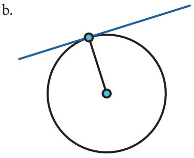
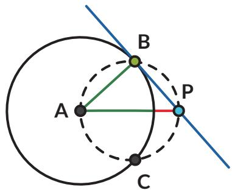

Titik biru mewakili posisi navigator pada kapal, titik oranye adalah pelabuhan yang tampak di cakrawala. Garis merah adalah jarak navigator ke permukaan air. Garis biru mewakili pandangan navigator ke pelabuhan, secara matematis merupakan garis singgung. Mari bereksplorasi menyelidiki sifat-sifat garis singgung.

1. Pelabuhan pertama kali terlihat sebagai sebuah titik di kejauhan. Garis singgung menyentuh lingkaran pada tepat satu titik (disebut titik singgung). Gunakan busur derajat untuk mengukur besar sudut yang dibentuk oleh garis singgung dan jari-jari lingkaran (pada titik singgung).

Sudut yang dibentuk oleh garis singgung dan jari-jari lingkaran pada titik singgung B besarnya

Bagaimana dengan garis singgung yang menyinggung di titik berbeda? Jika ada titik singgung lain, berapa besar sudut antara garis singgung dan jari-jari di titik singgung itu?

Kalian dapat menjawab pertanyaan ini dengan cara:

## Ayo Berteknologi

Jika tersedia, disarankan menggunakan aplikasi semacam GeoGebra atau Desmos.

https://www.geogebra.org/m/cjdyK8UR#material/ u6Ev7bHg

Kalian dapat mengerjakannya secara berkelompok. Setiap peserta didik menyelidiki gambar yang berbeda. Setelah itu diskusikan hasilnya.

a.  

c.  

d.  

e.  

f.  

Pada setiap titik singgung, sudut yang dibentuk oleh garis singgung dan jari-jari lingkaran di titik singgung itu besarnya

2. Pada sebuah titik pada lingkaran, gambarkan garis yang tidak membentuk sudut siku-siku dengan jari-jari lingkaran.

a. Garis tersebut memotong lingkaran di berapa titik?

b. Apakah garis tersebut merupakan garis singgung?

Garis sekan adalah garis yang memotong lingkaran pada dua titik.

3. Rani dan Nyoman mempelajari lebih lanjut tentang garis singgung lingkaran. Mereka menggambar garis singgung dari titik P ke lingkaran A.

Rani ingat teorema Thales, sehingga ia menduga ada sebuah lingkaran yang dapat digambarkan yang melalui titik A, B, dan P.

Tariklah ruas garis dari titik P ke setiap titik potong kedua lingkaran. Tentukan:

a. Garis PB merupakan garis singgung/garis sekan (pilih salah satu).

b. Garis PC merupakan garis singgung/garis sekan (pilih salah satu).

4. Tentukan besar sudutnya.

a. $\angle A B P =$

b. $\angle A C P =$

c. Jelaskan alasannya.

5. Tunjukkan bahwa $\triangle A B P$ kongruen dengan $\triangle A C P$

Akibatnya:

a. Panjang $\overline { { P B } }$ panjang $\overline { { P C } }$

b. $\angle A P B$ dan $\angle A P C$ besarnya

Dari sebuah titik di luar lingkaran dapat dibuat sebanyak \_ \_ buah garis singgung yang panjangnya

Yang dimaksud panjang garis singgung adalah panjang ruas garis PB atau ruas garis $P C$