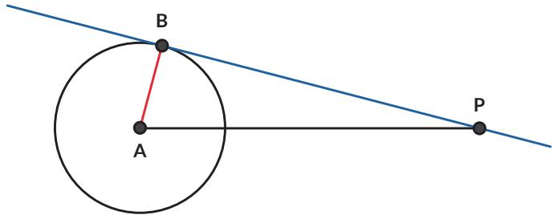
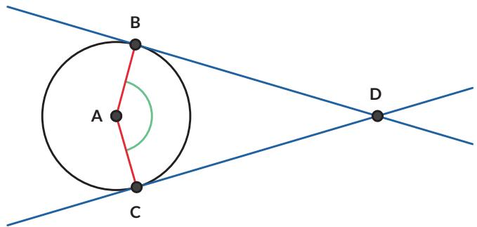
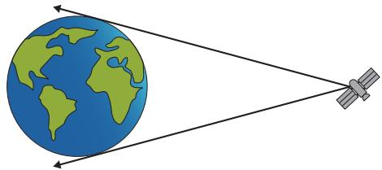

6. Jika navigator tersebut mengetahui jari-jari bumi, dan ketinggiannya dari permukaan air (berdasarkan ukuran kapal), bagaimana cara dia menentukan jarak kapal dengan pelabuhan yang tampak di cakrawala?

## Latihan

2.2

1. Jika jari-jari lingkaran A adalah 7 cm dan titik P berjarak 25 cm dari titik A, berapakah panjang garis singgung $\overline { { P B } } ?$

2. Pada gambar berikut, $\overline { { B D } }$ dan $\overline { { C D } }$ adalah garis singgung lingkaran A. Jika $\angle B A C = 1 4 7 ^ { \circ }$ , tentukan besar $\angle B D C$

3.

## Ayo Berpikir Kreatif

Bram, seorang navigator kapal laut, tahu bahwa jari-jari lingkaran bumi panjangnya 6.371 km. Ruang kemudi kapal berada pada ketinggian 40 m dari permukaan laut. Tentukan jarak cakrawala yang dapat Bram lihat.

Satelit komunikasi mengorbit bumi pada posisi yang tetap terhadap bumi (artinya jika dilihat dari bumi, satelit tersebut akan berada pada ketinggian dan bujur yang sama, meskipun bumi berputar dan mengelilingi matahari). Satelit Telkom-4 (Merah Putih) mengorbit bumi pada garis bujur 108◦ BT. Jika jari-jari bumi adalah 6.371 km dan satelit Telkom-4 terletak pada ketinggian 35.786 km dari permukaan bumi, apakah Satelit Telkom-4 dapat memancarkan sinyal ke seluruh wilayah Indonesia?

## 5. Garis singgung persekutuan luar

Garis singgung persekutuan adalah garis singgung yang merupakan garis singgung bagi dua lingkaran. CD merupakan garis singgung persekutuan luar untuk lingkaran A dan lingkaran B.

a. Lingkaran A dan lingkaran B memiliki dua buah garis singgung persekutuan luar. Gambarkan garis singgung persekutuan luar yang lain.

b. Tentukan panjang garis singgung persekutuan luar CD (s) jika jarak kedua pusat lingkaran (d) dan jari-jari masing-masing lingkaran diketahui (r dan R).

## Petunjuk

Gambarkan garis bantu sehingga kalian dapat memanfaatkan Teorema Pythagoras.

6. Rantai sepeda berfungsi untuk memindahkan daya penggerak dari pedal ke roda.

a. Tunjukkan garis singgung persekutuan luar pada gambar rantai sepeda tersebut.

b. Tentukan panjang garis singgung persekutuan luarnya jika jari-jari lingkaran yang lebih besar = 5 cm, jari-jari lingkaran yang lebih kecil = 3 cm, dan jarak antar kedua pusat lingkaran = 44 cm.

## 7. Garis singgung persekutuan dalam

Selain garis singgung persekutuan luar, ada juga garis singgung persekutuan dalam. $\overline { { E F } }$ merupakan garis singgung persekutuan dalam untuk lingkaran A dan lingkaran B.

a. Lingkaran A dan lingkaran B memiliki dua buah garis singgung persekutuan dalam. Gambarkan garis singgung persekutuan dalam yang lain.

b. Tentukan panjang garis singgung persekutuan dalam $\overline { { E F } } \left( g \right)$ jika jarak kedua pusat lingkaran (d ) dan jari-jari masing-masing lingkaran diketahui (r dan R ).

## Petunjuk

Gambarkan garis bantu sehingga kalian dapat memanfaatkan Teorema Pythagoras.