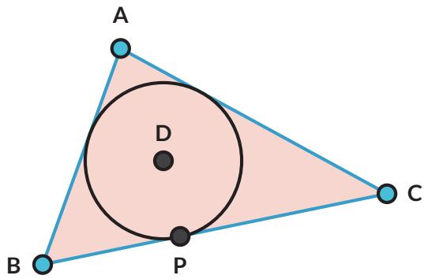
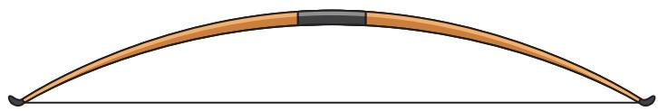

8. Dua buah lingkaran, pusatnya berjarak 5 cm. Jika kedua lingkaran tersebut masing-masing berjari-jari 1 cm dan 2 cm,

a. Gambarkan kedua lingkaran dengan ukuran sebenarnya, juga semua garis singgung persekutuan kedua lingkaran.

b. Tentukan panjang masing-masing garis singgung persekutuan.

c. Manakah yang lebih panjang: garis singgung persekutuan dalam atau garis singgung persekutuan luar?

9. AB, BC, dan $\overline { { A C } }$ adalah garis-garis singgung pada lingkaran $D$

a. Lingkaran D adalah lingkaran $\triangle A B C$

b. Buktikan: $A B + P C = A C + P B$

10.

## Ayo Berpikir Kritis

KL, LM, MN , dan $\overline { { N K } }$ adalah garis-garis singgung pada lingkaran O.   
Segiempat KLMN disebut segiempat garis singgung.

Buktikan: $L K + M N = L M + N K$

Latihan 2.2 nomor 9 dan 10 disebut Teorema Pitot.

## Tahukah Kamu?

Garis singgung dapat digunakan untuk menentukan bagian bumi yang akan mengalami gerhana matahari.

  
Gambar 2.6 Gerhana Matahari Sumber: sciencedirect.com (2020)

## Rangkuman

1. Garis singgung berpotongan dengan lingkaran di satu titik.

2. Titik potong lingkaran dengan garis singgung disebut titik singgung.

3. Garis singgung dan jari-jari lingkaran di titik singgung berpotongan tegak lurus.

4. Dari satu titik di luar lingkaran, dapat dibentuk dua garis singgung yang sama panjang.

## Ayo Berefleksi

1. Apakah saya dapat menggambar garis singgung?

2. Apakah saya dapat menentukan panjang garis singgung?

3. Apakah saya paham sifat-sifat garis singgung?

## C. Lingkaran dan Tali Busur

  
Gambar 2.7 Busur Panah

Busur panah merupakan bagian dari lingkaran dan talinya menghubungkan dua titik pada lingkaran. Dalam matematika, ruas garis yang menghubungkan dua titik pada lingkaran disebut tali busur.

2.3

## Ayo Bereksplorasi

1. Tali busur $\overline { { A B } }$ sama panjang dengan tali busur $\overline { { C D } }$ Ingat bahwa busur $A B$ dituliskan $\widehat { A B }$ . Besarnya $\overbrace { A B }$ ditentukan oleh besarnya $\angle A O B = \alpha$ (Titik O adalah pusat lingkaran).

Apakah besarnya $\widehat { A B }$ dan $\widehat { C D }$ sama?

Ayo Berpikir Kreatif

