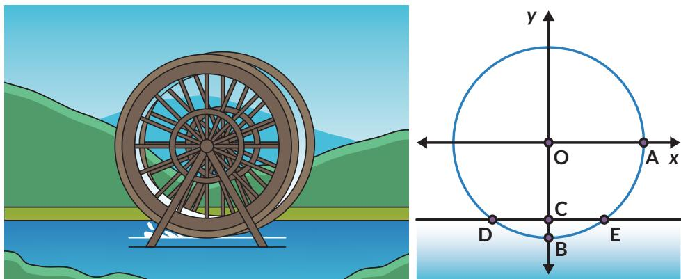
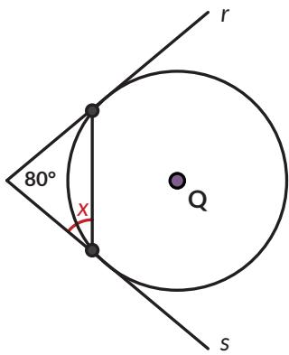
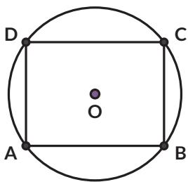

Situs Gunung Padang adalah situs prasejarah megalitik besar yang terletak di Kabupaten Cianjur. Salah satu artefak yang ditemukan di sana diduga merupakan pecahan guci. Diskusikan dengan temanmu bagaimana cara menentukan diameter mulut guci tersebut.

6. Kincir air berikut digunakan untuk pembangkit energi dan irigasi. Pada diagram sebelah kanan, roda dengan diameter 10 m diletakkan pada sungai sehingga titik terendah roda terletak pada kedalaman 1 m.

a. Tentukan ketinggian titik A dari permukaan air.

b. Permukaan air ditunjukkan oleh tali busur $\overline { { D E } }$ . Tentukan besar $\angle D A E$

c. Tentukan jarak dua titik pada roda yang terletak di permukaan air.

7. Sinar garis r dan s adalah garis singgung pada lingkaran $Q .$ Jika sudut antara r dan s adalah $8 0 ^ { \circ }$ , tentukan besarnya sudut x.

8. BD dan $\overline { { C D } }$ adalah garis singgung pada lingkaran A.

a. Apakah segiempat ABCD merupakan segiempat tali busur? Buktikan.

b. Jika segiempat ABCD merupakan segiempat tali busur, di manakah pusat lingkaran luar segiempat ABCD?

9. Segiempat ABCD adalah persegi panjang yang semua titik sudutnya terletak pada lingkaran.

a. Apakah ABCD merupakan segiempat tali busur? Buktikan.

b. Jika kalian menerapkan Teorema Ptolemeus pada segiempat ABCD, apakah yang kalian dapatkan?

c. Apakah nama teorema tersebut?

10.

## Ayo Berpikir Kreatif

Goras ingin menyajikan pizza yang dibelinya di atas piring. Sayangnya, piring yang tersedia diameternya lebih kecil daripada diameter pizza. Ia memotong pizzanya dengan cara tertentu, mengambil sebagian, lalu menyusun sisa pizza sehingga terlihat sebagai pizza utuh.

a. Ambillah selembar kertas berbentuk lingkaran. Cobalah melakukan hal yang dikerjakan Goras.

b. Apakah pizza kedua sama dengan pizza awal? Jelaskan.

## Rangkuman

Pada segiempat tali busur berlaku:

1. Sudut-sudut yang berhadapan saling berpelurus.

2. Hasil kali diagonal sama besarnya dengan jumlah dari hasil kali sisi yang berhadapan.

## Refleksi

1. Apakah saya dapat menerapkan teorema-teorema tentang lingkaran?

2. Apakah saya dapat membuktikan teorema-teorema terkait lingkaran?

3. Apakah saya mengerti sifat-sifat garis singgung?

4. Apakah saya mengerti sifat-sifat segiempat tali busur?

## Uji Kompetensi

1. Jika $\alpha = 4 8 ^ { \circ }$ , tentukan besarnya

a. $\angle C D E$

c. $\angle D A E$

b. $\angle D E A$

d. $\angle D F E$

2. Segiempat POST keempat sisinya menyinggung lingkaran. Jika panjang $\overline { { T S } } = 1 2$ cm dan panjang ${ \overline { { P C } } } = 1 4 { \mathrm { c m } }$ , tentukan keliling POST.

