# Komposisi Fungsi dan Fungsi Invers

## Tujuan Pembelajaran

Setelah mempelajari bab ini, diharapkan kalian dapat

1. Menjelaskan pengertian fungsi

2. Menentukan domain, kodomain, dan range dari suatu fungsi

3. Menjelaskan syarat dan aturan komposisi fungsi

4. Membuat komposisi fungsi yang terdiri atas dua atau lebih fungsi

5. Menggunakan konsep komposisi fungsi untuk menyelesaikan masalah

6. Menyelidiki sifat komutatif dan sifat asosiatif pada komposisi fungsi

7. Menjelaskan syarat dan aturan pembuatan fungsi invers

8. Menggunakan konsep fungsi invers untuk menyelesaikan masalah

## Pengantar Bab

Setiap dari kalian pasti pernah ke Stasiun Pengisian Bahan Bakar Umum (SPBU). Kalian pasti paham bahwa biaya yang dibayar untuk pembelian bahan bakar kendaraan bergantung pada jenis bahan bakar dan volumenya.

  
Gambar 1.1 Pembacaan Volume Bensin dan Harga yang Harus Dibayar Sumber: liputan6.com/Faizal Fanani (2018)

Bagaimana hubungan antara volume bahan bakar yang dibeli dan biaya yang dikeluarkan? Apakah penambahan volume bahan bakar berbanding lurus dengan biaya? Dapatkah relasi antara biaya dengan volume bahan bakar dituliskan sebagai $B = f ( V ) ? \qquad V$ menyatakan volume bahan bakar yang dibeli dan B merupakan biaya yang dibayar.

Grafik di bawah menunjukkan hubungan jarak tempuh suatu kendaraan terhadap penggunaan bahan bakar. Apakah penambahan penggunaan volume bahan bakar berbanding lurus dengan jarak tempuh kendaraan? Bagaimana menuliskan relasi antara keduanya?

  
Gambar 1.2 Grafik Jarak Tempuh terhadap Volume Bahan Bakar

Dapatkah kalian menyatakan semua volume bahan bakar yang dapat ditampung sebuah kendaraan sebagai suatu himpunan? Dapatkah kalian menyatakan semua jarak maksimal yang dapat ditempuh untuk setiap volume bahan bakar sebagai suatu himpunan? Konsep seperti ini akan kalian pelajari dalam topik domain, kodomain, dan range dari fungsi.

Jika kalian menggabungkan kedua informasi di atas, relasi baru apa yang kalian dapatkan? Hal ini yang akan dipelajari lebih mendalam dalam subbab komposisi fungsi. Kalian juga akan mempelajari operasi-operasi yang dapat diterapkan pada dua atau lebih fungsi.

Kembali ke relasi biaya terhadap pembelian bahan bakar, bagaimana kalian menentukan banyak bahan bakar yang dibeli jika kalian mempunyai sejumlah uang tertentu? Bagaimana kalian dapat menentukan jarak tempuh jika kendaraan kalian mempunyai volume bahan bakar tertentu? Hubungan timbal balik ini akan dipelajari dalam fungsi invers.

Secara umum, bab dimulai dengan pemahaman tentang pengertian fungsi termasuk di dalamnya domain, kodomain, dan range. Bagian kedua dari bab ini akan membahas tentang komposisi fungsi serta operasi-operasi fungsi yang lain yang sering digunakan dalam kehidupan sehari-hari. Di sini juga akan dibahas syarat yang harus dipenuhi untuk mengomposisikan dua atau lebih fungsi. Pada bagian akhir dari bab kalian akan mempelajari invers dari suatu fungsi beserta syarat dan sifat-sifatnya; termasuk di dalamnya invers dari komposisi fungsi.

## Pertanyaan Pemantik

• Apakah setiap relasi merupakan fungsi?

• Apa peran domain, kodomain, dan range dari sebuah fungsi?

• Bagaimana menerapkan operasi dan komposisi fungsi untuk memodelkan suatu keadaan atau masalah?

• Kapan fungsi invers dapat diperoleh?

• Bagaimana menggunakan fungsi invers untuk memodelkan suatu keadaan atau masalah?

## Kata Kunci

Fungsi, domain, kodomain, range, relasi, komposisi fungsi, fungsi invers

Peta Konsep  

## Ayo Mengingat Kembali

  
Gambar 1.3 Ronaldo dengan Nomor Punggung 7 Sumber: twitter.com/Manchester United (2021)

Relasi dapat dipahami dalam banyak hal di kehidupan sehari-hari. Konsep relasi menjelaskan hubungan antara anggota-anggota dari dua himpunan. Contohnya, setiap pemain bola di tim Manchester United memiliki nomor punggung masing-masing. Ronaldo memiliki nomor punggung 7.

Hubungan ini biasanya dijelaskan dalam bentuk himpunan pasangan berurutan, diagram panah, dan diagram Kartesius.

## A. Fungsi

Fungsi merupakan suatu relasi yang menghubungkan satu anggota dari suatu himpunan tepat ke satu anggota di himpunan yang lain. Fungsi adalah relasi yang lebih spesifik. Fungsi biasa dinyatakan dalam bentuk f(x) = y , di mana f merupakan fungsi, x merupakan variabel masukan (input) dan y adalah variabel keluaran (output). Kalian dapat memahami konsep ini dengan membayangkan fungsi sebagai mesin seperti pada gambar berikut:

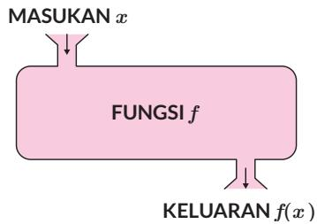  
Gambar 1.4 Analogi Fungsi Mesin

Jelaslah, kalian dapat simpulkan bahwa ada relasi yang merupakan fungsi dan ada yang bukan merupakan fungsi.

## 1. Fungsi dan Bukan Fungsi

Secara ilustratif, hubungan antara fungsi dan relasi dapat dipahami melalui Gambar 1.5 dan Gambar 1.6.

Pada bagian ini, kalian akan belajar menentukan relasi-relasi yang merupakan fungsi dan bukan merupakan fungsi. Relasi-relasi ini akan disajikan dalam bentuk diagram panah dan diagram Kartesius.

Perhatikan contoh ketiga diagram panah berikut. Ada yang menunjukkan relasi yang berupa fungsi dan ada yang menunjukkan bukan fungsi.

  
Gambar 1.5 Ada Relasi yang Bukan Fungsi

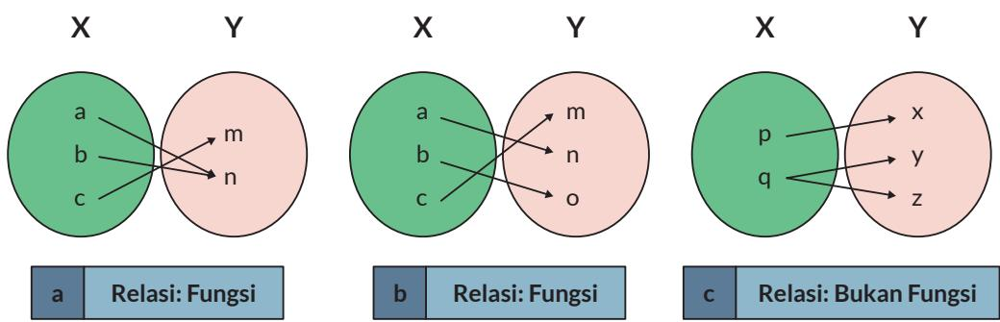  
Gambar 1.6 Relasi Merupakan Fungsi dan Bukan Fungsi

Relasi yang terdapat pada Gambar 1.6 (a) dan (b) merupakan fungsi karena relasi tersebut menghubungkan satu anggota himpunan input dengan tepat satu anggota himpunan output. Gambar 1.6 (c) merupakan contoh relasi yang bukan fungsi karena relasi tersebut menghubungkan satu anggota; “q” ke dua anggota berbeda “y” dan “z” .

a.  

## Ayo Berdiskusi

Diskusikan dalam kelompok, apakah kedua relasi dalam diagram Kartesius ini merupakan fungsi atau bukan fungsi.

Tuliskan juga pasangan berurutan dari setiap titik.

  
b.

  
Gambar 1.7 Relasi dalam Diagram Kartesius

Hubungan antara pemakaian bahan bakar dengan jarak tempuh dipengaruhi oleh beberapa hal seperti kepadatan lalu lintas, jalan mulus, dan jenis mobil. Pernahkah kalian memikirkan bahwa model fungsi sangat diperlukan untuk membuat hubungan antara pemakaian bahan bakar dengan jarak tempuh sebuah mobil?

Seperti yang kalian sudah ketahui, relasi sering juga ditampilkan dalam bentuk grafik. Kalian dapat menentukan apakah relasi semacam ini merupakan fungsi atau bukan dengan menggunakan Tes garis vertikal. Caranya yaitu cukup menggeser garis vertikal dari kiri ke kanan (atau sebaliknya) dan melewati grafik relasi. Apabila garis vertikal tersebut memotong grafik di dua atau lebih titik yang berbeda, maka relasi tersebut bukanlah fungsi.

## Gambar A

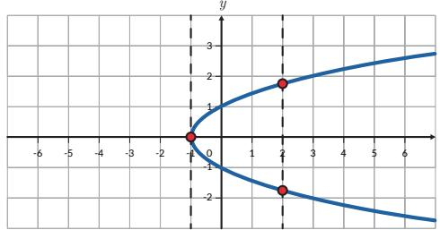

Gambar A menampilkan grafik dari relasi dengan persamaan $x = y ^ { 2 }$ . Dengan menggunakan Tes garis vertikal, dapat dilihat bahwa pada $x = 2$ garis vertikal memotong grafik pada dua titik yang berbeda. Relasi ini bukanlah suatu fungsi.

## Gambar B

  
Gambar 1.8 Penggunaan Tes Garis Vertikal untuk Menentukan Relasi

Gambar B menampilkan grafik dari relasi dengan persamaan $y = x ^ { 3 }$ Dengan menggunakan Tes garis vertikal, dapat dilihat bahwa untuk setiap nilai x, garis vertikal memotong grafik tepat pada satu titik. Relasi ini adalah suatu fungsi.

## Latihan

1. Apakah relasi-relasi di bawah ini merupakan fungsi? Jelaskan alasanmu.

a. Relasi antara jumlah penjualan HP Galaksi seri A terhadap waktu.

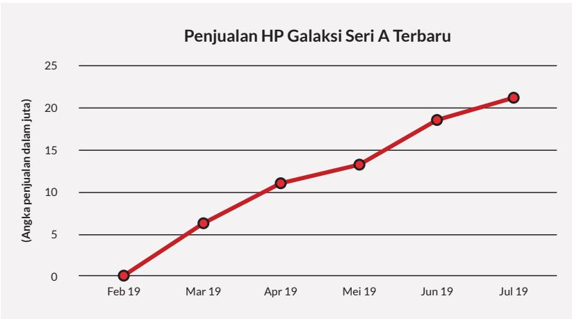

b. Relasi antara lama mengunggah video di YouTube terhadap waktu.

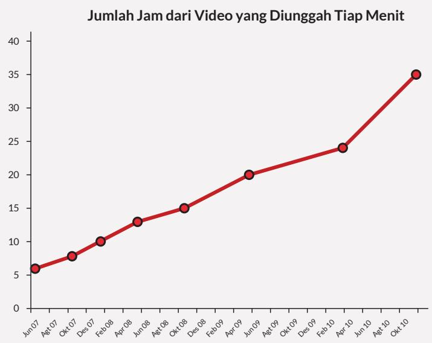  
Sumber: tubularinsights.com (2010)

2. Satuan energi adalah Joule dan kalori dengan 1 J = 2,4 kal. Apakah hubungan antara Joule dan kalori merupakan suatu fungsi? Jelaskan.

3. Berdasarkan data, pada tahun 2001 perusahaan A mampu menjual 9 laptop. Pada tahun 2002 dan 2003 perusahaan A mampu menjual masing-masing 27 dan 81 laptop. Apabila relasi antara tahun dan jumlah penjualan laptop membentuk fungsi eksponensial, berapa penjualan laptop pada tahun 2007?

4. Tentukan relasi mana dari grafik-grafik berikut yang merupakan fungsi (gunakan tes garis vertikal).

a.

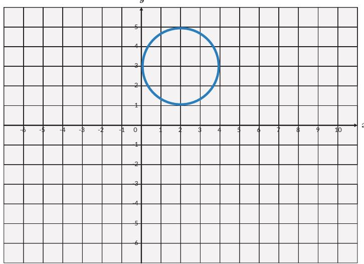

b.  
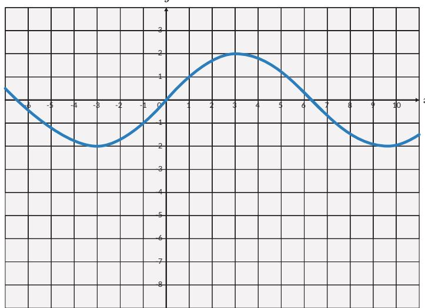

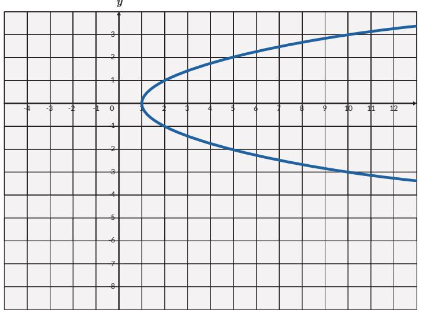

## Ayo Berkomunikasi

Relasi yang bukan fungsi dapat dibuat menjadi fungsi. Setujukah kalian dengan pendapat ini? Bagaimana kalian melakukan hal tersebut? Gunakan salah satu contoh soal dalam Latihan 1.1 no. 4 untuk mengubah relasi bukan fungsi menjadi fungsi.

## 2. Domain, Kodomain, dan Range

Eksplorasi 1.1 Domain, Kodomain, dan Range

Kalian sudah belajar domain, kodomain, dan range di SMP. Kalian memperdalam pemahaman ini dengan mengeksplorasi tiga masalah. Ketiga masalah tersebut dibuat berurutan agar kalian memperoleh pemahaman yang benar tentang domain, kodomain, dan range.

## Masalah Pertama

Data kecepatan seorang pelari jarak pendek (sprinter) setiap detik dicatat dan ditampilkan dalam grafik berikut:

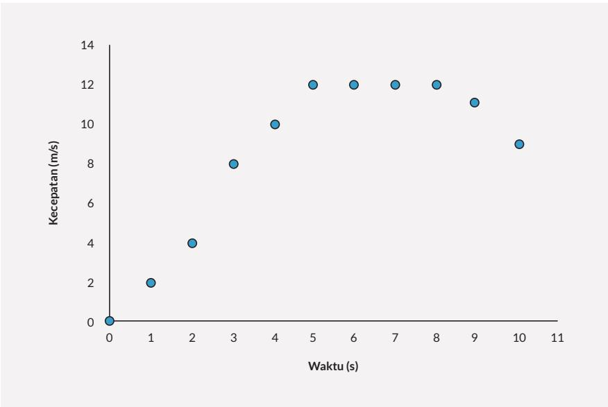  
Gambar 1.9 Grafik Kecepatan Pelari terhadap Waktu

## Pertanyaan

1. Buatlah tabel untuk grafik tersebut.

2. Nyatakan waktu (masukan) yang dicatat dalam notasi himpunan.

3. Nyatakan kecepatan (keluaran) yang dicatat dalam notasi himpunan.

## Masalah Kedua

  
Gambar 1.10 Mesin Memproses Tempe Menjadi Keripik Tempe

Sebuah pabrik pembuatan keripik tempe memiliki mesin yang beroperasi dengan mengubah 1 potong tempe bulat menjadi 6 keripik tempe. Pembuatan tempe dapat saja menghasilkan $\textstyle { \frac { 1 } { 2 } }$ potong keripik tempe atau bentuk pecahan lainnya. Menurut aturan, mesin membuang keripik yang tidak utuh ini (tidak lulus quality control) dan mengeluarkan keripik utuh. Mesin keripik tempe hanya beroperasi apabila ada minimal 200 potong tempe yang dimasukkan dan berhenti beroperasi apabila lebih dari 600 potong tempe dimasukkan. Asumsikan mesin produksi keripik tempe adalah sebagai fungsi linear, lengkapi tabel produksi tempe berikut:

Tabel 1.1 Jumlah Potongan Tempe dan Keripik Tempe
<table><tr><td rowspan=1 colspan=1>Jumlah Potong Tempe (Masukan)</td><td rowspan=1 colspan=1>Jumlah Keripik yang Dihasilkan (Keluaran)</td></tr><tr><td rowspan=1 colspan=1>200</td><td rowspan=1 colspan=1></td></tr><tr><td rowspan=1 colspan=1>200,25</td><td rowspan=1 colspan=1></td></tr><tr><td rowspan=1 colspan=1>500,75</td><td rowspan=1 colspan=1></td></tr><tr><td rowspan=1 colspan=1>…</td><td rowspan=1 colspan=1></td></tr><tr><td rowspan=1 colspan=1>600</td><td rowspan=1 colspan=1></td></tr><tr><td rowspan=1 colspan=1>601</td><td rowspan=1 colspan=1></td></tr></table>

1. Tuliskan notasi himpunan yang menyatakan masukan dari mesin fungsi keripik tempe. Himpunan ini disebut sebagai domain.

2. Tuliskan notasi yang menyatakan semua kemungkinan keripik tempe yang dihasilkan. Himpunan ini disebut sebagai kodomain.

3. Tuliskan notasi himpunan yang menyatakan keluaran dari mesin fungsi keripik tempe. Himpunan ini disebut sebagai range.

4. Berdasarkan pertanyaan 3 dan 4, jelaskan hubungan antara kodomain dan range.

Penjelasan lebih lanjut tentang domain dan range dapat juga kalian pahami melalui contoh grafik di bawah ini. Perhatikan hubungan antara penggunaan bahan bakar dengan jarak tempuh mobil “XY” pada jalan bebas hambatan yang diberikan oleh grafik.

  
Gambar 1.11 Jarak Tempuh Terhadap Jumlah Bahan Bakar

Jika x adalah jumlah bahan bakar dalam galon maka bahan bakar dapat dituliskan $0 ~ \leq ~ x ~ \leq ~ 9$ . Domain dari jumlah bahan bakar yang dinyatakan dalam himpunan adalah $\{ x \mid 0 \leq x \leq 9 , x \in \mathbb { R } \}$ , dengan $\mathbb { R }$ merupakan himpunan bilangan riil. Domain ini dapat juga dituliskan dalam bentuk [0,9].

Jarak tempuh dituliskan sebagai $0 ~ \leq ~ y ~ \leq ~ 2 5 0$ . Range dari jarak tempuh adalah $\{ y | 0 \le \ y \le 2 5 0 , \ y \in \mathbb { R } \}$ , dengan R merupakan himpunan bilangan bulat positif. Range dapat juga dituliskan dalam bentuk [0,250].

Jika diberikan grafik maka penentuan domain dan range dari suatu fungsi ditunjukkan masing-masing oleh nilai yang digunakan pada sumbu x dan sumbu y.

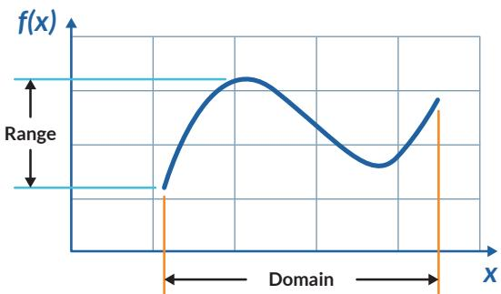  
Gambar 1.12 Domain dan Range dari Fungsi

## Ayo Berkomunikasi

Jelaskan pengertian domain dan range fungsi dengan menggunakan katakatamu sendiri.

Pengertian domain, kodomain, dan range dapat dilihat secara utuh dalam gambar di bawah ini.

  
Gambar 1.13 Domain, Kodomain, dan Range

## Ayo Berpikir Kritis

Kalian sudah memahami penggunaan domain, kodomain, dan range dalam kehidupan sehari-hari. Berikan contoh lain dalam kehidupan nyata yang membedakan pengertian kodomain dan range.

## Masalah Ketiga

Bagaimana menentukan domain, kodomain, dan range dari suatu fungsi jika diberikan dalam bentuk aljabar?

a. Perhatikan kedua grafik di bawah ini.

  
Gambar 1.14 Dua Fungsi Akar Berbeda  
Tuliskan domain dan range dari kedua grafik dalam notasi himpunan.

b.

## Ayo Berteknologi

Gunakan Microsoft Excel atau Geogebra untuk menggambar $\textstyle f \left( x \right) = { \frac { x ^ { 2 } - 1 } { x } }$ , dan tentukan domain dan range-nya.

## Latihan

1.

## Ayo Berteknologi

Gunakan Geogebra untuk menggambar fungsi-fungsi di bawah ini jika memungkinkan. Gambarkan dan tentukan domain dan range dari fungsi-fungsi berikut:   
a. $f \left( x \right) = x ^ { 2 } - 1$   
b. $\textstyle f ( x ) = { \frac { x + 1 } { 2 - x } }$   
c. $f \left( x \right) = \sqrt { x - 3 } + 4$

2. Tentukan domain dan range dari setiap fungsi di bawah ini.

a.

<table><tr><td rowspan=1 colspan=1></td><td rowspan=1 colspan=1></td><td rowspan=1 colspan=1></td><td rowspan=1 colspan=1></td><td rowspan=1 colspan=1></td><td rowspan=1 colspan=1></td><td rowspan=1 colspan=1></td><td rowspan=1 colspan=1></td><td rowspan=1 colspan=1></td><td rowspan=1 colspan=1></td><td rowspan=1 colspan=1></td><td rowspan=1 colspan=1></td><td rowspan=1 colspan=1></td><td rowspan=1 colspan=1></td><td rowspan=1 colspan=1></td><td rowspan=1 colspan=1></td></tr><tr><td rowspan=1 colspan=1></td><td rowspan=1 colspan=1></td><td rowspan=1 colspan=1></td><td rowspan=1 colspan=1></td><td rowspan=1 colspan=1></td><td rowspan=1 colspan=1></td><td rowspan=1 colspan=1></td><td rowspan=1 colspan=1></td><td rowspan=1 colspan=1></td><td rowspan=1 colspan=1></td><td rowspan=1 colspan=1></td><td rowspan=1 colspan=1></td><td rowspan=1 colspan=1></td><td rowspan=1 colspan=1></td><td rowspan=1 colspan=1></td><td rowspan=1 colspan=1></td></tr><tr><td rowspan=1 colspan=1></td><td rowspan=1 colspan=1></td><td rowspan=1 colspan=1></td><td rowspan=1 colspan=1></td><td rowspan=1 colspan=1></td><td rowspan=1 colspan=1></td><td rowspan=1 colspan=1></td><td rowspan=1 colspan=1></td><td rowspan=1 colspan=1></td><td rowspan=1 colspan=1></td><td rowspan=1 colspan=1></td><td rowspan=1 colspan=1></td><td rowspan=1 colspan=1></td><td rowspan=1 colspan=1></td><td rowspan=1 colspan=1></td><td rowspan=1 colspan=1></td></tr><tr><td rowspan=1 colspan=1></td><td rowspan=1 colspan=1></td><td rowspan=1 colspan=1></td><td rowspan=1 colspan=1></td><td rowspan=1 colspan=1></td><td rowspan=1 colspan=1></td><td rowspan=1 colspan=1></td><td rowspan=1 colspan=1></td><td rowspan=1 colspan=1></td><td rowspan=1 colspan=1></td><td rowspan=1 colspan=1></td><td rowspan=1 colspan=1></td><td rowspan=1 colspan=1></td><td rowspan=1 colspan=1></td><td rowspan=1 colspan=1></td><td rowspan=1 colspan=1></td></tr><tr><td rowspan=1 colspan=1></td><td rowspan=1 colspan=1></td><td rowspan=1 colspan=1></td><td rowspan=1 colspan=1></td><td rowspan=1 colspan=1></td><td rowspan=1 colspan=1></td><td rowspan=1 colspan=1></td><td rowspan=1 colspan=1></td><td rowspan=1 colspan=1></td><td rowspan=1 colspan=1></td><td rowspan=1 colspan=1></td><td rowspan=1 colspan=1></td><td rowspan=1 colspan=1></td><td rowspan=1 colspan=1></td><td rowspan=1 colspan=1></td><td rowspan=1 colspan=1></td></tr><tr><td rowspan=1 colspan=1></td><td rowspan=1 colspan=1></td><td rowspan=1 colspan=1></td><td rowspan=1 colspan=1></td><td rowspan=1 colspan=1></td><td rowspan=1 colspan=1></td><td rowspan=1 colspan=1></td><td rowspan=1 colspan=1></td><td rowspan=1 colspan=1></td><td rowspan=1 colspan=1></td><td rowspan=1 colspan=1></td><td rowspan=1 colspan=1></td><td rowspan=1 colspan=1></td><td rowspan=1 colspan=1></td><td rowspan=1 colspan=1></td><td rowspan=1 colspan=1></td></tr><tr><td rowspan=1 colspan=1></td><td rowspan=1 colspan=1>0</td><td rowspan=1 colspan=1>T</td><td rowspan=1 colspan=1></td><td rowspan=1 colspan=1></td><td rowspan=1 colspan=1></td><td rowspan=1 colspan=1></td><td rowspan=1 colspan=1></td><td rowspan=1 colspan=1></td><td rowspan=1 colspan=1>8</td><td rowspan=1 colspan=1></td><td rowspan=1 colspan=1>1</td><td rowspan=1 colspan=1>0  1</td><td rowspan=1 colspan=1>1  1</td><td rowspan=1 colspan=1>2  1</td><td rowspan=1 colspan=1>3</td></tr><tr><td rowspan=1 colspan=1></td><td rowspan=1 colspan=1>7</td><td rowspan=1 colspan=1></td><td rowspan=1 colspan=1></td><td rowspan=1 colspan=1></td><td rowspan=1 colspan=1></td><td rowspan=1 colspan=1></td><td rowspan=1 colspan=1></td><td rowspan=1 colspan=1></td><td rowspan=1 colspan=1></td><td rowspan=1 colspan=1></td><td rowspan=1 colspan=1></td><td rowspan=1 colspan=1></td><td rowspan=1 colspan=1></td><td rowspan=1 colspan=1></td><td rowspan=1 colspan=1></td></tr><tr><td rowspan=1 colspan=1></td><td rowspan=1 colspan=1></td><td rowspan=1 colspan=1></td><td rowspan=1 colspan=1></td><td rowspan=1 colspan=1></td><td rowspan=1 colspan=1></td><td rowspan=1 colspan=1></td><td rowspan=1 colspan=1></td><td rowspan=1 colspan=1></td><td rowspan=1 colspan=1></td><td rowspan=1 colspan=1></td><td rowspan=1 colspan=1></td><td rowspan=1 colspan=1></td><td rowspan=1 colspan=1></td><td rowspan=1 colspan=1></td><td rowspan=1 colspan=1></td></tr><tr><td rowspan=1 colspan=1></td><td rowspan=1 colspan=1></td><td rowspan=1 colspan=1></td><td rowspan=1 colspan=1></td><td rowspan=1 colspan=1></td><td rowspan=1 colspan=1></td><td rowspan=1 colspan=1></td><td rowspan=1 colspan=1></td><td rowspan=1 colspan=1></td><td rowspan=1 colspan=1></td><td rowspan=1 colspan=1></td><td rowspan=1 colspan=1></td><td rowspan=1 colspan=1></td><td rowspan=1 colspan=1></td><td rowspan=1 colspan=1></td><td rowspan=1 colspan=1></td></tr><tr><td rowspan=1 colspan=1></td><td rowspan=1 colspan=1></td><td rowspan=1 colspan=1></td><td rowspan=1 colspan=1></td><td rowspan=1 colspan=1></td><td rowspan=1 colspan=1></td><td rowspan=1 colspan=1></td><td rowspan=1 colspan=1></td><td rowspan=1 colspan=1></td><td rowspan=1 colspan=1></td><td rowspan=1 colspan=1></td><td rowspan=1 colspan=1></td><td rowspan=1 colspan=1></td><td rowspan=1 colspan=1></td><td rowspan=1 colspan=1></td><td rowspan=1 colspan=1></td></tr><tr><td rowspan=1 colspan=1></td><td rowspan=1 colspan=1></td><td rowspan=1 colspan=1></td><td rowspan=1 colspan=1></td><td rowspan=1 colspan=1></td><td rowspan=1 colspan=1></td><td rowspan=1 colspan=1></td><td rowspan=1 colspan=1></td><td rowspan=1 colspan=1></td><td rowspan=1 colspan=1></td><td rowspan=1 colspan=1></td><td rowspan=1 colspan=1></td><td rowspan=1 colspan=1></td><td rowspan=1 colspan=1></td><td rowspan=1 colspan=1></td><td rowspan=1 colspan=1></td></tr></table>

c.  

3. a. Berikan contoh suatu situasi atau fungsi dalam kehidupan sehari-hari di mana domain fungsi tidak dapat berharga negatif.

b. Berikan contoh suatu situasi atau fungsi dalam kehidupan sehari-hari di mana range tidak dapat berharga negatif.

4. a. Tentukan fungsi yang menyatakan hubungan antara suhu dalam Celcius dan Kelvin.

b. Tentukan juga domain dan range dari fungsi tersebut. Petunjuk: apakah ada suhu terendah dan tertinggi di alam semesta?

5. (Depresiasi nilai laptop) Seorang YouTuber membeli sebuah laptop baru seharga Rp20.000.000,00. Jika harga jual laptop tersebut pada tahun ke-t turun secara eksponensial dan dideskripsikan oleh fungsi berikut:

$$
H \left( t \right) = 2 0 . 0 0 0 . 0 0 0 \times e ^ { - 0 . 2 5 t } ,
$$

a. Berapakah harga jual laptop tersebut pada tahun ke-5?

b. Tentukan domain dan range-nya.

6. Tekanan udara berkurang jika ketinggian dari permukaan laut bertambah sebagaimana yang ditunjukkan oleh grafik di bawah ini. Tekanan udara dinyatakan dalam kiloPascal dan ketinggian di atas permukaan laut dinyatakan dalam kaki. Satu kaki = 0,3 m.

  
a. Tuliskan domain dan range dari fungsi ini.

b. Apakah ada tekanan udara bernilai negatif?

7. Grafik suhu terhadap ketinggian di atas permukaan laut diberikan di bawah ini. Suhu diberikan dalam derajat Fahrenheit dan ketinggian di atas permukaan laut dalam kaki.

a. Tuliskan domain dan range dari fungsi ini.

Gunakan Geogebra untuk menyelesaikan tugas ini.

Gambarkan suatu fungsi dengan ketentuan sebagai berikut.

Domain memenuhi $0 ~ \leq x ~ \leq 1 0$

• Range memenuhi $3 ~ \leq y ~ \leq 2 3$

• Titik (1,5) dan (4,11) memenuhi fungsi yang dimaksud.

## B. Komposisi Fungsi

Sebelum belajar tentang komposisi fungsi secara mendalam, coba amati dan pahami cara menggabungkan dua fungsi dalam eksplorasi berikut.

Perhatikan gambar di bawah ini.

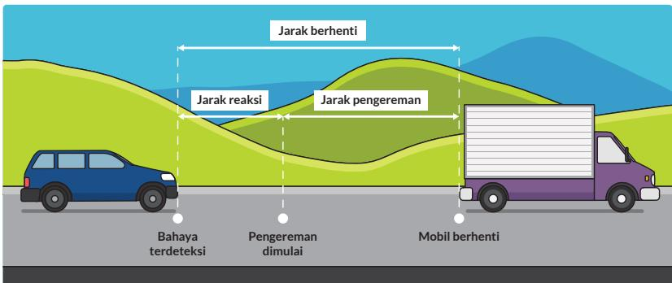  
Gambar 1.15 Jarak Henti Mobil

Seorang sopir sedang mengendarai mobil melewati sebuah desa kecil. Ketika melihat halangan di depan, sopir menginjak rem agar mobil berhenti. Jarak henti disebabkan oleh dua hal. Pertama, jarak akibat waktu yang diperlukan antara melihat halangan dan mengerem mobil (waktu reaksi). Kedua, jarak tempuh akibat pengereman. Tabel 1.2 menunjukkan jarak henti mobil sesuai dengan kecepatan mobil.

Tabel 1.2 Jarak Henti Mobil
<table><tr><td rowspan=1 colspan=1>Kecepatan(km/jam)</td><td rowspan=1 colspan=1>Jarak akibat waktureaksi (m)</td><td rowspan=1 colspan=1>Jarakpengereman (m)</td><td rowspan=1 colspan=1>Jarak total yangditempuh (m)</td></tr><tr><td rowspan=1 colspan=1>40</td><td rowspan=1 colspan=1>17</td><td rowspan=1 colspan=1>9</td><td rowspan=1 colspan=1>26</td></tr><tr><td rowspan=1 colspan=1>50</td><td rowspan=1 colspan=1>21</td><td rowspan=1 colspan=1>14</td><td rowspan=1 colspan=1>35</td></tr><tr><td rowspan=1 colspan=1>60</td><td rowspan=1 colspan=1>25</td><td rowspan=1 colspan=1>20</td><td rowspan=1 colspan=1>45</td></tr><tr><td rowspan=1 colspan=1>70</td><td rowspan=1 colspan=1>29</td><td rowspan=1 colspan=1>27</td><td rowspan=1 colspan=1>56</td></tr><tr><td rowspan=1 colspan=1>80</td><td rowspan=1 colspan=1>33</td><td rowspan=1 colspan=1>36</td><td rowspan=1 colspan=1>69</td></tr><tr><td rowspan=1 colspan=1>90</td><td rowspan=1 colspan=1>38</td><td rowspan=1 colspan=1>45</td><td rowspan=1 colspan=1>83</td></tr><tr><td rowspan=1 colspan=1>100</td><td rowspan=1 colspan=1>42</td><td rowspan=1 colspan=1>56</td><td rowspan=1 colspan=1>98</td></tr><tr><td rowspan=1 colspan=1>110</td><td rowspan=1 colspan=1>46</td><td rowspan=1 colspan=1>67</td><td rowspan=1 colspan=1>113</td></tr></table>

Sumber: www.internationalclinicaltrials.com (2017)

Gunakan teknologi untuk menjawab tugas Eksplorasi 1.2

## Ayo Berteknologi

Grafik a-c dapat digambar dengan menggunakan Microsoft Excel atau Geogebra atau secara manual.

a. Gambarkan grafik jarak akibat waktu reaksi terhadap kecepatan.

b. Gambarkan grafik jarak pengereman terhadap kecepatan.

c. Gambarkan grafik jarak total terhadap kecepatan.

d. Apakah hasil c sama dengan a+b? Tunjukkan dengan membandingkan nilai fungsi pada kecepatan yang sama.

e. Tentukan domain dan range dari nomor d.

## 1. Penjumlahan dan Pengurangan Fungsi

Penjumlahan dua atau lebih fungsi dapat menghasilkan fungsi yang baru. Perhatikan kedua grafik di bawah ini. Fungsi f(x) (berwarna hijau) dijumlahkan dengan fungsi g(x) (berwarna merah). Bagaimana dengan domain dan range dari fungsi yang baru?

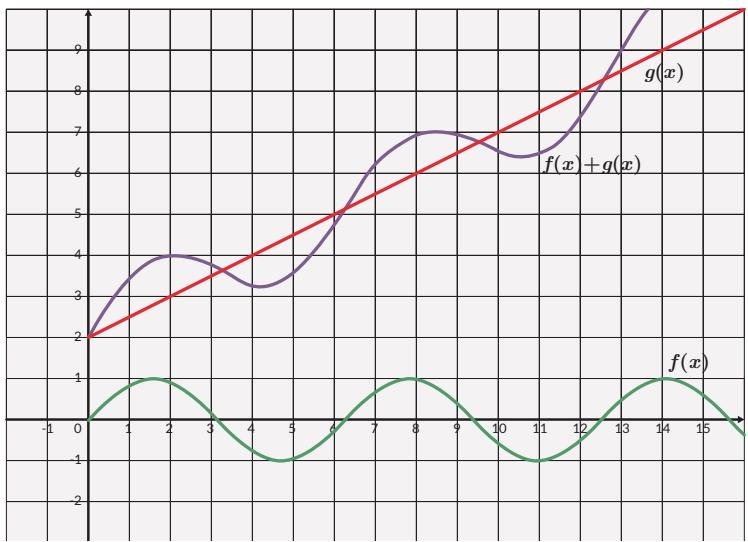  
Gambar 1.16 Penjumlahan Dua Fungsi

Apakah dua atau lebih fungsi hanya dapat dijumlahkan saja? Apakah fungsi juga menyerupai bilangan yang jika ada lebih dari satu maka dapat dijumlahkan,

dikurangkan, dikalikan, dan dibagi? Apakah operasi fungsi akan memengaruhi domain dari fungsi baru yang dihasilkan?

Jika $f ( x )$ dan $g ( x )$ merupakan dua fungsi dengan domain masing-masing $D _ { f }$ dan $D _ { g }$ . Maka penjumlahan $\left( f + g \right) \left( x \right) = f \left( x \right) + g ( x )$ menghasilkan fungsi yang baru dengan domain $D _ { f } \cap D _ { g }$

Jika $f ( x )$ dan $g ( x )$ merupakan dua fungsi dengan domain masing-masing $D _ { f }$ dan $D _ { g }$ . Maka pengurangan $( f - g ) ( x ) = f ( x ) - g ( x )$ menghasilkan fungsi yang baru dengan domain $D _ { f } \cap D _ { g } .$

## Ayo Mencoba

Perhatikan fungsi pendapatan dan biaya produksi yang diberikan dalam grafik di bawah ini. Keduanya merupakan fungsi dari jumlah barang yang diproduksi.

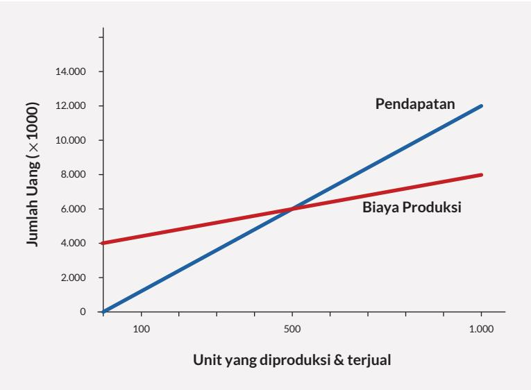  
Gambar 1.17 Fungsi Pendapatan dan Biaya Produksi

a. Kalian ingin mengetahui keuntungan yang diperoleh dari penjualan setiap barang. Bagaimana cara menemukan fungsi keuntungan jika diketahui fungsi pendapatan dan biaya produksi? (Petunjuk: penjumlahan atau pengurangan?)

b. Buatlah tabel yang menunjukkan keuntungan sebagai fungsi dari jumlah barang. Tentukan juga domain dan range-nya!

c. Buatlah grafik yang mewakili keuntungan sebagai fungsi dari jumlah barang!

## Tahukah Kamu?

Dua gelombang apa saja jika bertemu akan berpadu. Perpaduan dua gelombang atau lebih dapat dinyatakan dengan penjumlahan kedua atau lebih fungsi sinus. Penjumlahan kedua fungsi sebenarnya adalah penjumlahan simpangan gelombang. Simpangan gelombang ditunjukkan oleh ketinggian gelombang dalam grafik.

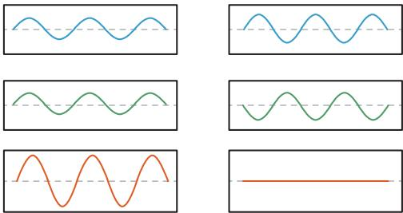  
Gambar 1.18 Penjumlahan Dua Fungsi Gelombang  
Penjumlahan dua fungsi gelombang dapat menghasilkan gelombang baru dengan simpangan yang lebih besar atau simpangan lebih kecil bahkan simpangan nol. Jika ada dua pengeras suara dalam suatu ruangan maka bunyi bergantian terdengar keras dan lemah sesuai dengan posisi pendengar karena penjumlahan dua fungsi gelombang.

## Ayo Berteknologi

Kode QR berikut ini berisi video yang mengilustrasikan penjumlahan grafik dua fungsi pada Gambar 1.18. https://youtu.be/JZaFl8yR1tc

## 2. Perkalian dan Pembagian Fungsi

Kalian telah melihat bahwa operasi penjumlahan dan pengurangan bisa diterapkan terhadap dua fungsi. Operasi ini bisa diperluas penerapannya untuk lebih dari dua fungsi. Sekarang, bagaimana dengan operasi perkalian dan pembagian dua atau lebih fungsi?

Jika $f ( x )$ dan $g ( x )$ merupakan dua fungsi dengan domain masing-masing $D _ { f }$ dan $D _ { g } .$ . Maka perkalian $( f \cdot g ) ( x ) = f ( x ) \cdot g ( x )$ menghasilkan fungsi yang baru dengan domain $D _ { f } \cap D _ { g }$

Pembagian dua fungsi $\begin{array} { r } { \left( \frac { f } { g } \right) ( x ) = \frac { f ( x ) } { g ( x ) } } \end{array}$ secara umum belum tentu menghasilkan fungsi. Supaya $\textstyle { \frac { f } { g } }$ menjadi sebuah fungsi, pembagi g tidak boleh memiliki nilai 0. Dengan kata lain, $\textstyle { \frac { f } { g } }$ adalah fungsi dengan domain $\left( D _ { f } \cap D _ { g } \right) - \left\{ x | g \left( x \right) = 0 \right\}$

## Latihan 1.3

1. Jika $f ( x ) = { \sqrt { x + 3 } }$ dan $g \left( x \right) = x + 3$

a. Tentukan $f \left( x \right) + g ( x )$

b. Tentukan domain dan range dari $f \left( x \right) + g ( x )$

2. $f ( x ) = x ^ { 2 } + 2 \mathrm { d a n } g ( x ) = 2 x - 5$

a. Tentukan $f \left( x \right) - g ( x )$

b. Tentukan domain dan range dari $f \left( x \right) - g ( x )$

3. Buatlah suatu fungsi kuadrat dan fungsi eksponensial! Tentukan hasil penjumlahan dan pengurangan kedua fungsi tersebut!

4. Dua fungsi, f(x) (berwarna merah) dan $g ( x )$ (berwarna biru) diberikan di bawah ini.

<table><tr><td rowspan=1 colspan=1></td><td rowspan=1 colspan=1></td><td rowspan=1 colspan=1></td><td rowspan=1 colspan=1></td><td rowspan=1 colspan=1></td><td rowspan=1 colspan=1></td><td rowspan=1 colspan=1></td><td rowspan=1 colspan=1></td><td rowspan=1 colspan=1></td><td rowspan=1 colspan=1></td><td rowspan=1 colspan=1></td><td rowspan=1 colspan=1></td><td rowspan=1 colspan=1></td><td rowspan=1 colspan=1></td><td rowspan=1 colspan=1></td><td rowspan=1 colspan=1></td><td rowspan=1 colspan=1></td></tr><tr><td rowspan=1 colspan=1></td><td rowspan=1 colspan=1></td><td rowspan=1 colspan=1></td><td rowspan=1 colspan=1></td><td rowspan=1 colspan=1></td><td rowspan=1 colspan=1></td><td rowspan=1 colspan=1></td><td rowspan=1 colspan=1></td><td rowspan=1 colspan=1></td><td rowspan=1 colspan=1></td><td rowspan=1 colspan=1></td><td rowspan=1 colspan=1></td><td rowspan=1 colspan=1></td><td rowspan=1 colspan=1></td><td rowspan=1 colspan=1></td><td rowspan=1 colspan=1></td><td rowspan=1 colspan=1></td></tr><tr><td rowspan=1 colspan=1></td><td rowspan=1 colspan=1></td><td rowspan=1 colspan=1></td><td rowspan=1 colspan=1></td><td rowspan=1 colspan=1></td><td rowspan=1 colspan=1></td><td rowspan=1 colspan=1></td><td rowspan=1 colspan=1></td><td rowspan=1 colspan=1></td><td rowspan=1 colspan=1></td><td rowspan=1 colspan=1>f(x)</td><td rowspan=1 colspan=1></td><td rowspan=1 colspan=1></td><td rowspan=1 colspan=1></td><td rowspan=1 colspan=1></td><td rowspan=1 colspan=1></td><td rowspan=1 colspan=1></td></tr><tr><td rowspan=1 colspan=1></td><td rowspan=1 colspan=1></td><td rowspan=1 colspan=1></td><td rowspan=1 colspan=1></td><td rowspan=1 colspan=1></td><td rowspan=1 colspan=1></td><td rowspan=1 colspan=1></td><td rowspan=1 colspan=1></td><td rowspan=1 colspan=1></td><td rowspan=1 colspan=1></td><td rowspan=1 colspan=1></td><td rowspan=1 colspan=1></td><td rowspan=1 colspan=1></td><td rowspan=1 colspan=1></td><td rowspan=1 colspan=1></td><td rowspan=1 colspan=1></td><td rowspan=1 colspan=1></td></tr><tr><td rowspan=1 colspan=1></td><td rowspan=1 colspan=1></td><td rowspan=1 colspan=1></td><td rowspan=1 colspan=1></td><td rowspan=1 colspan=1></td><td rowspan=1 colspan=1></td><td rowspan=1 colspan=1></td><td rowspan=1 colspan=1></td><td rowspan=1 colspan=1></td><td rowspan=1 colspan=1></td><td rowspan=1 colspan=1></td><td rowspan=1 colspan=1></td><td rowspan=1 colspan=1></td><td rowspan=1 colspan=1></td><td rowspan=1 colspan=1></td><td rowspan=1 colspan=1></td><td rowspan=1 colspan=1></td></tr><tr><td rowspan=1 colspan=1></td><td rowspan=1 colspan=1></td><td rowspan=1 colspan=1></td><td rowspan=1 colspan=1></td><td rowspan=1 colspan=1></td><td rowspan=1 colspan=1></td><td rowspan=1 colspan=1>0</td><td rowspan=1 colspan=1></td><td rowspan=1 colspan=1></td><td rowspan=1 colspan=1></td><td rowspan=1 colspan=1></td><td rowspan=1 colspan=1></td><td rowspan=1 colspan=1></td><td rowspan=1 colspan=1></td><td rowspan=1 colspan=1></td><td rowspan=1 colspan=1></td><td rowspan=1 colspan=1></td></tr><tr><td rowspan=1 colspan=1></td><td rowspan=1 colspan=1></td><td rowspan=1 colspan=1></td><td rowspan=1 colspan=1></td><td rowspan=1 colspan=1></td><td rowspan=1 colspan=1></td><td rowspan=1 colspan=1></td><td rowspan=1 colspan=1></td><td rowspan=1 colspan=1></td><td rowspan=1 colspan=1></td><td rowspan=1 colspan=1></td><td rowspan=1 colspan=1></td><td rowspan=1 colspan=1></td><td rowspan=1 colspan=1></td><td rowspan=1 colspan=1></td><td rowspan=1 colspan=1></td><td rowspan=1 colspan=1></td></tr><tr><td rowspan=1 colspan=1></td><td rowspan=1 colspan=1></td><td rowspan=1 colspan=1></td><td rowspan=1 colspan=1></td><td rowspan=1 colspan=1></td><td rowspan=1 colspan=1></td><td rowspan=1 colspan=1></td><td rowspan=1 colspan=1></td><td rowspan=1 colspan=1></td><td rowspan=1 colspan=1></td><td rowspan=1 colspan=1></td><td rowspan=1 colspan=1></td><td rowspan=1 colspan=1></td><td rowspan=1 colspan=1></td><td rowspan=1 colspan=1></td><td rowspan=1 colspan=1></td><td rowspan=1 colspan=1></td></tr><tr><td rowspan=1 colspan=1></td><td rowspan=1 colspan=1></td><td rowspan=1 colspan=1></td><td rowspan=1 colspan=1></td><td rowspan=1 colspan=1></td><td rowspan=1 colspan=1></td><td rowspan=1 colspan=1></td><td rowspan=1 colspan=1></td><td rowspan=1 colspan=1></td><td rowspan=1 colspan=1></td><td rowspan=1 colspan=1></td><td rowspan=1 colspan=1></td><td rowspan=1 colspan=1></td><td rowspan=1 colspan=1></td><td rowspan=1 colspan=1></td><td rowspan=1 colspan=1></td><td rowspan=1 colspan=1></td></tr><tr><td rowspan=1 colspan=1></td><td rowspan=1 colspan=1></td><td rowspan=1 colspan=1></td><td rowspan=1 colspan=1></td><td rowspan=1 colspan=1></td><td rowspan=1 colspan=1></td><td rowspan=1 colspan=1></td><td rowspan=1 colspan=1></td><td rowspan=1 colspan=1></td><td rowspan=1 colspan=1></td><td rowspan=1 colspan=1></td><td rowspan=1 colspan=1></td><td rowspan=1 colspan=1></td><td rowspan=1 colspan=1></td><td rowspan=1 colspan=1></td><td rowspan=1 colspan=1></td><td rowspan=1 colspan=1></td></tr><tr><td rowspan=1 colspan=1></td><td rowspan=1 colspan=1></td><td rowspan=1 colspan=1></td><td rowspan=1 colspan=1></td><td rowspan=1 colspan=1></td><td rowspan=1 colspan=1></td><td rowspan=1 colspan=1></td><td rowspan=1 colspan=1></td><td rowspan=1 colspan=1></td><td rowspan=1 colspan=1></td><td rowspan=1 colspan=1></td><td rowspan=1 colspan=1></td><td rowspan=1 colspan=1></td><td rowspan=1 colspan=1></td><td rowspan=1 colspan=1></td><td rowspan=1 colspan=1></td><td rowspan=1 colspan=1></td></tr></table>

Tentukan

a. (f + g)(2) b. (f –g)(1) c. (fg)(3) d. $( { \frac { f } { g } } ) ( 4 )$

5. Pendapatan dari penjualan suatu produk adalah $R \left( x \right) = - 2 0 x ^ { 2 } + 1 0 0 0 x ,$ sedangkan biaya produksi C(x) adalah 100x + 8000. Jumlah produk dinyatakan dalam x. Tentukan keuntungan sebagai fungsi dari jumlah produk x.

6. Jika f (3) = 7, g (3) = 6, f (6) = 13, g (6) = 12, tentukan a. f(3) + g(3) b. f (3) − g(3) c. f(3)  g(3) d. f(3)  g(3)

7. Berikan contoh nyata tentang perkalian dua fungsi dalam kehidupan sehari-hari.

8. Berikan contoh nyata tentang pembagian dua fungsi dalam kehidupan seharihari.

## 3. Komposisi Fungsi

Potongan harga dan diskon merupakan hal yang biasa ditemui dalam kehidupan sehari-hari. Misalkan, sebuah toko memberikan penawaran khusus akhir pekan dengan dua pilihan. Pilihan pertama ialah “diskon 20%” terhadap semua barang dengan tambahan potongan harga sebesar Rp25.000,00 setelah diskon 20%. Sedangkan pilihan kedua adalah potongan harga sebesar Rp25.000,00 dilanjutkan diskon 20% setelah potongan harga. Apakah kedua pilihan penawaran tersebut sama? Jika tidak, pilihan mana yang lebih menguntungkan untuk pembeli?

Pertanyaan tersebut dapat kalian jawab dengan memahami konsep komposisi fungsi.

## EkSplorasi 1.3

## Masalah Pertama

Perhatikan gambar di bawah ini. Sebuah toko memberikan diskon 20% dan potongan harga Rp25.000,00 untuk suatu produk tertentu.

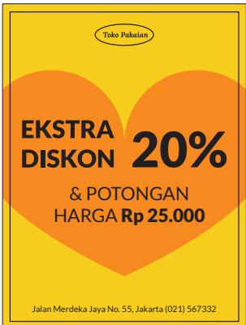  
Gambar 1.19 Diskon dalam Persen dan Potongan Harga

a. Lengkapi tabel di bawah ini.
<table><tr><td rowspan=1 colspan=1>Harga awal</td><td rowspan=1 colspan=1>Diskon20%</td><td rowspan=1 colspan=1>PotonganRp25.000,00</td><td rowspan=1 colspan=1>Hargaakhir</td></tr><tr><td rowspan=1 colspan=1>Rp100.000,00</td><td rowspan=1 colspan=1></td><td rowspan=1 colspan=1></td><td rowspan=1 colspan=1></td></tr><tr><td rowspan=1 colspan=1>Rp150.000,00</td><td rowspan=1 colspan=1></td><td rowspan=1 colspan=1></td><td rowspan=1 colspan=1></td></tr><tr><td rowspan=1 colspan=1>Rp200.000,00</td><td rowspan=1 colspan=1></td><td rowspan=1 colspan=1></td><td rowspan=1 colspan=1></td></tr><tr><td rowspan=1 colspan=1>Rp250.000,00</td><td rowspan=1 colspan=1></td><td rowspan=1 colspan=1></td><td rowspan=1 colspan=1></td></tr><tr><td rowspan=1 colspan=1>x</td><td rowspan=1 colspan=1></td><td rowspan=1 colspan=1></td><td rowspan=1 colspan=1></td></tr></table>

Apakah kalian sudah memahami cara menyelesaikan soal tersebut? Coba buatlah pernyataan fungsi untuk masalah serupa di bawah ini. Jika harga awal adalah x dan harga akhir atau nilai fungsi $f ( x ) \ = \ y$ , nyatakan y sebagai suatu fungsi yang memodelkan diskon 30% dilanjutkan dengan potongan harga sebesar Rp10.000,00.

## Masalah Kedua

Toko sering memberikan diskon ganda seperti yang ditunjukkan oleh gambar di bawah ini. Harga suatu produk diberi diskon 50% kemudian diberikan diskon lagi 10%.

  
Gambar 1.20 Diskon Ganda

a. Gambarkan mesin fungsi yang menunjukkan pemahaman diskon ganda ini dengan x merupakan harga sebelum diskon ganda dan y adalah harga sesudah diskon ganda. Nyatakan fungsi pertama sebagai $f ( x )$ dan fungsi kedua sebagai $g ( x )$ . Tuliskan hasil akhir sebagai dari operasi kedua fungsi terhadap masukan x.

b. Jika harga barang yang mengalami diskon ganda berkisar dari Rp100.000,00 s.d. Rp1.000.000,00 tentukan domain dan range dari fungsi yang merepresentasikan masalah ini.

Kalian perhatikan bahwa dalam menyelesaikan kedua masalah di atas kalian mengoperasikan fungsi pertama dengan masukan adalah harga awal penjualan kemudian hasil fungsi pertama dioperasikan dalam fungsi kedua untuk mendapatkan harga akhir.

## Definisi Komposisi Fungsi

Jika $g : A  B$ dan $f : B \to C$ merupakan dua fungsi maka komposisi keduanya $f \left( g \left( x \right) \right)$ dinyatakan dengan notasi $( f \circ g ) ( x )$ adalah fungsi dari domain A ke kodomain C. Komposisi dua fungsi dapat dipahami melalui diagram panah berikut:

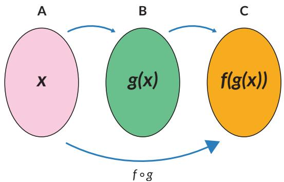  
Gambar 1.21 Diagram Panah dari Komposisi Fungsi

## Ayo Mencoba

Perhatikan contoh yang ada kemudian selesaikan soal.

$f \left( x \right) = x + 1$ dan $g \left( x \right) = x ^ { 2 }$ maka $h \left( x \right) = g \left( f \left( x \right) \right) = g \left( x + 1 \right) = \left( x + 1 \right) ^ { 2 }$ Jika $f \left( x \right) = x - 2$ dan $g ( x ) \ = \ \sqrt { x }$ tentukan $h \left( x \right) = \ g \left( f \left( x \right) \right)$

Pertanyaan penting selanjutnya adalah, “Apa syarat agar fungsi f dan g dapat dikomposisikan?”

## Eksplorasi

Untuk menjawab syarat agar fungsi f dan g dapat dikomposisikan maka lakukan dua eksplorasi masalah di bawah ini.

## Masalah Pertama

Perhatikan dua grafik f(x) dan $g ( x )$ pada gambar 1.22.

a. Nyatakan domain dan range dari setiap fungsi dalam bentuk himpunan.

b. Nyatakan domain dan range jika kedua fungsi dikomposisikan menurut $( f \circ g ) ( x )$

c. Nilai-nilai range dari $g ( x )$ yang dapat digunakan untuk komposisi fungsi $( f \circ g ) ( x )$

  
Gambar 1.22 Domain dan Range dari Fungsi Komposisi

## Masalah Kedua

Perhatikan kedua grafik di bawah ini. Misalkan, fungsi yang dinyatakan oleh grafik kiri adalah $f ( x )$ dan fungsi yang dinyatakan oleh grafik kanan adalah $g ( x )$ Apakah kedua fungsi dapat dikomposisikan menurut $( g \circ f ) ( x ) ?$ Jelaskan jawaban kalian!

  
Gambar 1.23 Grafik Dua Fungsi

## Syarat Komposisi Fungsi

Kedua masalah di atas memberikan pemahaman yang jelas syarat agar dua fungsi dapat dikomposisikan.

Dua fungsi $f$ dan g dapat dikomposisikan sebagai $f \circ g$ jika range dari g merupakan himpunan bagian dari domain $f .$ Ini merupakan syarat komposisi fungsi.

Pertanyaan menarik lainnya adalah “Apakah operasi komposisi fungsi memenuhi sifat komutatif dan asosiatif?”

## Eksplorasi 1.5

## Sifat Komutatif

## Masalah Pertama

Selidikilah apakah harga setelah diskon 25% yang dilanjutkan dengan diskon 20% sama dengan harga setelah diskon 20% yang dilanjutkan dengan diskon 25%. Apakah berlaku sifat komutatif dalam komposisi fungsi ini?

## Masalah Kedua

Selidikilah apakah harga setelah diskon 25% yang dilanjutkan dengan potongan Rp15.000,00 sama dengan harga setelah kena potongan Rp15.000,00 yang dilanjutkan dengan diskon 25%. Apakah berlaku sifat komutatif dalam komposisi fungsi ini?

## Masalah Ketiga

Perhatikan tiga fungsi di bawah ini, yaitu f, g dan $h$

$$
\begin{array} { r } { f ( x ) = 2 x + 1 , g ( x ) = x ^ { 2 } + 4 \mathrm { d a n } h \left( x \right) = \frac { 1 } { \left( x + 1 \right) } } \end{array}
$$

Tentukan domain dan range dari masing-masing fungsi!

• Dengan informasi tentang domain dan range dari masing-masing fungsi, selidikilah apakah komposisi-komposisi di bawah ini merupakan fungsi:

$$
g _ { } \circ  { f , f } \circ  { g , f } \circ  { h , h } \circ  { f , g } \circ  { h , h } \circ  { g } !
$$

• Mari cek apakah komposisi-komposisi di atas bersifat komutatif!

$$
\mathrm { a } . \quad g \circ f = f \circ g \ ?
$$

$$
\mathrm { b } . \quad f \circ h = h \circ f ?
$$

$$
\mathsf { c . } \quad g \circ h = h \circ g ?
$$

Berdasarkan Eksplorasi 1.5 ternyata komposisi fungsi secara umum tidak memenuhi sifat komutatif.

## Sifat Asosiatif

Eksplorasi dilakukan untuk mengecek apakah operasi komposisi fungsi memenuhi sifat asosiatif.

Perhatikan kembali tiga fungsi di bawah ini, yaitu $f , g$ dan h:

$$
\begin{array} { r } { f ( x ) = 2 x + 1 , g ( x ) = x ^ { 2 } + 4 \mathrm { ~ d a n ~ } h \left( x \right) = \frac { 1 } { \left( x + 1 \right) } } \end{array}
$$

1. Selidikilah apakah operasi asosiatif secara umum berlaku untuk komposisi fungsi, dengan kata lain cek apakah persamaan-persamaan berikut benar:

$\begin{array} { r } { \left( f \left( h \circ g \right) \right) ( x ) = ( ( f \circ h ) \circ g ) ( x ) ? } \end{array}$

$\begin{array} { r } { \left( h \left( f \circ g \right) \right) ( x ) = ( ( h \circ f ) \circ g ) ( x ) ? } \end{array}$

$\left( g \left( f \circ h \right) \right) ( x ) = ( ( g \circ f ) \circ h ) ( x ) ?$

2. Pikirkan konfigurasi komposisi lain yang mungkin dari ketiga fungsi di atas. Cek apakah sifat asosiatif masih terpenuhi.

Berdasarkan Eksplorasi 1.5 ternyata komposisi fungsi memenuhi sifat asosiatif.

Komposisi dua fungsi injektif dan dua fungsi surjektif

Untuk memahami fungi injektif dan fungsi surjektif lihat halaman 32 dan 33.

## Ayo Bekerja Sama

Misalkan $g : A  B$ dan $f : B \to C$ merupakan dua fungsi injektif. Apakah fungsi komposisi $f \circ g \mathrm { j u g a }$ bersifat injektif? Berikan alasanmu!

Misalkan $g : A  B$ dan $f : B \to C$ merupakan dua fungsi surjektif. Apakah fungsi komposisi $f \circ g$ juga bersifat surjektif? Berikan alasanmu!

## Latihan 1.4

1. Jika $\textstyle f ( x ) = { \frac { 1 } { x } }$ dan $g \left( x \right) = 2 x + 1$ , tentukan

a. $( f \circ g ) ( x )$

b. $\left( f \circ g \right) ( 3 ) \mathrm { d a n } \left( f \circ g \right) ( - 3 )$

c. $f ( a ) \mathrm { j i k a } ( f \circ g ) ( a ) = - 1 .$

2. Jika $\textstyle f ( x ) = { \frac { 1 } { ( 2 x + 1 ) } }$ dan $g ( x ) \ = \ 2 x ^ { 2 } \ + \ 1$ , tentukan

a. $( f \circ g ) \ ( x )$

b. $( g \circ f ) \ ( x )$

c. domain dan range dari $( f \circ g ) \ ( x )$

d. domain dan range dari $( g \circ f ) \ ( x )$

3. Jika $f ( x ) = 6 x ~ - ~ 5$ dan $g ( x ) \ = \ a x \ + \ b$ , tentukan a dan b sehingga $( f \circ g ) ( x ) = ( g \circ f ) ( x )$

4. Hasil dari $\left( f \circ g \right) ( x ) = \left( 2 x ~ + ~ 3 \right) ^ { 3 }$ sedangkan $f \left( x \right) = x ^ { 3 }$ tentukan g(x).

5. Lengkapi tabel di bawah ini.

<table><tr><td rowspan=1 colspan=1>x</td><td rowspan=1 colspan=1>f(x)</td></tr><tr><td rowspan=1 colspan=1>-2</td><td rowspan=1 colspan=1>-1</td></tr><tr><td rowspan=1 colspan=1>-1</td><td rowspan=1 colspan=1></td></tr><tr><td rowspan=1 colspan=1>0</td><td rowspan=1 colspan=1>1</td></tr><tr><td rowspan=1 colspan=1>1</td><td rowspan=1 colspan=1></td></tr><tr><td rowspan=1 colspan=1>2</td><td rowspan=1 colspan=1>3</td></tr></table>

<table><tr><td rowspan=1 colspan=1>f(x)</td><td rowspan=1 colspan=1> $g ( f ( x ) )$ </td></tr><tr><td rowspan=1 colspan=1>-1</td><td rowspan=1 colspan=1>0,5</td></tr><tr><td rowspan=1 colspan=1>0</td><td rowspan=1 colspan=1>1</td></tr><tr><td rowspan=1 colspan=1>1</td><td rowspan=1 colspan=1>2</td></tr><tr><td rowspan=1 colspan=1>2</td><td rowspan=1 colspan=1></td></tr><tr><td rowspan=1 colspan=1>3</td><td rowspan=1 colspan=1></td></tr></table>

<table><tr><td rowspan=1 colspan=1>x</td><td rowspan=1 colspan=1> $g ( f ( x ) )$ </td></tr><tr><td rowspan=1 colspan=1>-2</td><td rowspan=1 colspan=1></td></tr><tr><td rowspan=1 colspan=1>-1</td><td rowspan=1 colspan=1></td></tr><tr><td rowspan=1 colspan=1>0</td><td rowspan=1 colspan=1></td></tr><tr><td rowspan=1 colspan=1>1</td><td rowspan=1 colspan=1></td></tr><tr><td rowspan=1 colspan=1>2</td><td rowspan=1 colspan=1></td></tr></table>

6. Jika f (3) = 7, g (3) = 6, $f \left( 6 \right) = 1 3$ $g \left( 6 \right) = 1 2 ,$ tentukan $\left( f \circ g \right) \ ( 3 )$

7. Jumlah kertas yang diperlukan untuk mencetak x eksemplar modul matematika dinyatakan dalam fungsi $k ( x ) = 2 5 0 ( x + 1 )$ lembar. Biaya pencetakan yang diperlukan untuk k lembar adalah $b ( k ) = 4 0 0 k + 2 0 . 0 0 0$ (dalam rupiah). Jika pengeluaran hari ini untuk mencetak x eksemplar modul adalah Rp10.120.000,00 tentukan banyak eksemplar modul yang dicetak.

8. Suatu pabrik memberikan ketentuan mengenai jumlah produksi dan jenisnya. Produksi telepon genggam berbasis android adalah dua kali produksi telepon genggam berbasis bukan android sedangkan produksi laptop adalah tiga kali produksi telepon genggam berbasis android.

a. Gunakan mesin fungsi untuk menyatakan fungsinya.

b. Jika diproduksi 2.000 telepon genggam tidak berbasis android, berapa banyak laptop yang dihasilkan? Selesaikan dengan mesin fungsi.

9. Anton membeli sebuah meja belajar dari sebuah toko. Ada banyak pilihan meja dengan harga-harga yang bervariasi. Meja-meja tersebut berukuran besar. Karena ukuran mobil Anton kecil, maka Anton memutuskan untuk menyewa jasa antar dari toko tersebut. Setelah berdiskusi dengan pihak toko, maka total biaya yang harus dibayar adalah harga meja belajar, pajak pembelian, dan biaya angkut. Pajak pembelian sebesar 7,5% harga meja. Biaya angkut sebesar Rp20.000,00.

a. Tuliskan fungsi t(x) sebagai total harga meja yang mencakup harga meja dan pajak, dengan x adalah harga satu meja.

b. Tuliskan juga fungsi f(x) sebagai total biaya yang mencakup harga meja dan biaya angkut.

c. Tuliskan kedua komposisi fungsi berikut $( f \circ t ) ( x )$ dan $( t \circ f ) ( x )$ . Manakah dari kedua fungsi yang memberikan biaya yang lebih kecil untuk setiap harga meja?

d. Peraturan daerah di tempat Anton tinggal tidak melegalkan pengenaan pajak pada biaya angkut. Komposisi fungsi yang mana dari bagian c yang sejalan dengan perda ini?

## C. Fungsi Invers

Kalian pasti sering menemukan bahasa Inggris dalam kehidupan sehari-hari, baik lewat film, berita, cerita ataupun lagu. Kalian memahami artinya dengan menerjemahkan ke dalam bahasa Indonesia.

  
Gambar 1.24 Mesin Penerjemahan Bahasa

Dapatkah kalian menerjemahkan nama mata pelajaran (sebaliknya) dari bahasa Indonesia ke dalam dalam bahasa Inggris?

• Apakah proses kebalikan dapat kalian terapkan juga untuk semua relasi?

Berdasarkan Gambar 1.24, dapat diamati bahwa dengan membalikkan arah panah, untuk setiap mata pelajaran dalam bahasa Indonesia (keluaran), kalian bisa mencari kata yang mempunyai arti yang sama dalam bahasa Inggris (masukan). Prosedur ini membentuk suatu relasi kebalikan (invers) antara anggota-anggota keluaran dan masukan. Apakah relasi kebalikan ini berlaku juga pada fungsi? Apakah relasi kebalikan membentuk sebuah fungsi yang dikenal dengan fungsi invers? Pertanyaan ini akan bisa kalian jawab dengan memahami terlebih dahulu fungsi injektif, surjektif, dan bijektif.

## 1. Fungsi Injektif, Surjektif, dan Bijektif

Perhatikan kembali Gambar 1.9 dan 1.11. Pada grafik 1.9 ketika waktu = 6 detik dan 7 detik pelari memiliki kecepatan yang sama, yaitu 12 m/det. Pada grafik 1.11 terlihat bahwa jumlah bahan bakar berbeda menghasilkan jarak tempuh berbeda.

Gambar 1.25 di bawah ini menunjukkan jenis relasi yang berbeda. Menurut kalian, relasi mana dalam Gambar 1.25 yang menunjukkan grafik 1.9 dan grafik 1.11? Berdasarkan jenis relasinya, fungsi dibagi menjadi tiga jenis:

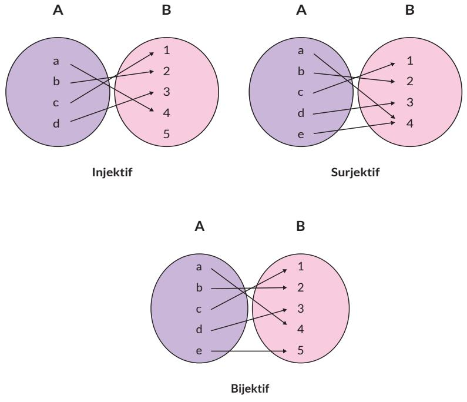  
Gambar 1.25 Fungsi Injektif, Fungsi Surjektif, dan Fungsi Bijektif

## Ayo Berkomunikasi

Jelaskan pengertian fungsi injektif, fungsi surjektif, dan fungsi bijektif dengan kata-katamu sendiri.

## Ayo Berpikir Kritis

Setujukah kalian dengan pendapat bahwa fungsi kuadrat dan fungsi eksponensial merupakan fungsi bijektif? Jelaskan alasannya.

Pertanyaan di atas dapat kalian jawab dengan menggunakan definisi fungsi yang telah dipelajari dan dengan mengkaji domain dan range.

Fungsi seperti apa yang memiliki kebalikan atau invers? Secara umum tidak semua fungsi memiliki fungsi invers. Hanya fungsi bijektif (injektif dan surjektif) saja yang memiliki invers.

## Ayo Berkomunikasi

Mengapa hanya fungsi bijektif saja yang dapat memiliki invers? Pikirkanlah dengan teman-temanmu.

Sebuah fungsi bisa dibuat bijektif dengan cara memodifikasi range-nya. Sebelum kalian berdiskusi tentang ini lebih jauh, coba jawab pertanyaan berikut ini. Bagaimana hubungan antara domain dan range dari fungsi asli dan fungsi invers-nya (jika ada)?

## Eksplorasi

1.6

Kalian akan menyelidiki fungsi yang merupakan kebalikan dari suatu fungsi dengan memecahkan dua masalah di bawah ini.

## Masalah Pertama

Perhatikan tabel harga baju kaos di bawah ini.

<table><tr><td rowspan=1 colspan=1>Jumlah Baju Kaos(Masukan)</td><td rowspan=1 colspan=1>Harga Baju Kaos(Keluaran)</td></tr><tr><td rowspan=1 colspan=1>1</td><td rowspan=1 colspan=1>55.000</td></tr><tr><td rowspan=1 colspan=1>3</td><td rowspan=1 colspan=1>165.000</td></tr><tr><td rowspan=1 colspan=1>5</td><td rowspan=1 colspan=1>275.000</td></tr><tr><td rowspan=1 colspan=1>10</td><td rowspan=1 colspan=1>550.000</td></tr></table>

1. Buatlah tabel dengan membalikkan keluaran menjadi masukan dan masukan menjadi keluaran.

2. Buatlah grafik jumlah baju kaos terhadap harga baju kaos dan grafik harga baju kaos terhadap jumlah baju kaos. Jelaskan hasil yang kamu peroleh.

3. Tentukan domain dan range dari kedua grafik yang dihasilkan di nomor (2).

4. Buatlah diagram panah yang menunjukkan fungsi asal.

5. Buatlah diagram panah yang menunjukkan fungsi yang berkebalikan dari fungsi asalnya.

Apa yang kalian peroleh dari eksplorasi di atas?

## Masalah Kedua

Harga suatu pakaian setelah mendapatkan diskon 40% dan kemudian diberikan potongan harga Rp15.000,00 adalah Rp45.000,00. Berapa harga awal pakaian?

1. Gunakan mesin fungsi untuk menyelesaikan masalah ini. Mulai kerjakan dari fungsi kedua yang dilanjutkan dengan fungsi pertama. Kerjakan secara terbalik.

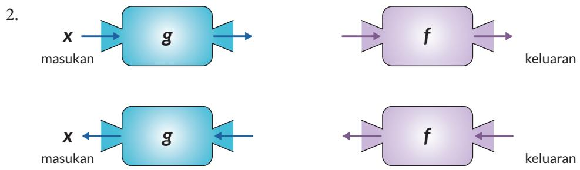

3. Jika harga awal pakaian adalah x dan hasil akhirnya adalah y maka buatlah fungsi kebalikannya yaitu x adalah fungsi dari y.

Fungsi yang berkebalikan operasinya dari fungsi asalnya disebut sebagai fungsi invers. Fungsi ini memetakan anggota yang ada di range fungsi asal ke anggota yang ada di domain fungsi asal. Fungsi invers dituliskan sebagai $f ^ { - 1 }$ . Kalian perhatikan bahwa −1 di sini bukan merupakan suatu pangkat.

Dari definisi fungsi invers yang baru dijelaskan sebelumnya, hubungan antara domain dan range dari fungsi asal dan fungsi invers dapat dipahami melalui diagram panah berikut.

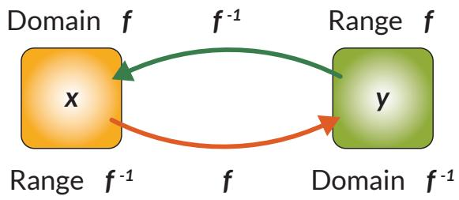  
Gambar 1.26 Domain dan Range dari Fungsi Asal dan Fungsi Invers

Secara konsep, menentukan fungsi invers dari fungsi asal dengan diagram panah memang lebih intuitif; dengan membalik arah panah. Namun, sering kali dijumpai bahwa fungsi asal dituliskan dalam bentuk persamaan matematis. Dalam kasus ini, cara untuk menemukan persamaan fungsi invers dari fungsi asal dapat dilakukan dengan cara berikut:

1. Ubah $y = f \left( x \right)$ menjadi bentuk $x = f ( y )$

2. Ubah persamaan $x = f ( y )$ menjadi bentuk $y = . . . .$

3. Ubahlah variabel y dengan $f ^ { - 1 } ( x )$ sehingga diperoleh rumus fungsi invers $f ^ { - 1 } ( x )$

Perhatikan gambar yang menunjukkan fungsi dan fungsi invers-nya. Gunakan langkah-langkah di atas untuk menemukan fungsi invers dari $f .$

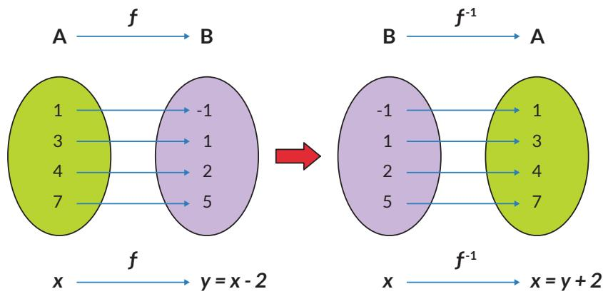  
Gambar 1.27 Domain dan Range dari $y = x - 2$ dan $x = y + 2$

## Ayo Berkomunikasi

Sejauh ini, ketika menjelaskan fungsi invers dari fungsi asal, selalu diasumsikan bahwa fungsi asal memiliki invers. Secara umum, “Apakah benar semua fungsi selalu mempunyai invers? Kalau tidak, apa syarat untuk sebuah fungsi memiliki invers?”

## Eksplorasi

Masalah berikut ini akan membantu kalian memahami syarat sebuah fungsi untuk memiliki invers.

Sebuah mobil melaju di jalan raya. Kecepatan tiap menit diukur dan dicatat dalam tabel di bawah ini:

Tabel 1.3 Kecepatan Mobil Terhadap Waktu
<table><tr><td rowspan=1 colspan=1>Waktu (menit)(x)</td><td rowspan=1 colspan=1>Kecepatan Mobil (m/menit)(y)</td></tr><tr><td rowspan=1 colspan=1>1</td><td rowspan=1 colspan=1>100</td></tr><tr><td rowspan=1 colspan=1>2</td><td rowspan=1 colspan=1>180</td></tr><tr><td rowspan=1 colspan=1>3</td><td rowspan=1 colspan=1>193</td></tr><tr><td rowspan=1 colspan=1>4</td><td rowspan=1 colspan=1>185</td></tr><tr><td rowspan=1 colspan=1>5</td><td rowspan=1 colspan=1>180</td></tr><tr><td rowspan=1 colspan=1>6</td><td rowspan=1 colspan=1>165</td></tr><tr><td rowspan=1 colspan=1>7</td><td rowspan=1 colspan=1>175</td></tr><tr><td rowspan=1 colspan=1>8</td><td rowspan=1 colspan=1>186</td></tr><tr><td rowspan=1 colspan=1>9</td><td rowspan=1 colspan=1>190</td></tr><tr><td rowspan=1 colspan=1>10</td><td rowspan=1 colspan=1>166</td></tr></table>

Dari data pada Tabel 1.3, jawablah pertanyaan berikut:

1. Apakah data waktu dan kecepatan membentuk relasi? Jika ya, apakah relasi itu adalah fungsi?

2. Plot data dengan sumbu x adalah waktu dan sumbu sumbu y adalah kecepatan.

3. Sekarang, kalian tentukan invers relasi dari pertanyaan 1.

4. Dari definisi fungsi yang kalian pelajari, apakah invers relasi pada pertanyaan (3) adalah fungsi? Jelaskan alasanmu.

5. Apabila pada menit ke-5 kecepatan diubah menjadi 182 m/menit, apakah relasi antara waktu dan kecepatan merupakan relasi surjektif dan injektif?

6. Dengan perubahan ini, apakah invers relasi adalah fungsi? Jika ya, apakah fungsi injektif dan surjektif (bijektif)?

## Tahukah Kamu?

Misalkan, f dan g adalah fungsi. Jika $( f \circ g ) ( x ) = x$ dan $( g \circ f ) ( x ) = x$ maka g adalah fungsi invers dari f dan f adalah fungsi invers dari g.

## Ayo Berpikir Kritis

Setujukah kalian bahwa konversi satuan merupakan fungsi yang mempunyai invers? Jelaskan jawaban kalian.

Berikan satu contoh konversi satuan, tentukan juga domain dan range-nya.

## Eksplorasi

Kalian akan menyelidiki invers dari komposisi fungsi.

Sebuah toko mainan memberikan potongan harga berupa diskon 20% dan dilanjutkan dengan potongan harga Rp10.000,00. Jawablah pertanyaan-pertanyaan berikut!

1. Jika $f : A  B$ dipahami sebagai fungsi harga setelah diskon 20%, dimana A adalah domain harga asal, dan B adalah kodomain dengan anggota harga setelah diskon. Maka tuliskan persamaan matematis untuk fungsi ini.

2. Jika $g : B  C$ sebagai fungsi potongan harga Rp10.000,00 setelah diskon 20%, dengan $C$ adalah kodomain dengan anggota harga akhir. Maka tuliskan persamaan matematis untuk fungsi ini.

3. Apakah benar harga akhir dapat diperoleh dengan cukup menggunakan fungsi $( g \circ f ) ( x ) ?$ Jelaskan alasanmu.

4. Apakah bedanya fungsi komposisi $( g \circ f ) ( x )$ dan $( f \circ g ) ( x ) ?$

5. Misal fungsi $( g \circ f ) ( x )$ memiliki invers. Jika diketahui harga akhir mainan, coba tuliskan fungsi yang dapat digunakan untuk memperoleh harga asal (gunakan fungsi invers dari g dan f lalu komposisikan).

6. Gunakan fungsi dari nomor 5, untuk mengetahui harga asal mainan jika diketahui harga akhir sebesar Rp30.000,00.

7.

## Ayo Berpikir Kritis

Apakah benar secara umum, jika $( g \circ f ) ( x )$ memiliki invers maka $\left( g \circ f \right) ^ { - 1 } \left( x \right) =$ $( f ^ { - 1 } \circ g ^ { - 1 } ) ( x ) ?$

## Latihan

1. Gambarkan fungsi-fungsi di bawah ini dan tentukan apakah fungsi-fungsi tersebut mempunyai fungsi invers. Jelaskan alasanmu. a. $f \left( x \right) = x ^ { 2 }$ b. $f ( x ) = 2 ^ { x }$ c. $f \left( x \right) = { \sqrt { 2 x } }$

2. Tentukan fungsi invers (jika ada) dari fungsi-fungsi di bawah ini, juga domain dan range-nya. a. $f \left( x \right) = x ^ { 3 }$ b. $f \left( x \right) = - 3 x + 1$ c. $f \left( x \right) = { \sqrt { x - 3 } }$ d. $\textstyle f \left( x \right) = { \frac { x + 4 } { 2 x - 5 } }$

3. Berikut ini adalah grafik dari fungsi $g \left( x \right) = \sqrt { 2 x - 3 }$

a. Gambarkan grafik dari invers fungsi g(x) dengan pencerminan terhadap $y = x$

b. Temukan persamaan matematis untuk fungsi invers $g ^ { - 1 } ( x )$

c. Plotlah dengan menggunakan beberapa titik fungsi invers $g ^ { - 1 } ( x )$

d. Bandingkan apakah grafik yang diperoleh sama dengan grafik pada bagian (a).

4. Diketahui $f \left( x \right) = 2 x + b$ dan $f ( f ( x ) ) = 4 x + 6$ . Tentukan nilai b dan $f ^ { - 1 } ( x )$

5. Populasi badak Jawa terhadap waktu diberikan pada grafik di bawah ini.

  
Sumber: www.ourworldindata.org (2021)

Apakah grafik ini menunjukkan fungsi bijektif atau surjektif? Jelaskan.

## Refleksi

1. Apakah saya sudah dapat membedakan fungsi dengan bukan fungsi dengan beberapa cara?

2. Bagaimana saya menentukan domain, kodomain, dan range dari suatu fungsi?

3. Bagaimana saya menentukan dua fungsi atau lebih dapat dikomposisi?

4. Apakah saya dapat membedakan fungsi injektif, fungsi surjektif, dan fungsi bijektif?

5. Bagaimana saya dapat menentukan suatu fungsi dapat mempunyai invers?

## Uji Kompetensi

1. Hubungan antara keuntungan yang diperoleh dengan harga barang yang dijual diberikan sebagai $U \left( x \right) = - 7 5 x ^ { 2 } + 3 0 0 x - 1 4 0$ , di mana x adalah harga barang dalam kelipatan Rp10.000,00.

a. Apakah $U ( x )$ merupakan suatu fungsi? Jelaskan.

b. Jika U(x) merupakan suatu fungsi, tentukan domain dan range-nya.

c. Jika diinginkan keuntungan tertentu dapatkah diketahui harga barang?

d. Jika $U ( x )$ merupakan suatu fungsi, apakah fungsi ini mempunyai invers? Jelaskan.

2. Berikan satu contoh situasi nyata yang bisa diberikan dalam fungsi di mana fungsi tersebut mempunyai invers.

3. Berikan satu contoh situasi nyata yang mana suatu fungsi tersebut tidak mempunyai invers.

4. Berikan satu contoh situasi nyata yang bisa diberikan dalam komposisi fungsi.

5. Perhatikan diagram panah di bawah ini.

Apakah fungsi $g ( x )$ mempunyai fungsi invers? Jelaskan.

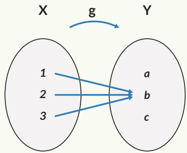

6. Perhatikan percakapan di bawah ini .

Anton : Suatu fungsi dapat dipastikan mempunyai fungsi invers atau tidak dengan menggunakan diagram panah.

Toni : Saya tidak setuju karena diagram panah tidak memberikan informasi lengkap.

Setujukah kamu dengan pendapat keduanya? Adakah pendapatmu yang diperlukan untuk melengkapi kedua pendapat tersebut?

7. Perhatikan kedua grafik di bawah ini.

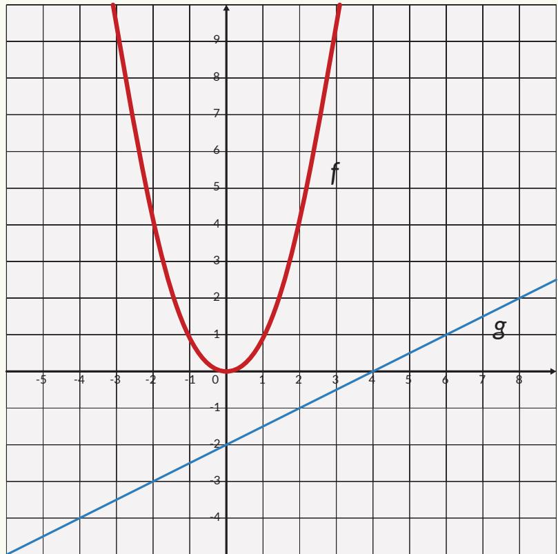

a. Tentukan nilai $( f \circ g ) ( 2 )$

b. Tentukan nilai yang menyebabkan $( f \circ g ) ( x ) = 4$

c. Apakah $( f \circ g ) ( x )$ berupa fungsi linear atau kuadrat? Jelaskan.

d. Apakah (g ◦ f)(x) berupa fungsi linear atau kuadrat? Jelaskan.

e. Apa yang harus dilakukan dengan domain f(x) jika diinginkan f(x) mempunyai invers?

8. Perhatikan $\begin{array} { r } { f \left( x \right) = 3 x + 1 \mathrm { d a n } g ( x ) = \frac { ( x - 1 ) } { 3 } . } \end{array}$

a. Gambarkan kedua fungsi tersebut pada satu sistem koordinat.

b. Lakukan fungsi komposisi $( f \circ g ) ( x )$ dan $( g \circ f ) ( x )$ . Jelaskan hasil yang diperoleh.

c. Berdasarkan hasil a dan b apakah yang dapat disimpulkan?

9. Hang time menunjukkan lamanya seseorang berada di udara setelah melompat hingga ketinggian tertentu. Makin tinggi lompatan makin lama seseorang berada di udara. Atlet-atlet olahraga tertentu, seperti bola basket, memerlukan hang time agar dapat memasukkan bola.

a. Tentukan hubungan antara ketinggian lompatan dengan hang time dalam bentuk fungsi.

b. Mengapa fungsi invers diperlukan dalam masalah ini? Jelaskan.

c. Carilah hang time dari seorang pemain basket dunia.

## Pengayaan

## Ayo Berteknologi

Tentukan hang time dan ketinggian lompat dari beberapa orang, dapat anggota keluargamu atau temanmu. Kalian dapat mengambil data dengan menanyakan kepada mereka, tanpa harus mengukur waktu dan ketinggian mereka secara langsung.

1. Buatlah tabel dan plot grafiknya. Kalian dapat menggunakan Microsoft Excel untuk membuatnya.

2. Pilih satu hang time dan ketinggian lompat yang bersesuaian dengannya dari seorang atlet, lalu cocokkan dengan grafik yang kamu buat. Apakah sesuai?

3. Jika hang time merupakan fungsi dari ketinggian lompat, pikirkan satu hal yang memengaruhi ketinggian lompat. Nyatakan semua hubungan ini dalam mesin fungsi komposisi.