Kementerian Pendidikan, Kebudayaan, Riset, dan Teknologi Republik Indonesia, 2021

Matematika untuk SMA/SMK Kelas XI

Penulis: Dicky Susanto, dkk.

ISBN: 978-602-244-789-5 (jil.2)

## Lingkaran

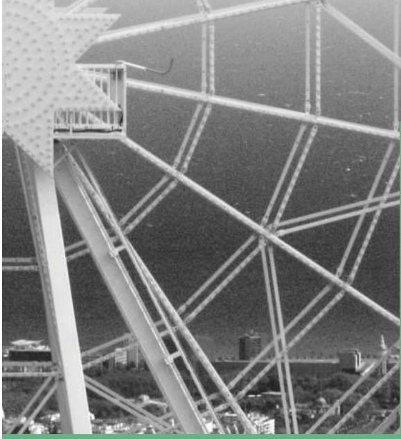

## Tujuan Pembelajaran

Setelah mempelajari bab ini, diharapkan kalian dapat

1. Menerapkan teorema lingkaran dalam menyelesaikan permasalahan yang terkait

2. Membuktikan teorema yang berhubungan dengan lingkaran

3. Menemukan sifat-sifat garis singgung pada lingkaran

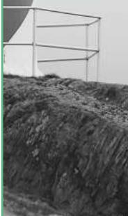

4. Menemukan sifat-sifat segiempat tali busur

  
Gambar 2.1 Sepeda dengan Berbagai Bentuk Roda

## Ayo Berpikir Kritis

Roda sepeda umumnya berbentuk lingkaran. Pernahkah kalian bertanya kenapa? Apa yang terjadi jika roda sepeda tidak berbentuk lingkaran?

  
Gambar 2.2 Penutup Lubang Selokan

Lubang untuk memeriksa selokan (lihat Gambar 2.2) umumnya berbentuk lingkaran. Bagaimana kaitan bentuk lingkaran dengan keselamatan pekerja yang sedang berada di dalam? Apa yang terjadi jika tutup lubang bentuknya bangun datar yang berbeda? Bagaimana jika tutupnya berbentuk persegi? Bagaimana jika persegi panjang?

## Tahukah Kamu?

Pythagoras adalah matematikawan yang hidup pada abad keenam Sebelum Masehi. Para pengikutnya membentuk sebuah sekte tertutup yang disebut Pythagoreans. Pengikut sekte ini menganggap lingkaran sebagai bangun yang sempurna.

Archimedes adalah matematikawan Yunani kuno yang hidup pada abad ketiga Sebelum Masehi. Menurut legenda, Archimedes sedang berkonsentrasi penuh mempelajari lingkaran (yang digambarkan pada pasir di hadapannya) saat kota tempat tinggalnya dikalahkan dalam perang. Pasukan lawan (yang ditugaskan membawa Archimedes pada pemimpin mereka) menanyakan identitasnya. Archimedes (yang konsentrasinya terganggu oleh kehadiran mereka) menjawab dengan gusar, “Jangan ganggu lingkaran saya!” Kalimat tersebut disebut sebagai kata-kata terakhir Archimedes.

Pada bab ini kalian akan mempelajari tentang lingkaran dan teorema-teorema yang berhubungan dengan lingkaran. Kalian juga akan menerapkan teorema-teorema itu untuk menyelesaikan masalah yang terkait dengan lingkaran.

## Pertanyaan pemantik

• Mengapa roda sepeda berbentuk lingkaran?

• Apa saja sifat-sifat lingkaran?

• Apakah semua lingkaran sebangun?

• Bangun datar yang seperti apa yang semua titik sudutnya terletak pada lingkaran?

## Kata Kunci

Lingkaran, jari-jari, diameter, sudut pusat, sudut keliling, busur lingkaran, garis singgung, tali busur, segiempat tali busur, teorema Thales, teorema Ptolemeus

## Peta Konsep

## Ayo Mengingat Kembali

Gambarkan sebuah titik pada kertas, beri nama titik O. Ambil penggaris dan tandai sebuah titik yang berjarak 2 cm dari titik O (beri nama titik A). Tandai titik lain yang berjarak 2 cm dari titik O. Gambarkan 10 titik lain yang berjarak 2 cm dari titik O.

1. Jika semua (termasuk titik-titik lain yang belum kalian gambarkan) titik yang berjarak 2 cm dari titik O dihubungkan, bangun datar apa yang kalian dapatkan?

2. Titik O disebut apa untuk bangun datar tersebut?

3. Jarak 2 cm itu disebut apa bagi bangun datar tersebut?

Lingkaran adalah tempat kedudukan titik-titik yang jaraknya sama dari suatu titik tertentu (disebut pusat lingkaran). Jarak yang sama itu disebut jari-jari.

Ruas garis yang menghubungkan pusat lingkaran dengan salah satu titik pada lingkaran juga disebut jari-jari.

Daerah yang dibatasi oleh lingkaran disebut daerah lingkaran.

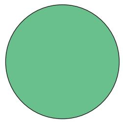

## A. Lingkaran dan Busur Lingkaran

  
Gambar 2.3 Mercusuar

Pada masa sebelum adanya GPS (Global Positioning System), mercusuar dibangun untuk menolong kapal bernavigasi sehingga tidak menabrak karang. Daerah yang diterangi oleh lampu mercusuar berbentuk daerah lingkaran. Kapal bernavigasi dengan memanfaatkan perhitungan sudut yang akurat sehingga dapat berlayar dengan aman.

Bagian dari lingkaran disebut busur lingkaran. Busur yang lebih kecil disebut busur minor (pada gambar berwarna biru) dan bagian yang lebih besar disebut busur mayor (berwarna merah).

Jika hanya disebutkan kata busur, maka yang dimaksud adalah busur minor.

Busur BC dituliskan $\widehat { B C }$ . Besarnya $\widehat { B C }$ ditentukan oleh besarnya $\angle B A C = \alpha$ (Titik A adalah pusat lingkaran).

Dalam matematika,

• Sudut α disebut sudut pusat yang menghadap pada $\widehat { B C }$

Sudut pusat adalah sudut yang titik sudutnya terletak pada pusat lingkaran dan kaki-kaki sudutnya adalah jari-jari lingkaran.

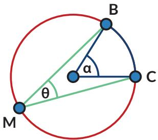

• Sudut θ disebut sudut keliling yang menghadap pada $\widehat { B C }$

Sudut keliling adalah sudut yang titik sudutnya terletak pada lingkaran dan kaki-kaki sudutnya berupa tali busur.

Apakah kalian ingat apa yang dimaksud tali busur? Tali busur adalah ruas garis yang menghubungkan dua titik pada lingkaran.

Ayo Bereksplorasi

Sebuah kolam berbentuk lingkaran. Pada salah satu bagian kolam ada perosotan. Pengelola ingin meletakkan lampu sehingga daerah perosotan selalu terang. Jika daerah yang ingin diterangi ditampilkan sebagai busur lingkaran berwarna biru. Busur lingkaran tersebut besarnya α.

Setiap lampu yang diproduksi oleh pabrik Q dapat menyinari daerah dengan jarak tertentu dan sudut penyinaran tertentu (β).

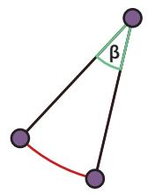

Jika semua lampu yang ada dalam gudang pengelola kolam dapat menyinari jarak yang dibutuhkan, bantulah pengelola taman memilih sudut penyinaran yang tepat.

1. Lampu taman dengan sudut penyinaran $3 0 ^ { \circ }$ diletakkan pada titik M dan dapat menerangi perosotan pada $\widehat { B C }$ Di mana saja pengelola dapat memasang lampu yang sama dan tetap menyinari perosotan pada $\widehat { B C } ?$

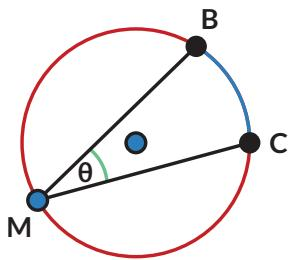

2. Jika lampu diletakkan di pusat kolam dan ingin menyorot $\widehat { B C }$ , apakah lampu dengan sudut penyinaran $3 0 ^ { \circ }$ dapat digunakan? Jika tidak, berapa sudut yang dibutuhkan?

3. Jika ukuran perosotan berubah $( \widehat { B C } )$ bagaimana pengaruhnya terhadap perubahan sudut penyinaran yang dibutuhkan?

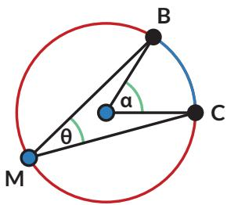

<table><tr><td rowspan=1 colspan=1>α</td><td rowspan=1 colspan=1>θ</td></tr><tr><td rowspan=1 colspan=1></td><td rowspan=1 colspan=1></td></tr><tr><td rowspan=1 colspan=1></td><td rowspan=1 colspan=1></td></tr><tr><td rowspan=1 colspan=1></td><td rowspan=1 colspan=1></td></tr></table>

Kalian dapat melakukan Eksplorasi 2.1 dengan cara:

## Ayo Berteknologi

Jika tersedia, disarankan menggunakan aplikasi semacam GeoGebra atau Desmos. https://www.geogebra.org/m/cjdyK8UR#material/UT4sXfYW dan https://www.geogebra.org/m/cjdyK8UR#material/VGNfTTEu

## Ayo Bekerja Sama

Kalian dapat mengerjakannya secara berkelompok. Setiap siswa menyelidiki gambar yang berbeda. Setelah itu diskusikan hasilnya.

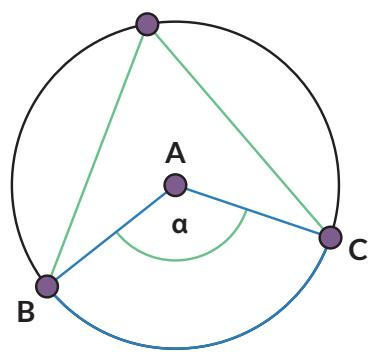

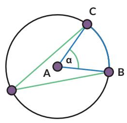

Temuan:

Sudut pusat besarnya kali sudut keliling yang menghadap ke busur lingkaran yang sama.

• Sudut keliling yang menghadap ke busur yang sama besarnya

• Sudut keliling yang menghadap ke diameter besarnya

## Pembuktian

Rani dan Nyoman juga ingin membuktikan hasil pengamatan mereka tentang hubungan sudut pusat dan sudut keliling pada lingkaran.

Nyoman mengusulkan bahwa ada empat kemungkinan.

  
Kasus 1

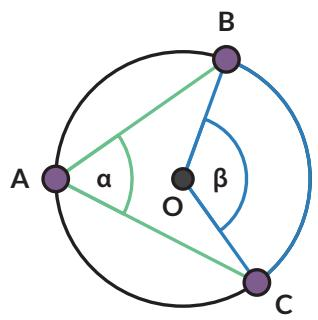  
Kasus 2

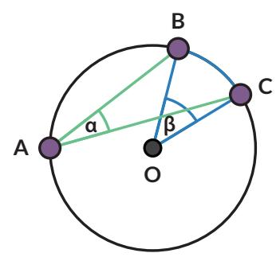

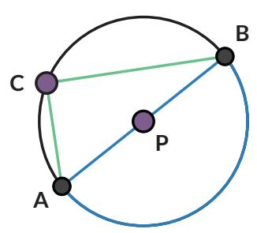

• Kasus 1

Pertama-tama perhatikan kasus khusus saat $\overline { { A C } }$ melalui titik O.   
Ingat bahwa $\overline { { A C } }$ artinya ruas garis AC.

Bukti:

panjang ${ \overline { { O A } } } = { \mathrm { p a n j a n g } } { \overline { { O B } } }$

(jari-jari lingkaran) maka sama kaki.

$\angle O A B = \angle$

(karena $\triangle A O B$ sama kaki)

$\angle A O B =$ …..(1)

(jumlah sudut dalam $\triangle A O B$ adalah 180◦)

$\angle A O B =$ …..(2)

$( \angle A O B$ adalah pelurus $\angle B O C )$

$$
\beta =
$$

Gabungkan (1) dan (2) untuk membuktikan.

## Kasus 2

Sekarang perhatikan kasus yang lebih umum, saat $\overline { { A C } }$ tidak melalui pusat lingkaran. B

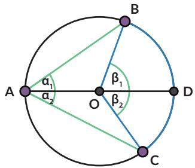

Tarik $\overline { { A D } }$ melalui titik $O ,$ membelah α menjadi $\alpha = \alpha _ { 1 } + \alpha _ { 2 }$

Dengan cara yang sama dengan

$$
\beta _ { 1 } = 2 \alpha _ { 1 }
$$

…… (1)

Kasus 1

Dengan cara serupa

$$
\beta _ { 2 } = 2 \alpha _ { 2 }
$$

…… (2)

Gunakan (1) dan (2)

$$
\begin{array} { c } { \beta = \beta _ { 1 } + \beta _ { 2 } } \\ { { { } } } \\ { { { } = \dots . . . . } } \end{array}
$$

## • Kasus 3

akan kalian lakukan pada Latihan 2.1 no. 1.

• Kasus 4

Kasus 4 adalah kasus khusus untuk sudut keliling yang menghadap pada diameter lingkaran $( \angle A C B )$

Bukti:

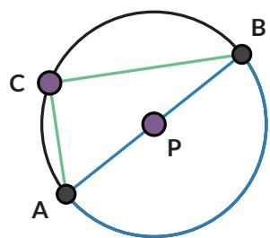

1. Gambarkan jari-jari ${ \overline { { P C } } } .$ . Segitiga jenis apakah $\triangle A P C$ dan $\triangle B P C ?$ Bagaimana kalian tahu?

2. Nyatakan besarnya sudut-sudut yang sama pada $\triangle A P C$ sebagai $x ^ { \circ }$ dan besarnya sudut-sudut yang sama pada $\triangle B P C$ sebagai $y ^ { \circ }$ , tuliskan sudutsudut pada $\triangle A B C$ dalam $x ^ { \circ }$ dan $y ^ { \circ }$

a. $\angle A = . . .$ b. $\angle B = . . .$ c. $\angle C = \ldots$

3. Apa yang kalian ketahui tentang sudut-sudut pada segitiga yang dapat digunakan untuk menentukan besarnya $\angle A C B ?$ $\angle A C B =$

## Tahukah Kamu?

Kasus 4 dikenal dengan nama Teorema Thales.

Thales adalah orang Yunani yang menjadi matematikawan, ahli astronomi, dan filsuf. Dalam Matematika, Thales adalah orang pertama yang menerapkan argumentasi deduktif dalam geometri. Dia adalah orang pertama yang namanya disematkan pada teorema.

## Teorema Thales:

Jika tiga titik A, B, C terletak pada lingkaran dan AB adalah diameter, maka $\angle A C B$ siku-siku.

  
sumber: en.wikipedia.org/Wilhelm Meyer (2021)

## Latihan

## 2.1

1. Ini adalah Kasus 3 dari bukti Eksplorasi 2.1.

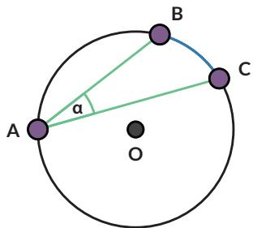

a. Gambarkan sudut pusat yang menghadap ke busur yang sama dengan sudut keliling $\angle B A C$

b. Apakah pada lingkaran berikut juga berlaku bahwa sudut pusat besarnya dua kali lipat sudut keliling? Buktikan.

## Petunjuk

Buatlah diameter yang melalui titik A dan titik O.

2. Jika $\angle B O C = 9 0 ^ { \circ }$ , berapakah besar $\angle B E C 3$

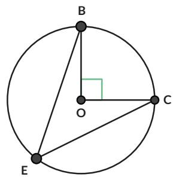

3. Lingkaran A berjari-jari 2 satuan. Jika panjang ${ \overline { { B C } } } = 2 ,$ tentukan besar $\angle B D C$

4. $\overline { { A B } }$ adalah diameter pada lingkaran berikut. Jari-jari lingkaran 8,5 cm dan panjang $\overline { { A C } } = 8$ cm. Tentukan:

a. besar $\angle A C B$

b. panjang $\overline { { A B } }$

c. panjang $\overline { { B C } }$

5. Apa yang salah pada gambar berikut?

6. Lingkaran A berjari-jari 2 cm. Tentukan:

a. besar $\angle B D C$   
b. jika $\angle C A D = 9 0 ^ { \circ }$ , tentukan besar $\angle A C D$   
c. panjang CD

## Ayo Berpikir Kreatif

Jelaskan cara memanfaatkan alat gambar teknik berbentuk T ini untuk menentukan letak titik pusat piring.

8.

## Ayo Berpikir Kritis

Pada gambar berikut, titik P dan titik Q adalah mercusuar. Daerah dengan karang berbahaya telah dipetakan dan lingkaran menyatakan daerah berbahaya tersebut. Kapal diharapkan tidak memasuki daerah lingkaran untuk menghindari kemungkinan kandas.

Pelajari sudut yang dibentuk antara cahaya dari kedua mercusuar $( \angle P C Q )$ jika kapal berada di luar lingkaran/pada lingkaran/di dalam lingkaran. Menurutmu, informasi apa yang perlu diketahui kapten kapal tentang lokasi ini untuk memastikan kapalnya tidak kandas?

## Rangkuman

Sifat-sifat sudut pada lingkaran:

1. Sudut keliling yang menghadap pada busur yang sama, besarnya sama.

2. Sudut pusat besarnya dua kali sudut keliling yang menghadap pada busur yang sama.

3. Sudut keliling yang menghadap pada diameter lingkaran, adalah sudut siku-siku.

1. Apakah saya memahami hubungan sudut keliling dan busur lingkaran?

2. Apakah saya memahami hubungan sudut keliling dan sudut pusat?

3. Apakah saya bisa mengerjakan soal-soal yang terkait dengan sudut keliling dan sudut pusat lingkaran?

## B. Lingkaran dan Garis Singgung

  
Gambar 2.4 Roda Kereta Api

Roda kereta api menyentuh rel kereta di satu titik. Secara matematis dikatakan bahwa rel adalah garis singgung roda dan titik sentuhnya disebut sebagai titik singgung.

## Eksplorasi 2.2

## Ayo Bereksplorasi

Dalam tugasnya, seorang navigator pada kapal laut perlu menghitung jarak pelabuhan yang berada pada cakrawala.

  
Gambar 2.5 Cakrawala

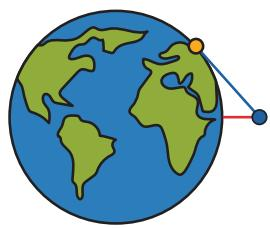

Titik biru mewakili posisi navigator pada kapal, titik oranye adalah pelabuhan yang tampak di cakrawala. Garis merah adalah jarak navigator ke permukaan air. Garis biru mewakili pandangan navigator ke pelabuhan, secara matematis merupakan garis singgung. Mari bereksplorasi menyelidiki sifat-sifat garis singgung.

1. Pelabuhan pertama kali terlihat sebagai sebuah titik di kejauhan. Garis singgung menyentuh lingkaran pada tepat satu titik (disebut titik singgung). Gunakan busur derajat untuk mengukur besar sudut yang dibentuk oleh garis singgung dan jari-jari lingkaran (pada titik singgung).

Sudut yang dibentuk oleh garis singgung dan jari-jari lingkaran pada titik singgung B besarnya

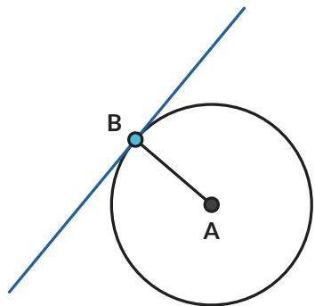

Bagaimana dengan garis singgung yang menyinggung di titik berbeda? Jika ada titik singgung lain, berapa besar sudut antara garis singgung dan jari-jari di titik singgung itu?

Kalian dapat menjawab pertanyaan ini dengan cara:

## Ayo Berteknologi

Jika tersedia, disarankan menggunakan aplikasi semacam GeoGebra atau Desmos.

https://www.geogebra.org/m/cjdyK8UR#material/ u6Ev7bHg

Kalian dapat mengerjakannya secara berkelompok. Setiap peserta didik menyelidiki gambar yang berbeda. Setelah itu diskusikan hasilnya.

a.  
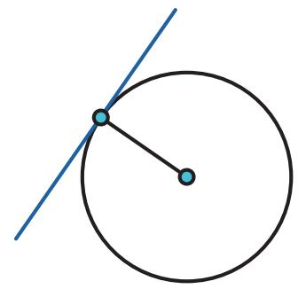

c.  

d.  
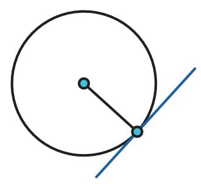

e.  
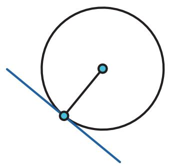

f.  
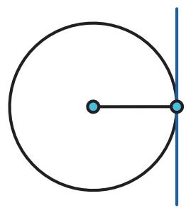

Pada setiap titik singgung, sudut yang dibentuk oleh garis singgung dan jari-jari lingkaran di titik singgung itu besarnya

2. Pada sebuah titik pada lingkaran, gambarkan garis yang tidak membentuk sudut siku-siku dengan jari-jari lingkaran.

a. Garis tersebut memotong lingkaran di berapa titik?

b. Apakah garis tersebut merupakan garis singgung?

Garis sekan adalah garis yang memotong lingkaran pada dua titik.

3. Rani dan Nyoman mempelajari lebih lanjut tentang garis singgung lingkaran. Mereka menggambar garis singgung dari titik P ke lingkaran A.

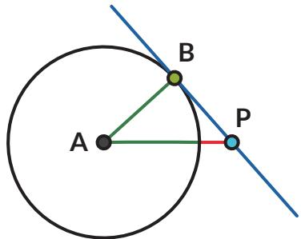

Rani ingat teorema Thales, sehingga ia menduga ada sebuah lingkaran yang dapat digambarkan yang melalui titik A, B, dan P.

Tariklah ruas garis dari titik P ke setiap titik potong kedua lingkaran. Tentukan:

a. Garis PB merupakan garis singgung/garis sekan (pilih salah satu).

b. Garis PC merupakan garis singgung/garis sekan (pilih salah satu).

4. Tentukan besar sudutnya.

a. $\angle A B P =$

b. $\angle A C P =$

c. Jelaskan alasannya.

5. Tunjukkan bahwa $\triangle A B P$ kongruen dengan $\triangle A C P$

Akibatnya:

a. Panjang $\overline { { P B } }$ panjang $\overline { { P C } }$

b. $\angle A P B$ dan $\angle A P C$ besarnya

Dari sebuah titik di luar lingkaran dapat dibuat sebanyak \_ \_ buah garis singgung yang panjangnya

Yang dimaksud panjang garis singgung adalah panjang ruas garis PB atau ruas garis $P C$

6. Jika navigator tersebut mengetahui jari-jari bumi, dan ketinggiannya dari permukaan air (berdasarkan ukuran kapal), bagaimana cara dia menentukan jarak kapal dengan pelabuhan yang tampak di cakrawala?

## Latihan

2.2

1. Jika jari-jari lingkaran A adalah 7 cm dan titik P berjarak 25 cm dari titik A, berapakah panjang garis singgung $\overline { { P B } } ?$

2. Pada gambar berikut, $\overline { { B D } }$ dan $\overline { { C D } }$ adalah garis singgung lingkaran A. Jika $\angle B A C = 1 4 7 ^ { \circ }$ , tentukan besar $\angle B D C$

3.

## Ayo Berpikir Kreatif

Bram, seorang navigator kapal laut, tahu bahwa jari-jari lingkaran bumi panjangnya 6.371 km. Ruang kemudi kapal berada pada ketinggian 40 m dari permukaan laut. Tentukan jarak cakrawala yang dapat Bram lihat.

Satelit komunikasi mengorbit bumi pada posisi yang tetap terhadap bumi (artinya jika dilihat dari bumi, satelit tersebut akan berada pada ketinggian dan bujur yang sama, meskipun bumi berputar dan mengelilingi matahari). Satelit Telkom-4 (Merah Putih) mengorbit bumi pada garis bujur 108◦ BT. Jika jari-jari bumi adalah 6.371 km dan satelit Telkom-4 terletak pada ketinggian 35.786 km dari permukaan bumi, apakah Satelit Telkom-4 dapat memancarkan sinyal ke seluruh wilayah Indonesia?

## 5. Garis singgung persekutuan luar

Garis singgung persekutuan adalah garis singgung yang merupakan garis singgung bagi dua lingkaran. CD merupakan garis singgung persekutuan luar untuk lingkaran A dan lingkaran B.

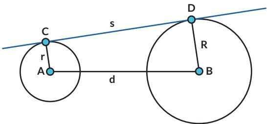

a. Lingkaran A dan lingkaran B memiliki dua buah garis singgung persekutuan luar. Gambarkan garis singgung persekutuan luar yang lain.

b. Tentukan panjang garis singgung persekutuan luar CD (s) jika jarak kedua pusat lingkaran (d) dan jari-jari masing-masing lingkaran diketahui (r dan R).

## Petunjuk

Gambarkan garis bantu sehingga kalian dapat memanfaatkan Teorema Pythagoras.

6. Rantai sepeda berfungsi untuk memindahkan daya penggerak dari pedal ke roda.

a. Tunjukkan garis singgung persekutuan luar pada gambar rantai sepeda tersebut.

b. Tentukan panjang garis singgung persekutuan luarnya jika jari-jari lingkaran yang lebih besar = 5 cm, jari-jari lingkaran yang lebih kecil = 3 cm, dan jarak antar kedua pusat lingkaran = 44 cm.

## 7. Garis singgung persekutuan dalam

Selain garis singgung persekutuan luar, ada juga garis singgung persekutuan dalam. $\overline { { E F } }$ merupakan garis singgung persekutuan dalam untuk lingkaran A dan lingkaran B.

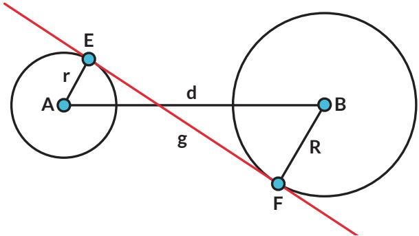

a. Lingkaran A dan lingkaran B memiliki dua buah garis singgung persekutuan dalam. Gambarkan garis singgung persekutuan dalam yang lain.

b. Tentukan panjang garis singgung persekutuan dalam $\overline { { E F } } \left( g \right)$ jika jarak kedua pusat lingkaran (d ) dan jari-jari masing-masing lingkaran diketahui (r dan R ).

## Petunjuk

Gambarkan garis bantu sehingga kalian dapat memanfaatkan Teorema Pythagoras.

8. Dua buah lingkaran, pusatnya berjarak 5 cm. Jika kedua lingkaran tersebut masing-masing berjari-jari 1 cm dan 2 cm,

a. Gambarkan kedua lingkaran dengan ukuran sebenarnya, juga semua garis singgung persekutuan kedua lingkaran.

b. Tentukan panjang masing-masing garis singgung persekutuan.

c. Manakah yang lebih panjang: garis singgung persekutuan dalam atau garis singgung persekutuan luar?

9. AB, BC, dan $\overline { { A C } }$ adalah garis-garis singgung pada lingkaran $D$

a. Lingkaran D adalah lingkaran $\triangle A B C$

b. Buktikan: $A B + P C = A C + P B$

10.

## Ayo Berpikir Kritis

KL, LM, MN , dan $\overline { { N K } }$ adalah garis-garis singgung pada lingkaran O.   
Segiempat KLMN disebut segiempat garis singgung.

Buktikan: $L K + M N = L M + N K$

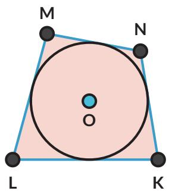

Latihan 2.2 nomor 9 dan 10 disebut Teorema Pitot.

## Tahukah Kamu?

Garis singgung dapat digunakan untuk menentukan bagian bumi yang akan mengalami gerhana matahari.

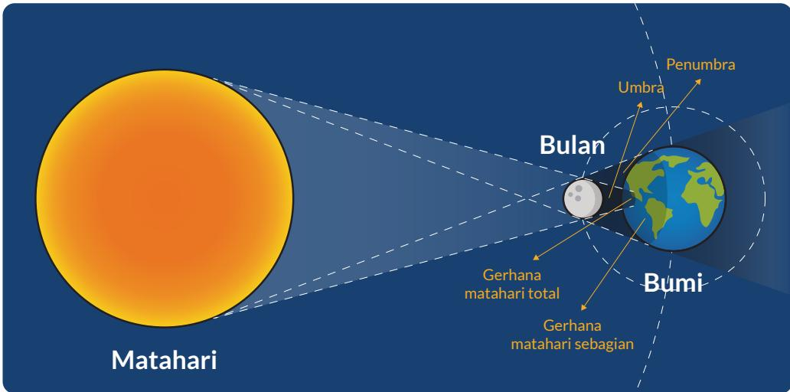  
Gambar 2.6 Gerhana Matahari Sumber: sciencedirect.com (2020)

## Rangkuman

1. Garis singgung berpotongan dengan lingkaran di satu titik.

2. Titik potong lingkaran dengan garis singgung disebut titik singgung.

3. Garis singgung dan jari-jari lingkaran di titik singgung berpotongan tegak lurus.

4. Dari satu titik di luar lingkaran, dapat dibentuk dua garis singgung yang sama panjang.

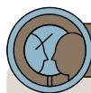

## Ayo Berefleksi

1. Apakah saya dapat menggambar garis singgung?

2. Apakah saya dapat menentukan panjang garis singgung?

3. Apakah saya paham sifat-sifat garis singgung?

## C. Lingkaran dan Tali Busur

  
Gambar 2.7 Busur Panah

Busur panah merupakan bagian dari lingkaran dan talinya menghubungkan dua titik pada lingkaran. Dalam matematika, ruas garis yang menghubungkan dua titik pada lingkaran disebut tali busur.

2.3

## Ayo Bereksplorasi

1. Tali busur $\overline { { A B } }$ sama panjang dengan tali busur $\overline { { C D } }$ Ingat bahwa busur $A B$ dituliskan $\widehat { A B }$ . Besarnya $\overbrace { A B }$ ditentukan oleh besarnya $\angle A O B = \alpha$ (Titik O adalah pusat lingkaran).

Apakah besarnya $\widehat { A B }$ dan $\widehat { C D }$ sama?

Ayo Berpikir Kreatif

2. Jika AB dan CD adalah dua tali busur yang sama panjang, gambarkan $\triangle O A B$ dan $\triangle O C D$ . Apakah $\triangle O A B$ dan $\triangle O C D$ kongruen? Bagaimana kalian tahu?

3. Berdasarkan no. 2, bagaimana besar $\angle A O B$ dan $\angle C O D ?$

4. Gunakan no. 3 untuk membuktikan temuanmu pada no. 1.

## Eksplorasi 2.4

## Ayo Bereksplorasi

Suatu hari seorang siswi SMA kelas XI, Sondang, dengan gembira mengatakan kepada Nyoman dan Rani bahwa dia menemukan suatu teorema baru ketika sedang bereksplorasi dengan lingkaran. Sondang menemukan jika dia mengambil segitiga siku-siku (sudut siku-sikunya menghadap pada diameter lingkaran) dan mencerminkan segitiga ini pada diameter lingkaran, maka segiempat yang dihasilkan memiliki sifat yang menarik, yaitu jumlah sudut yang berhadapan selalu sama dengan 180°.

1. Apakah penemuan Sondang itu benar atau hanya kebetulan berlaku untuk kasus itu saja?

2. Bagaimana kalau diagonal segiempat tidak harus merupakan diameter lingkaran? Apakah sifat itu masih berlaku?

Coba kalian bereksplorasi dan membuat kesimpulan dari hasil eksplorasi kalian!

1. Gambarkan sebuah lingkaran dan segitiga siku-siku yang sisi miringnya adalah diameter lingkaran. Cerminkan segitiga siku-siku itu pada diameter lingkaran. Perhatikan segiempat yang terbentuk. Apakah keempat titik sudutnya terletak pada lingkaran? Jelaskan.

2. Untuk masing-masing titik sudut, tentukan sudut tersebut menghadap ke busur yang mana.

a.

b.

c.

d.

3. Jumlahkan sudut-sudut yang berhadapan.

a.

b.

4. Bagaimana jika segiempat itu bukan merupakan penggabungan segitiga sikusiku dan pencerminannya? Apakah sifat yang sama masih berlaku?

a. Ulangi langkah 2 dan 3 jika keempat titik sudutnya terletak pada lingkaran.

b. Ulangi langkah 2 dan 3 jika salah satu titik sudutnya tidak terletak pada lingkaran.

Segiempat yang keempat sisinya merupakan tali busur sebuah lingkaran disebut segiempat tali busur. Pada segiempat tali busur, sudut-sudut yang berhadapan jumlahnya

5. Kalian telah menemukan sifat sudut-sudut pada segiempat tali busur. Adakah sifat segiempat tali busur yang terkait panjang ruas garisnya? Perhatikan segiempat tali busur ABCD berikut.

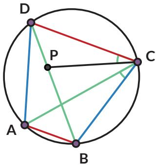

a. Gambarkan titik P pada BD sehingga $\angle A C B = \angle D C P$ . Buktikan bahwa $\triangle C D P \sim \triangle C A B$

b. Tunjukkan bahwa $D P \cdot A C = A B \cdot C D$

c. Tunjukkan bahwa $\triangle A C D \sim \triangle B C P$

d. Tunjukkan bahwa $B P \cdot A C = B C \cdot D A$

e. Berdasarkan poin b dan d, apa yang dapat kalian simpulkan tentang $A C \cdot B D ?$

Hasil yang kalian dapatkan ini dikenal sebagai Teorema Ptolemeus.

## Latihan 2.3

1. Lingkaran yang berpusat di titik O dan jari-jarinya 5 cm. Berapa panjang tali busurnya yang paling panjang?

2. Jika $A D = 3$ cm dan $B E = A D$ , tentukan:

a. besar $\angle B A E$

b. besar $\angle B D E$

## 3. Apotema

Apotema adalah ruas garis dari pusat lingkaran dan tegak lurus tali busur. Buktikan bahwa $B D = D C$

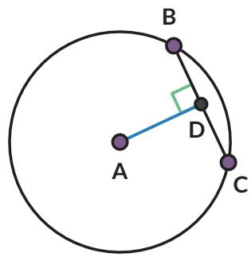

4. Tentukan nilai w sehingga $\overline { { K L } }$ dan $\overline { { M N } }$ sama panjang.

Situs Gunung Padang adalah situs prasejarah megalitik besar yang terletak di Kabupaten Cianjur. Salah satu artefak yang ditemukan di sana diduga merupakan pecahan guci. Diskusikan dengan temanmu bagaimana cara menentukan diameter mulut guci tersebut.

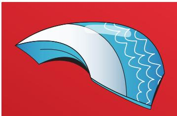

6. Kincir air berikut digunakan untuk pembangkit energi dan irigasi. Pada diagram sebelah kanan, roda dengan diameter 10 m diletakkan pada sungai sehingga titik terendah roda terletak pada kedalaman 1 m.

a. Tentukan ketinggian titik A dari permukaan air.

b. Permukaan air ditunjukkan oleh tali busur $\overline { { D E } }$ . Tentukan besar $\angle D A E$

c. Tentukan jarak dua titik pada roda yang terletak di permukaan air.

7. Sinar garis r dan s adalah garis singgung pada lingkaran $Q .$ Jika sudut antara r dan s adalah $8 0 ^ { \circ }$ , tentukan besarnya sudut x.

8. BD dan $\overline { { C D } }$ adalah garis singgung pada lingkaran A.

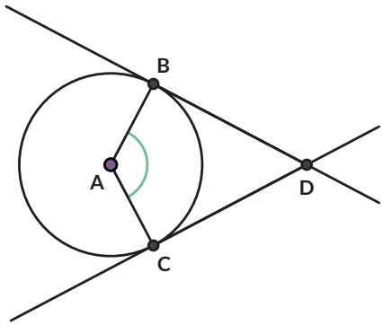

a. Apakah segiempat ABCD merupakan segiempat tali busur? Buktikan.

b. Jika segiempat ABCD merupakan segiempat tali busur, di manakah pusat lingkaran luar segiempat ABCD?

9. Segiempat ABCD adalah persegi panjang yang semua titik sudutnya terletak pada lingkaran.

a. Apakah ABCD merupakan segiempat tali busur? Buktikan.

b. Jika kalian menerapkan Teorema Ptolemeus pada segiempat ABCD, apakah yang kalian dapatkan?

c. Apakah nama teorema tersebut?

10.

## Ayo Berpikir Kreatif

Goras ingin menyajikan pizza yang dibelinya di atas piring. Sayangnya, piring yang tersedia diameternya lebih kecil daripada diameter pizza. Ia memotong pizzanya dengan cara tertentu, mengambil sebagian, lalu menyusun sisa pizza sehingga terlihat sebagai pizza utuh.

a. Ambillah selembar kertas berbentuk lingkaran. Cobalah melakukan hal yang dikerjakan Goras.

b. Apakah pizza kedua sama dengan pizza awal? Jelaskan.

## Rangkuman

Pada segiempat tali busur berlaku:

1. Sudut-sudut yang berhadapan saling berpelurus.

2. Hasil kali diagonal sama besarnya dengan jumlah dari hasil kali sisi yang berhadapan.

## Refleksi

1. Apakah saya dapat menerapkan teorema-teorema tentang lingkaran?

2. Apakah saya dapat membuktikan teorema-teorema terkait lingkaran?

3. Apakah saya mengerti sifat-sifat garis singgung?

4. Apakah saya mengerti sifat-sifat segiempat tali busur?

## Uji Kompetensi

1. Jika $\alpha = 4 8 ^ { \circ }$ , tentukan besarnya

a. $\angle C D E$

c. $\angle D A E$

b. $\angle D E A$

d. $\angle D F E$

2. Segiempat POST keempat sisinya menyinggung lingkaran. Jika panjang $\overline { { T S } } = 1 2$ cm dan panjang ${ \overline { { P C } } } = 1 4 { \mathrm { c m } }$ , tentukan keliling POST.

3. Pada lingkaran A yang berjari-jari 5 cm terdapat tali busur $\overline { { B C } }$ sepanjang 8 cm. Tentukan panjang apotemanya.

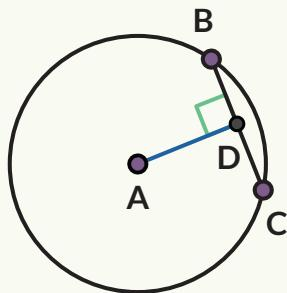

4. Dua tali busur, $\overline { { A C } }$ dan BD pada lingkaran dengan pusat O, berpotongan tegak lurus pada titik P. Panjang AB sama dengan jari-jari lingkaran.

a. Berapa besar $\widehat { A B } \ ?$

b. Apa nilai perbandingan ${ \frac { D C } { A B } } { \mathrm { i } }$ ? Jelaskan bagaimana kamu mendapatkan jawabannya.

5. Berapa panjang dari tali busur AC? a. $\textstyle { \frac { 1 6 { \sqrt { 1 7 } } } { 1 7 } }$ c. $\sqrt { 3 2 }$ b. $\sqrt { 6 8 }$ d. $\frac { \sqrt { 3 2 } } { 6 8 }$

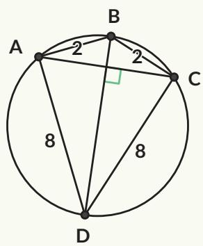

6. Segiempat BDCE adalah segiempat tali busur, O adalah titik pusat lingkaran, dan besar $\angle B O C = 1 3 0 ^ { \circ }$ . Tentukan besar $\angle B E C$

## Pengayaan

Gambar 2.8 menunjukkan segitiga sama sisi. Titik P terletak pada lingkaran luar segitiga ABC. Titik P dihubungkan dengan setiap titik sudut segitiga ABC.

Jika AP lebih panjang daripada $B P$ dan $C P ,$ buktikan bahwa:

$$
A P = B P + C P
$$

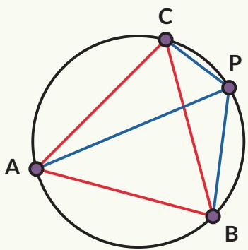  
Gambar 2.8 Segitiga Sama Sisi ABC

Sifat ini pertama kali ditemukan oleh matematikawan Belanda bernama Frans van Schooten, karena itu disebut sebagai Teorema van Schooten.